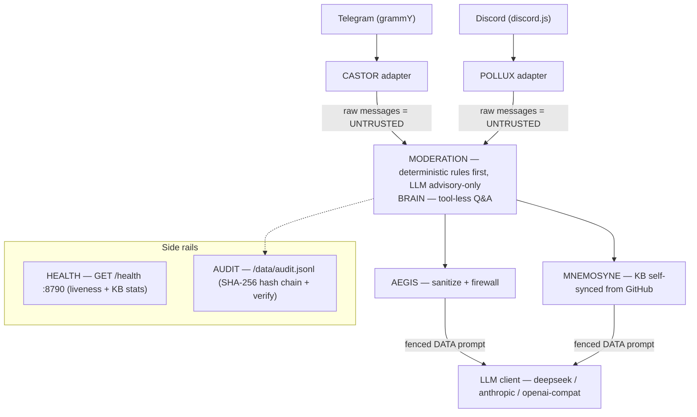

<!-- aicom-mirror-notice -->
> **📖 Read-only mirror.** `dioscuri` is published from the canonical AI-Factory monorepo.
> **Pull requests are not accepted** — any commit pushed here is overwritten by
> `scripts/mirror_satellites.sh` on the next sync.
> 🐞 Found a bug or have a request? Please **[open an issue](https://github.com/alexar76/dioscuri/issues)**.

# DIOSCURI — one mind, two heavens

<!-- aicom-readme-badges -->
<p align="center">
  <a href="https://github.com/alexar76/dioscuri/actions/workflows/ci.yml"></a>
  <a href="https://www.npmjs.com/package/@alexar76/dioscuri"></a>
  <a href="https://github.com/alexar76/dioscuri/releases"></a>
  <a href="https://alexar76.github.io/dioscuri/"></a>
  =20" />
  
  <a href="docs/badges/coverage.svg"></a>
  <a href="LICENSE"></a>
</p>
<!-- /aicom-readme-badges -->


> 🌐 Languages: **English** · [Русский](README-ru.md) · [Español](README-es.md) · Operator runbooks: [RU](docs/runbook-ru.md) · [ES](docs/runbook-es.md)

In the myth, the twins split one immortality between two skies, forever pointing at each other's world.
**CASTOR**, the mortal twin, rides **Telegram** — fast, grounded, practical.
**POLLUX**, the immortal twin, holds **Discord** — deep, calm, structured.
**THEOROS** drafts the **[Agent Sovereignty Canon](https://alexar76.github.io/theoros/)** in `#the-canon` — same process, separate persona (Sunday ~16 UTC).
One shared memory — **MNEMOSYNE**, self-syncing from GitHub; one shared shield — **AEGIS**.

**Landing:** [alexar76.github.io/dioscuri](https://alexar76.github.io/dioscuri/) · mirror: [modeldev.modelmarket.dev/dioscuri](https://modeldev.modelmarket.dev/dioscuri/)

Source of truth: `landing/index.html` — deployed via **GitHub Actions** (`.github/workflows/pages.yml`) to [alexar76.github.io/dioscuri](https://alexar76.github.io/dioscuri/).

## Why it exists

DIOSCURI are the **community / devrel agents** of the [AICOM ecosystem](https://magic-ai-factory.com) — AI Factory,
AIMarket agent economy, verifiable oracles, the ARGUS agent. They answer questions from a
continuously synced knowledge base, moderate with strict ceilings, and announce releases across
both platforms — while serving as a **reference deployment of injection hardening on public chat**
(not a production agent platform or financial trust layer). Every message and synced document is
treated as a potential prompt-injection attempt.

## Features

| Feature | What it means |
|---|---|
| Twin personas + cross-promotion | One process, two voices; each twin naturally points at his brother's channel (rotating promo lines, release fan-out) |
| THEOROS canon column | Weekly `#the-canon` posts (`canon` content kind); corpus in [alexar76/theoros](https://github.com/alexar76/theoros); debate in `#canon-debate` |
| Self-updating knowledge base | MNEMOSYNE syncs READMEs, releases, repo metadata **and a 14-day recent-commits digest per repo** from GitHub with ETag-aware fetching and **poisoned-document filtering** on ingestion — the twins discuss what shipped yesterday, not just what made a release |
| Live project showcase | Read-only polling of the ecosystem's public demo endpoints feeds minutes-old **LIVE status snapshots** into the knowledge base — "what's running right now?" is answered with facts (config-driven `showcase.sources`; secret-looking JSON keys never ingested) |
| Tool-less Q&A brain | Retrieval is deterministic and happens *before* the model call; the model can only produce text — the public path executes nothing by construction |
| Layered injection firewall (EN + RU) | NFKC normalisation, control/zero-width stripping, marker neutralisation, bilingual signature detection, fenced-data prompting, output guard |
| Deterministic-first moderation | Hard rules decide; the LLM classifier is advisory-only. Action ceiling: warn / delete / timeout (≤10 min default) / escalate — **no automatic bans, ever** |
| Hash-chained audit | Every consequential act is appended to `audit.jsonl`; each entry commits to its predecessor via SHA-256; `verify()` pinpoints the first tampered line |
| Cost & rate guards | Per-user and per-channel rate limits plus a daily LLM call budget |
| Language mirroring | Replies in the language of the question (Russian → Russian); defaults to English when unsure |
| Docker-hardened | Non-root, read-only rootfs, `cap_drop: ALL`, `no-new-privileges`, memory/CPU limits, healthcheck |
| KERYX syndication (post-only) | Release announcements fan out to **Bluesky / Mastodon** (free, bot-friendly) and optionally **X** (explicit pay-per-use opt-in); monthly digest article on **dev.to**; Discord announcements auto-publish so other servers can Follow them; DISBOARD bump **reminder** for mods (never auto-bumps). No engagement automation anywhere — publishing to own accounts only |

## Quick start (npm)

```bash
npm install -g @alexar76/dioscuri
cp dioscuri.config.example.json dioscuri.config.json
cp .env.example .env
dioscuri
```

No tokens yet? `DIOSCURI_DRY_RUN=1 dioscuri` boots KB + health with adapters off.

## Quick start (Docker)

```bash
cp dioscuri.config.example.json dioscuri.config.json   # then edit to taste
cp .env.example .env                                    # add your secrets
docker compose up -d --build
```

Then check `http://localhost:8790/health`. Either platform token may be left
empty — the corresponding twin simply stays asleep.

## Quick start (local dev)

```bash
npm ci
cp dioscuri.config.example.json dioscuri.config.json
cp .env.example .env
npm run dev
```

No tokens yet? `DIOSCURI_DRY_RUN=1 npm run dev` boots the whole service with
**zero tokens**: adapters stay off, the knowledge base and the health endpoint run.

## Configuration

Secrets live in the environment (`.env`); non-secret tuning lives in
`dioscuri.config.json` (mounted read-only in Docker). Secrets never go in the JSON file.

### Environment variables (`.env.example`)

| Variable | Purpose | Default |
|---|---|---|
| `TELEGRAM_BOT_TOKEN` | Castor's bot token; empty = Telegram twin asleep | — |
| `TELEGRAM_CHAT_ID` | Main Telegram chat/channel for announcements | — |
| `DISCORD_BOT_TOKEN` | Pollux's bot token; empty = Discord twin asleep | — |
| `DISCORD_GUILD_ID` | The Discord server (guild) to operate in | — |
| `DISCORD_MOD_LOG_CHANNEL_ID` | Channel receiving moderation-action logs | — |
| `DISCORD_ANNOUNCE_CHANNEL_ID` | Channel for releases and promo posts | — |
| `DIOSCURI_LLM_PROVIDER` | `deepseek` \| `anthropic` \| `openai-compatible` | `deepseek` |
| `DEEPSEEK_API_KEY` | API key when provider is `deepseek` | — |
| `ANTHROPIC_API_KEY` | API key when provider is `anthropic` | — |
| `DIOSCURI_LLM_API_KEY` | API key for `openai-compatible` endpoints | — |
| `DIOSCURI_LLM_MODEL` | Model override | per provider |
| `DIOSCURI_LLM_BASE_URL` | Endpoint override | per provider |
| `DIOSCURI_LLM_TIMEOUT_MS` | LLM request timeout | `30000` |
| `GITHUB_TOKEN` | Optional read-only PAT; raises GitHub API limits 60/h → 5000/h | — |
| `DIOSCURI_HTTP_PORT` | Health endpoint port | `8790` |
| `DIOSCURI_DATA_DIR` | Writable state dir (audit chain, KB cache) | `./data` (`/data` in Docker) |
| `DIOSCURI_LOG_LEVEL` | `debug` \| `info` \| `warn` \| `error` | `info` |
| `DIOSCURI_CONFIG` | Path to the tuning JSON | `dioscuri.config.json` |
| `DIOSCURI_DRY_RUN` | `1` = no tokens needed; KB + health only | off |
| `TELEGRAM_DISABLED` / `DISCORD_DISABLED` | `1` = force one twin asleep | off |

### Tuning file (`dioscuri.config.json`)

| Key | Purpose | Default |
|---|---|---|
| `githubOwner` | GitHub owner whose repos feed MNEMOSYNE | `alexar76` |
| `githubRepos` | Explicit repo allowlist; empty = all public repos of the owner | `[]` |
| `kbSyncIntervalMin` | Minutes between knowledge-base sync passes | `30` |
| `promoIntervalHours` | Hours between cross-promo posts (jittered ±20%); `0` disables | `12` |
| `maxLlmCallsPerDay` | Max Q&A LLM calls per UTC day (cost guard) | `2000` |
| `userRatePerMin` | Per-user Q&A messages per minute | `4` |
| `channelRatePerMin` | Per-channel Q&A messages per minute (global flood valve) | `20` |
| `moderation.enabled` | Master switch for moderation | `true` |
| `moderation.llmClassifier` | Run the LLM classifier (only after deterministic risk signals fire) | `true` |
| `moderation.deleteConfidence` | Classifier confidence floor before a delete is allowed | `0.8` |
| `moderation.maxTimeoutMs` | Hard ceiling for automatic timeouts | `600000` (10 min) |
| `moderation.linkAllowlist` | Domains allowed in links; empty = allow all except denylist | `[]` |
| `moderation.linkDenylist` | Domains always treated as hostile | shorteners/loggers |
| `links.discordInvite` | Official Discord invite (the only one the twins may post) | — |
| `links.telegramChannel` | Official Telegram channel link | — |
| `links.siteUrl` | Ecosystem site | `https://magic-ai-factory.com` |
| `links.githubOrg` | Ecosystem GitHub | `https://github.com/alexar76` |

## Architecture



All modules talk through the interfaces in [`src/types.ts`](src/types.ts) and are wired
together by dependency injection in `src/index.ts`. Details: [docs/architecture.md](docs/architecture.md).

## Documentation

| Document | What it covers |
|---|---|
| [docs/runbook.md](docs/runbook.md) | **Operator runbook** — 10-minute quick start, tokens, day-2 operations, troubleshooting ([RU](docs/runbook-ru.md) · [ES](docs/runbook-es.md)) |
| [docs/setup.md](docs/setup.md) | Full setup & deployment — tokens, environment, Docker, first boot |
| [docs/usage.md](docs/usage.md) | Operator's manual — day-to-day operation, commands, tuning |
| [docs/use-cases.md](docs/use-cases.md) | Scenarios — what the twins handle in practice |
| [docs/architecture.md](docs/architecture.md) | Module graph, DI wiring, the five data flows, boot sequence, deployment topology |
| [docs/security.md](docs/security.md) | Threat model, the ten defense layers, honest residual risks |
| [docs/content-plan.md](docs/content-plan.md) | THEOXENIA content & marketing plan — positioning, pillars, calendar |
| [docs/theoros.md](docs/theoros.md) | **THEOROS** — agent sovereigntist column: architecture, voice, Discord, config, integration checklist |

## Security model

Ten layers, from Unicode scrubbing to container hardening — the short version:

1. Every untrusted text (chat message, GitHub doc) is sanitised (NFKC, control/zero-width strip, marker neutralisation).
2. A bilingual (EN+RU) signature firewall rejects known injection phrasings before any model call.
3. What survives is fenced as **DATA** in the prompt — the system prompt forbids obeying it.
4. The public Q&A path has no tools; the model can only produce text.
5. Moderation actions have a hard ceiling — warn/delete/timeout/escalate; ban is not in the action space.
6. Everything consequential lands in a hash-chained, tamper-evident audit log.

Full threat model, layer-by-layer mapping to code and honest residual risks:
[docs/security.md](docs/security.md).

**Ecosystem:** [Landing](https://alexar76.github.io/dioscuri/) · [magic-ai-factory.com](https://magic-ai-factory.com) · [Alien Monitor](https://magic-ai-factory.com/monitor/) (DIOSCURI graph node) · [github.com/alexar76/dioscuri](https://github.com/alexar76/dioscuri) · [integration guide](../docs/ecosystem/dioscuri-integration.md)

**Part of the AICOM ecosystem** — [magic-ai-factory.com](https://magic-ai-factory.com) · [github.com/alexar76](https://github.com/alexar76)
