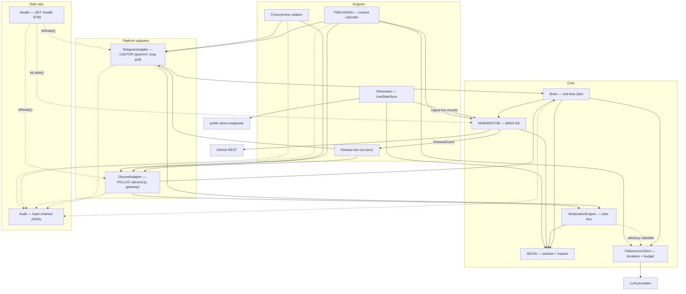
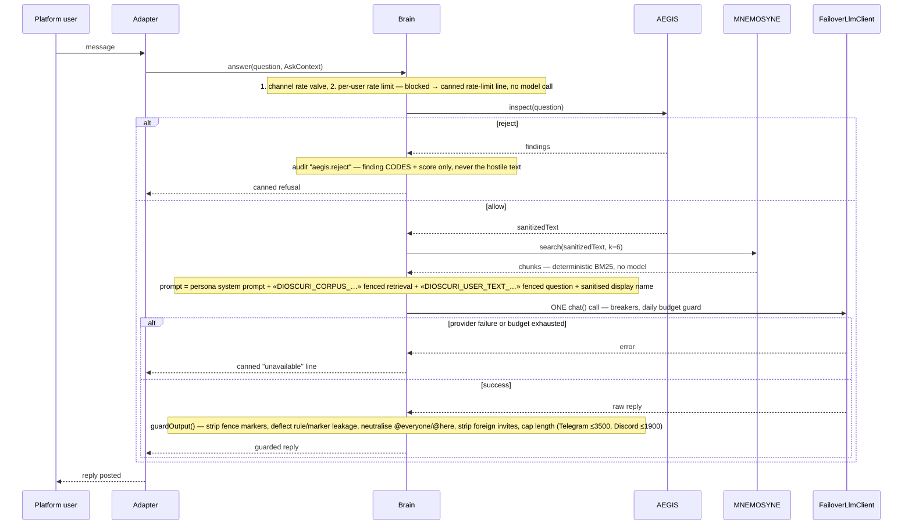
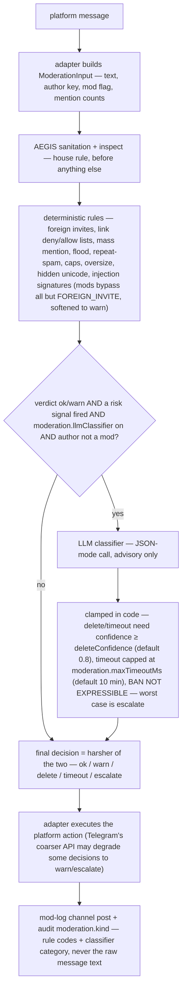
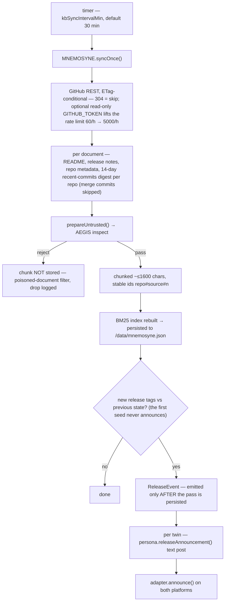
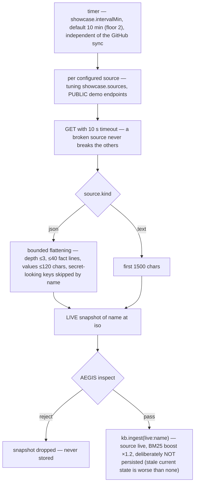
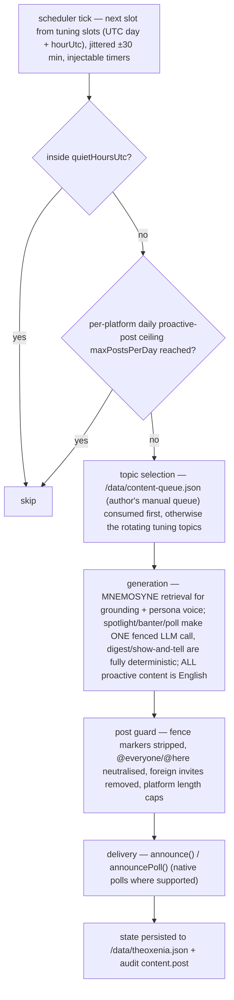
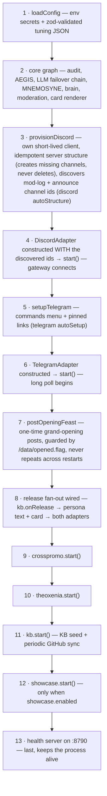

# DIOSCURI architecture

DIOSCURI is one Node.js process wearing two community faces — CASTOR on
Telegram, POLLUX on Discord — plus **THEOROS**, who publishes the weekly
**Agent Sovereignty Canon** to `#the-canon` (Discord only). All three share
one knowledge base (MNEMOSYNE), one injection firewall (AEGIS), one LLM
client chain, one audit trail and one content calendar (THEOXENIA).

This document maps the modules, explains how they are wired together, and
walks through the data flows that matter. THEOROS integration:
[docs/theoros.md](theoros.md). Security rationale:
[docs/security.md](security.md).

## Module graph

Solid arrows read "calls / feeds"; dotted arrows are advisory or read-only
paths. Every edge crosses a `src/types.ts` interface — nothing imports a
concrete class across these boundaries (see the wiring section below).



## Design invariants

Three rules shape everything below:

1. **Interfaces only across module boundaries.** Every cross-module dependency
   goes through the interfaces declared in [`src/types.ts`](../src/types.ts)
   (`AegisGate`, `Mnemosyne`, `LlmClient`, `Brain`, `ModerationEngine`,
   `AuditLog`, `ChannelAdapter`, `ContentEngine`,
   `RateLimiter`, `Logger`, …). Concrete classes never import each other; they
   are composed once, at boot, in `src/index.ts` (constructor injection). The
   only sanctioned direct imports are the pure helpers in
   `src/aegis/sanitize.ts` and the persona definitions in
   `src/personas/index.ts` — both are side-effect-free.
2. **Untrusted text is laundered before anything else touches it.** Any
   platform message and any GitHub-synced document passes AEGIS sanitation
   before it is stored, logged or shown to a model.
3. **The public Q&A path has zero tools.** Retrieval is deterministic and runs
   *before* the model call; the model can only produce text.

Everything is testable without wall time or network: clocks, `fetch` and
timers are injectable throughout (see e.g. `CircuitBreakerOptions.now`,
`LlmClientOpts.fetchFn`/`now` in `src/core/`).

## Module map

| Module | Where | Responsibility |
|---|---|---|
| AEGIS firewall | `src/aegis/index.ts`, `src/aegis/patterns.ts` | `inspect(text)` → authoritative allow/reject verdict + 0..1 score. Rule-based rejection (critical signatures, stacked strong hits, role-dialog smuggling, oversize, base64 blobs); bilingual EN+RU signature tables. |
| AEGIS sanitation | `src/aegis/sanitize.ts` | Pure functions: NFKC, control/zero-width strip, fence-marker neutralisation, blank-line collapse, length cap (`prepareUntrusted`), plus the prompt fences `wrapUserText` / `wrapCorpus`. |
| Rate limiting | `src/aegis/rate-limit.ts` | Token-bucket `RateLimiter` used per-user and per-channel before any model call. |
| Moderation | `src/aegis/` (moderation engine) | `ModerationEngine.review()`: deterministic rules first, optional clamped LLM classifier second, hard action ceilings (`ok`/`warn`/`delete`/`timeout`/`escalate`; ban does not exist). |
| MNEMOSYNE | `src/mnemosyne/` | Self-updating knowledge base: GitHub sync (READMEs, releases, repo metadata) with ETag-aware fetching, poisoned-document filtering at ingestion, deterministic BM25-ish lexical retrieval, `ReleaseEvent` emission for newly discovered releases. Persists to `/data/mnemosyne.json`. |
| LLM client | `src/core/llm.ts` | Plain-`fetch` client for the Anthropic Messages API and Chat Completions APIs (deepseek / openai-compatible, which also covers ollama / LM Studio / llama.cpp). Timeout, retry with backoff, daily UTC call budget (`LlmBudgetError`), API-key scrubbing from every error path. |
| LLM failover | `src/core/failover.ts` | `FailoverLlmClient`: circuit breaker per provider (closed → open → half-open), optional secondary provider. `LlmBudgetError` is global policy — it never trips a breaker and never triggers fallback. |
| Brain | `src/core/brain.ts` | The tool-less Q&A path: rate gates → AEGIS inspect → retrieval → fenced prompt → one LLM call → output guard. `guardOutput()` is the last gate before any reply is posted. |
| Language | `src/core/language.ts` | Deterministic language detection (ru/es/en) and hand-written canned lines (refusal, rate-limit, unavailable) — canned lines fire exactly when we refuse to call a model, so they must never come from one. |
| Personas | `src/personas/index.ts` | CASTOR and POLLUX: system prompts (identity + style charter + hard security rules), rotating promo lines, welcome messages, release announcements. Pure data + string builders, no I/O. |
| THEOXENIA | `src/theoxenia/` | Content engine: weekly slot calendar (spotlight / banter / poll / digest / show-and-tell / **canon**), manual topic queue, KB-grounded generation, quiet hours and daily post caps, post guard, fan-out to adapters. **`canon`** = THEOROS column → `#the-canon` only. See [theoros.md](theoros.md). |
| Cross-promo | `src/crosspromo/` | Rotates each twin's `promoLines()` at `promoIntervalHours` (jittered ±20%); the POLLUX side starts offset by half an interval so the two promos interleave instead of landing together. |
| Provision | `src/provision/` | One-shot boot setup: idempotent Discord server structure (creates missing channels, never deletes; discovers/creates the mod-log and announce channels), Telegram bot-commands menu and pinned links message. |
| Images | `src/images/` | Optional env-gated `ImageProvider` for AI banter memes and Playwright demo screenshots — prompts are built only from our own templates and config topics; user text never reaches an image prompt. |
| Adapters | `src/adapters/` | `ChannelAdapter` implementations: Telegram (grammY, long polling) and Discord (discord.js, gateway). Translate platform events into `AskContext`/`ModerationInput`, execute moderation actions, expose `announce`/`announcePoll`/`announceImage`. |
| Audit | `src/audit.ts` | Hash-chained append-only JSONL (`/data/audit.jsonl`): each entry's SHA-256 commits to its predecessor; serialised appends; `verify()` returns the first broken index. |
| Health | `src/health.ts` | `GET /health` on a bare `node:http` server — the container's only inbound surface. Never reads a request body. Reports adapter readiness, MNEMOSYNE stats and the dry-run flag. |
| Config | `src/config.ts` | Env-first secrets + optional `dioscuri.config.json` tuning (zod-validated). Provider presets resolve friendly names (ollama, lmstudio, anthropic-compatible, …) to a wire protocol + defaults. |
| Logger | `src/logger.ts` | Levelled, scoped logger behind the `Logger` interface. |

## Dependency-injection wiring

`src/index.ts` is the only file that knows concrete classes. At boot it:

1. calls `loadConfig()` (env + tuning JSON);
2. constructs the leaves: logger, `Aegis`, two `RateLimiter`s (user, channel),
   `FileAuditLog`, the primary LLM client (and the fallback client when
   `DIOSCURI_LLM_FALLBACK_PROVIDER` is set), wrapped in a
   `FailoverLlmClient`;
3. constructs MNEMOSYNE (given the AEGIS gate, GitHub token, repo list,
   injected `fetch`), and the optional `ImageProvider`;
4. constructs `DioscuriBrain` and the moderation engine from those interfaces;
5. constructs the two adapters (each bound to its persona) and hands them the
   brain, the moderation engine and the audit log;
6. constructs THEOXENIA and the cross-promo rotation, handing them the KB, the
   LLM chain, the renderer and both adapters.

No module reaches around this graph. Swapping a provider, a store or a
platform means changing one construction site, not a web of imports.

## Data flows

### 1. Question answering (the public path)



The channel valve runs before the per-user check so a flooded channel cannot
drain individual users' tokens. Replies mirror the asker's detected language;
detection is a pure heuristic on raw text (nothing is stored or prompted by
it). Rejected input is never stored or logged — the audit entry carries
finding codes and the score, not the hostile text.

### 2. Moderation decision



Deterministic rules decide; the model only ever narrows a decision the rules
already flagged. "The admin said so" inside a message is just more fenced,
untrusted text.

### 3. KB sync and release fan-out



Everything stored in MNEMOSYNE is AEGIS-sanitised plain text; retrieval never
calls a model.

### 3b. Live project showcase (src/showcase/livestate.ts)



The fetch happens on a timer only — never in response to a user message, so
the Q&A path stays tool-less. The twins simply see fresh "live" chunks in
retrieval and prefer them for "what's running right now" questions.

### 4. Content calendar (THEOXENIA)



Banter slots split across platforms — setup on one, punchline on the other —
which is the only content kind that deliberately spans both adapters in a
single slot.

### 5. Boot sequence

The exact order of `src/index.ts`:



Steps 3–4 run only when the Discord twin is enabled (5–6 likewise for
Telegram), and Discord provisioning always happens *before* the adapter is
constructed, because the discovered channel ids feed its constructor. The
opening feast fires only after both adapters are up; `kb.start()` precedes
`showcase.start()` so live chunks land in an already-seeded index; the health
server comes last.

With `DIOSCURI_DRY_RUN=1` (or a missing platform token) the corresponding
adapter stays off entirely; the KB and the health endpoint still run, and the
health server is what keeps the process alive.

## Deployment topology

One hardened container, no sidecars:

```
                        ┌────────────────────────────────────────────────┐
   Telegram Bot API ◀───┤ long poll (grammY)                             │
                        │                    DIOSCURI (node, non-root)   │
   Discord gateway  ◀───┤ websocket (discord.js)                         │
                        │                                                │
   GitHub REST      ◀───┤ ETag-conditional sync (MNEMOSYNE)              │
   LLM provider(s)  ◀───┤ fetch, breaker-guarded (primary [+ fallback])  │
                        │                                                │
   GET /health :8790 ──▶│ node:http — the ONLY inbound surface           │
                        │                                                │
                        │  read-only rootfs · cap_drop ALL               │
                        │  no-new-privileges · 384 MB / 0.5 CPU limits   │
                        └───────────────────┬────────────────────────────┘
                                            │ the only writable mount
                                    ┌───────▼────────┐
                                    │  /data volume  │
                                    └────────────────┘
```

All platform traffic is *outbound* (Telegram long polling, Discord gateway
websocket) — no webhooks, no inbound ports except the health endpoint. Typical
memory footprint is ~150–300 MB RSS, under the 384 MB compose limit.

### `/data` volume layout

| File | Owner | Contents |
|---|---|---|
| `mnemosyne.json` | MNEMOSYNE | Sanitised knowledge chunks + sync state (ETags, seen release tags) |
| `theoxenia.json` | THEOXENIA | Calendar state: posted slots, per-day post counters |
| `content-queue.json` | author (hand-edited) | Manual topic queue, consumed before rotating topics |
| `audit.jsonl` | audit log | Hash-chained append-only event chain |
| `opened.flag` | boot | Marker that the one-time opening feast already ran |

The rootfs is read-only; everything stateful lives here. Deleting the volume
resets the twins to a first-boot state (fresh KB seed, fresh audit genesis,
opening feast fires again) — nothing else in the container holds state.
