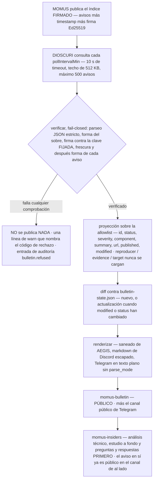
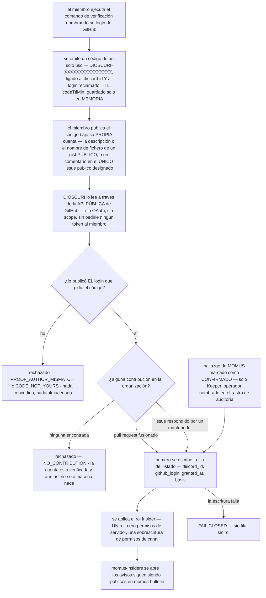

# Acceso comunitario de DIOSCURI — el boletín público y la puerta Insider

> 🌐 Idiomas: [English](community-access.md) · [Русский](community-access-ru.md) · **Español** · [Français](community-access-fr.md) · [中文](community-access-zh.md)

Del boletín de seguridad de MOMUS salen dos canales, y no son la misma clase de
cosa. `#momus-bulletin` es **público**: lo lee cualquiera en el servidor, y los
avisos (advisories) se publican en el mismo momento en que se emiten.
`#momus-insiders` se **gana**, y lo que contiene es el análisis técnico
(write-up), el estudio a fondo y las preguntas y respuestas — nunca el aviso en
sí.

Este documento explica qué aterriza dónde, qué verifica DIOSCURI antes de decir
una palabra, cómo se gana el rol `Insider`, qué se almacena exactamente sobre
una persona y —sin rodeos— el razonamiento detrás de cada una de esas
decisiones. Cada afirmación está contrastada con el código; donde existe un
ajuste, se nombra la clave de configuración. El análisis de amenazas vive en
[security.md](security.md); la operación del día 2, en [usage.md](usage.md).

Código: `src/bulletin/` (publicador, verificador, renderizador, estado),
`src/community/` (la puerta, el lector de GitHub, el listado),
`src/provision/structure.ts` (los canales y el único rol).

## 1. Dos canales, una regla

| Canal | Quién lo lee | Qué aterriza allí | Política de permisos |
|---|---|---|---|
| `#momus-bulletin` | **todo el mundo** | cada aviso verificado, en cuanto verifica; se actualiza cuando alguno cambia | `readonly` — lectura pública, escribible por el bot |
| `#momus-insiders` | quienes tienen `Insider` | el análisis técnico, el estudio a fondo, las preguntas y respuestas — comentario sobre avisos que ya son públicos en el canal de al lado | `insidersonly` — oculto a `@everyone`, abierto por un solo rol |

La regla que decide todos los casos ambiguos:

> **La exclusividad está en el MOMENTO y en el COMENTARIO, nunca en la información.**

Un aviso es público en el instante en que se emite. Lo que los insiders reciben
antes es nuestra prosa sobre él. Si alguna vez una pregunta de diseño se reduce
a «¿debería restringirse este hecho?», la respuesta es no.

La categoría del boletín en sí **no** está restringida, deliberadamente
(`BULLETIN_CATEGORY` en `src/provision/structure.ts`): solo lo está el canal
del análisis técnico que vive dentro de ella.

Una nota para el operador sobre `readonly`: el aprovisionador crea
`#momus-bulletin` de forma que solo el bot pueda publicar, mientras que el
topic del canal invita a la discusión. Si quieres que los lectores respondan en
el propio canal, abre `SendMessages` para `@everyone` a mano — el
aprovisionador solo fija permisos en los canales que crea él, y nunca toca uno
adoptado, así que tu cambio sobrevive a cada arranque posterior.

## 2. Qué aterriza en `#momus-bulletin`, y por qué es público

### La publicación

Un mensaje por aviso: un embed de Discord y un mensaje de texto plano de
Telegram para el canal público de Telegram. Existen exactamente estos campos
porque son exactamente los que carga el verificador (`toAdvisory` en
`src/bulletin/verify.ts`):

| Campo | Se muestra como | Notas |
|---|---|---|
| `id` | título del embed, p. ej. `MOMUS-2026-0007` | restringido a un juego de caracteres, no meramente escapado |
| `status` | insignia — 🔴 OPEN / 🟢 FIXED / ⚪ WITHDRAWN | emoji + palabra + color del embed, para que el estado sobreviva a un lector daltónico, a un tema oscuro y a una notificación de móvil de una sola línea |
| `severity` | `info … critical` | un valor no reconocido se renderiza como `unspecified`, nunca se devuelve como eco |
| `component` | campo, 80 caracteres | lo afectado, p. ej. `aimarket-hub` |
| `summary` | descripción, 700 caracteres | prosa remota no confiable — saneada y después escapada para markdown |
| `url` | enlace del embed | **solo https, y solo en el propio origen del índice del boletín** |
| `published` / `modified` | campos | se muestran literalmente, así que deben parecer fechas o se descartan |

Para un aviso `open`, la publicación lleva además una línea nuestra:

> ⚠️ **Aviso abierto** — deliberadamente no accionable: sin pasos de
> reproducción, sin evidencias, sin objetivo. El detalle se publica cuando
> llega la corrección.

Esa línea no es decoración. Un aviso escueto se lee como un aviso que alguien
olvidó terminar, salvo que digas que la omisión es justamente el punto — y el
renderizador presupuesta el resumen remoto frente a nuestras propias líneas
precisamente para que un resumen largo y hostil no pueda empujar esa
advertencia fuera del final del embed (`src/bulletin/render.ts`).

### Qué no aterriza nunca allí

`reproducer`, `evidence`, `poc`, `target_url` — y cualquier otra cosa que pueda
traer el payload. No se filtran aguas abajo: **nunca se cargan**. El
verificador proyecta cada registro sobre una allowlist (lista blanca) de ocho
campos, de modo que ningún renderizador puede alcanzar un exploit y ninguna
edición futura de una plantilla puede interpolar uno. El diseño de divulgación
de MOMUS ya omite esos campos de los avisos `open`; este es el segundo cerrojo,
en nuestro lado del cable, porque «el publicador lo prometió» no es un control
que nos pertenezca.

### Por qué el canal es público

Porque el valor de un boletín de seguridad es que **lo lea la gente afectada**.

Poner los avisos detrás de cualquier tipo de prueba de lealtad —una
contribución, una suscripción, una estrella, un nivel de «supporter»— significa
que alguien que está ejecutando nuestro código no se entera de que su
componente tiene un agujero abierto. Y lo sigue ejecutando. Eso no es una
ventaja para la comunidad con un inconveniente; es el modo de fallo que el
boletín existe para evitar, y ninguna ganancia en interacción lo paga.

El diseño es coherente consigo mismo también en la otra dirección: los avisos
`open` de MOMUS son deliberadamente **no accionables** —sin pasos de
reproducción, sin evidencias, sin objetivo— *precisamente para que puedan ser
públicos*. El argumento habitual para restringir la divulgación es que el
detalle arma a los atacantes más rápido de lo que avisa a los defensores. Ese
argumento no se aplica a un documento que no contiene detalle alguno. Publicar
«este componente tiene un hallazgo abierto de esta severidad» le dice a un
defensor que mire y no le dice a un atacante nada que pueda usar. El detalle se
publica cuando llega la corrección.

Así que hay dos cerrojos y apuntan en la misma dirección: al aviso se le quita
todo lo accionable y, *porque* se le ha quitado, puede llegar a todo el mundo.

### Nuevo frente a actualización

El fichero de estado (`bulletin-state.json`, una línea por id de aviso)
recuerda lo que ya anunciamos. Un aviso se vuelve a anunciar como
**actualización** cuando su marca `modified` avanza **o** cuando cambia su
estado — el estado se compara por separado a propósito, porque un publicador
que pase de `open → fixed` sin tocar `modified` dejaría el canal en silencio
justo sobre la transición que los lectores están esperando.

El fichero de estado guarda ids de avisos, la revisión anunciada e ids de
mensajes de cada plataforma. Nada sobre una persona: ningún id de miembro,
ningún quién-leyó-qué, ninguna interacción de ningún tipo — y tampoco el texto
de los avisos, porque el boletín es público y una copia local solo sería una
segunda fuente de verdad que puede desviarse de la de MOMUS.

## 3. DIOSCURI verifica antes de decir una palabra

MOMUS publica el boletín como UN único índice firmado:

```json
{ "advisories": [ … ], "timestamp": 1754650000000, "signature": "<hex ed25519>" }
```

`signature` es Ed25519 sobre la forma canónica RFC 8785 (JCS) de
`{advisories, timestamp}` — el mismo sobre que MOMUS ya usa para el feed de
amenazas de WARDEN, y la misma forma de verificación que ARGUS le aplica. Un
sobre, un canonicalizador, una filosofía de fallo.

**Por qué existe esto siquiera.** Todo lo que DIOSCURI publica sale bajo
nuestro propio bot comunitario, en nuestro propio nombre, a un canal público.
Un aviso sin verificar significaría que quien controle la ruta de red entre
nosotros y MOMUS —un proxy, una respuesta DNS, un borde comprometido— puede
publicar acusaciones de seguridad contra componentes con nombre y apellidos
como si las hubiéramos hecho nosotros. La verificación aquí no es un detalle de
cortesía; es la diferencia entre un boletín y un megáfono apuntando a
desconocidos.



### Las cinco propiedades, y por qué ese orden

| Orden | Comprobación | Códigos de rechazo | Por qué |
|---|---|---|---|
| 1 | parseo JSON estricto | `UNPARSEABLE` | las claves duplicadas y los literales no enteros son una decisión que le toca tomar al publicador, no al parser |
| 2 | forma del sobre, tamaño, recuento | `MALFORMED`, `OVERSIZED` | `timestamp` es **obligatorio**: uno opcional significaría «un índice que lo omite es fresco para siempre» |
| 3 | Ed25519 contra la clave **fijada** | `NO_PUBKEY`, `BAD_PUBKEY`, `NO_CANONICAL_FORM`, `SIGNATURE_INVALID` | autenticidad. Sin pin configurado no se publica nunca nada — un boletín sin firmar se rechaza, no se le confía por el mero hecho de haber llegado |
| 4 | frescura, la **última** | `STALE`, `FUTURE_DATED` | hasta que la firma verifica, `timestamp` es un número que eligió un atacante, así que rechazar por él no probaría nada |
| 5 | forma de cada aviso | *se descarta el registro, se conserva el índice* | un aviso mal formado no debe silenciar a los que están bien |

La frescura merece su propia frase, porque es la comprobación que la gente da
por redundante. Una firma dice **quién** escribió un documento; nunca dice
**cuándo te lo entregaron**. Sin una ventana de frescura, quien sirva la URL
puede reproducir para siempre un snapshot de hace meses y borrar en silencio
todos los avisos publicados desde entonces. Para un boletín, ese borrado *es*
el ataque: el aviso que un operador más querría suprimir es el más reciente.
Ventana por defecto: 24 h (`tuning.bulletin.maxAgeHours`, 1–336). Puede
ampliarse para una cadencia de publicación más lenta. No puede desactivarse.

El tamaño y el recuento son las guardas aburridas que impiden que un publicador
hostil o averiado se lleve el proceso por delante: 512 KB de cuerpo, 500
avisos, 10 segundos de timeout de descarga y un tope de 4000 caracteres en
cualquier campo que conservemos.

### Qué ve un operador cuando falla una comprobación

**No se publica nada.** Ni una publicación parcial, ni una publicación «de
mejor esfuerzo» con una salvedad, ni el snapshot del ciclo anterior reenviado.
La comunidad ve un canal sin cambios — lo cual se parece *exactamente* a «MOMUS
no ha publicado nada últimamente». Esa ambigüedad es la razón de que el fallo
sea ruidoso del lado del operador, en tres sitios:

1. **Una línea de advertencia por ciclo**, que nombra el código y el motivo:

   ```json
   {"ts":"2026-08-08T12:00:00.000Z","level":"warn",
    "msg":"bulletin index REFUSED — nothing posted","code":"STALE",
    "reason":"signed snapshot is 51.2 h old, past the 24 h limit — REJECTED as a possible replay hiding newer advisories"}
   ```

2. **Una entrada de auditoría**, encadenada por hash como todo acto con
   consecuencias:

   ```json
   {"kind":"bulletin.refused","actor":"dioscuri","subject":"https://momus.modelmarket.dev/bulletin",
    "data":{"code":"SIGNATURE_INVALID","reason":"Ed25519 signature does not match the pinned key — index REJECTED, nothing posted"}}
   ```

3. **Una advertencia en el arranque** cuando la funcionalidad está mal
   configurada, porque un pin ausente, si no, se ve idéntico a un publicador
   callado:

   ```text
   bulletin publisher not started — no pinned publisher key; an unverified advisory is never posted
   bulletin publisher not started — no channel configured
   ```

Merece la pena vigilar dos advertencias más, porque ambas significan que un
índice *firmado* traía algo que no repetiríamos:

```text
bulletin: advisories dropped for failing shape validation        (dropped=N)
bulletin: advisory links dropped for pointing off the index origin (droppedLinks=N)
```

La segunda importa más de lo que parece: verificamos *quién* escribió el
índice, lo cual no es una promesa sobre adónde apunta, y un enlace pulsable en
un boletín de seguridad es el enlace más confiable del canal. Un enlace fuera
del origen o que no sea https se descarta; el aviso se publica igualmente, solo
que sin hipervínculo.

Lista completa de códigos de rechazo: `NO_URL`, `NO_PUBKEY`, `FETCH_FAILED`,
`HTTP_ERROR`, `OVERSIZED`, `UNPARSEABLE`, `MALFORMED`, `BAD_PUBKEY`,
`NO_CANONICAL_FORM`, `SIGNATURE_INVALID`, `STALE`, `FUTURE_DATED`, más los de
nivel de ciclo `NO_SINKS`, `ALREADY_RUNNING` e `INTERNAL_ERROR`.

### Aquí nada lanza excepciones

`BulletinPublisher.runOnce()` captura todo y resuelve con un objeto de
resultado, de modo que la ruta programada nunca puede tumbar el bot: un
publicador que revienta el proceso porque un feed estaba caído es peor que uno
que se salta un ciclo. Un destino que lanza una excepción se registra y se
omite — la otra plataforma recibe igualmente el aviso, y el que falló se
reintenta en el ciclo siguiente durante un máximo de 24 h (lo bastante como
para cubrir una caída y un reinicio, lo bastante poco como para que un canal
configurado más tarde no reciba tres años de historia de golpe). El estado se
guarda después de **cada** publicación exitosa, así que un fallo a mitad de
ejecución no puede volver a anunciar lo que ya salió, y `maxPostsPerRun` (5 por
defecto) hace que un arranque en frío gotee en lugar de inundar.

### Cómo activarlo

Apagado por defecto, y doblemente fail-closed (denegar por defecto): activarlo
no basta:

| Clave | Por defecto | Significado |
|---|---|---|
| `tuning.bulletin.enabled` | `false` | interruptor maestro |
| `tuning.bulletin.indexUrl` | `https://momus.modelmarket.dev/bulletin` | el índice firmado |
| `tuning.bulletin.publicKey` | `""` | **el pin** — Ed25519 en SPKI DER hexadecimal. Vacío significa que nunca se publica nada |
| `tuning.bulletin.maxAgeHours` | `24` | ventana de frescura, 1–336 |
| `tuning.bulletin.pollIntervalMin` | `30` | mínimo 5 |
| `tuning.bulletin.maxPostsPerRun` | `5` | 1–25 |
| `tuning.bulletin.writeupBaseUrl` | `""` | URL base del análisis técnico para insiders; vacío no renderiza ninguna línea de análisis |
| `DISCORD_BULLETIN_CHANNEL_ID` | *(automático)* | el aprovisionador crea y descubre `#momus-bulletin`; ponlo solo para fijar un canal que hayas colocado tú |
| `TELEGRAM_BULLETIN_CHAT_ID` | *(vacío)* | vacío significa que el lado de Telegram queda apagado — los avisos **nunca** se pliegan al chat principal como alternativa |

`publicKey` es una clave *pública*, así que vive en el fichero de tuning no
secreto — pero es un **pin**, y es la única razón por la que podemos repetir
bajo nuestro propio bot las acusaciones de MOMUS sobre componentes con nombre.

## 4. Ganar `Insider` — tres vías de contribución

La puerta es **contribución, nunca respaldo**. CUALQUIERA de estas gana el rol:

| Base | Qué califica | Cómo se comprueba |
|---|---|---|
| `pr` | un **pull request fusionado** en la organización configurada | una búsqueda pública, `is:pr is:merged author:<login> user:<owner>` |
| `issue` | un **issue que abriste y que respondió un mantenedor** | búsqueda pública de los issues que creaste y después los comentarios de hasta 5 de ellos |
| `finding` | un **hallazgo de MOMUS que un operador marcó como CONFIRMADO** | un Keeper nombra al miembro de Discord; el rastro de auditoría registra quién lo hizo |

Las contribuciones en cualquier otro sitio del mundo no cuentan — el
calificador `user:` acota ambas búsquedas al owner configurado
(`githubOwner`). Contribuir al proyecto de otra persona te convierte en insider
de otra persona.

Por qué contribución y no respaldo, dicho con todas las letras: un «haz esto y
obtén acceso» dirigido a un respaldo es interacción incentivada según las
Acceptable Use Policies de GitHub, y un proyecto cuyo posicionamiento entero es
la auditabilidad no puede permitírselo. Una comprobación permanente de «¿nos
sigue respaldando?» sería peor: significaría sondear para siempre la actividad
de GitHub de personas concretas y guardar un historial de interacción. Eso es
vigilancia, más un conjunto de datos que después tendríamos que proteger. La
contribución selecciona a las personas que **dieron** algo en lugar de a las
que hicieron clic en algo.

### Por qué la vía del issue exige la respuesta de un mantenedor

Porque sin ella la puerta se lee como «abre un issue vacío».

Esa versión selecciona ruido: un tracker que se llena de issues de una línea
abiertos para superar un listón, que entierran debajo los reportes de verdad.
Exigir que alguien de nuestro lado del proyecto *respondiera* significa que el
issue merecía una respuesta — el juicio lo hace una persona haciendo su trabajo
normal de mantenimiento, no una regla que un farmeador pueda satisfacer a
propósito.

Dos detalles mantienen eso honesto:

- «Mantenedor» es el **propio** campo `author_association` de GitHub —
  `OWNER`, `MEMBER` o `COLLABORATOR`. No es una lista que curemos nosotros, así
  que no puede convertirse calladamente en una lista de favoritos.
- El comentario que responde no puede ser del propio miembro. Responderte a tu
  propio issue es exactamente el farmeo que esta cláusula existe para cerrar.

La comprobación mira hasta 5 issues creados por la persona (acotando el coste
de API), y un issue ilegible se omite en lugar de tratarse como un veredicto
sobre la persona.

### Por qué la vía del hallazgo pasa por un humano

La recepción de reportes de MOMUS es **anónima por diseño**. Por tanto no
existe ningún vínculo automático entre un reporte anónimo y una persona, y este
módulo no se inventa uno: un operador nombra el handle de Discord y asume la
responsabilidad.

La vía es exclusiva de los Keeper, y quien la llama debe declarar
`operatorIsKeeper` explícitamente — un futuro borde de plataforma que se olvide
de comprobar el rol Keeper tiene que pasar una mentira literal para
atravesarla, y eso es fácil de detectar en una revisión. La entrada de
auditoría registra qué operador lo hizo y, opcionalmente, el id del aviso que
lo justificaba. `github_login` es opcional en esta vía y se almacena como `""`
cuando falta: un buscador anónimo puede no tener cuenta que nombrar, e
inventarle una metería una ficción en el listado.

## 5. Probar una cuenta de GitHub sin OAuth

Nunca le pedimos un token a un miembro.

Un token de acceso capaz de leer la actividad de alguien es muchísimo más poder
del que necesita «controlo esta cuenta», y aceptarlo nos convierte en su
custodio: ahora hay una credencial en nuestro proceso, en nuestros logs si
alguien se descuida y en nuestras copias de seguridad. Lo que se está probando
es un solo bit: *este miembro de Discord controla esa cuenta de GitHub.* Un
desafío público prueba exactamente ese bit y nos deja sin nada en las manos.



### Los tres pasos

1. **Emitir.** El miembro ejecuta el comando de verificación nombrando su login
   de GitHub. Emitimos `DIOSCURI-` + 16 caracteres hexadecimales, ligado a su
   id de Discord *y* al login reclamado, con un TTL (30 min por defecto,
   `tuning.insiders.codeTtlMin`). Este paso es offline — todavía no ocurre
   ninguna petición a GitHub, así que un login mal escrito no le cuesta a nadie
   una llamada a la API.
2. **Publicar.** El miembro publica ese código bajo su propia cuenta: un **gist
   público** con el código en su descripción o en un nombre de fichero, o un
   comentario que lo contenga en **un único** issue público designado
   (`tuning.insiders.proofRepo` + `proofIssue`).
3. **Leer.** Lo leemos igual que podría hacerlo cualquier desconocido —
   listados de gists (solo descripción y nombres de fichero, nunca el contenido
   de los ficheros) y los comentarios de ese único issue, acotados a los
   comentarios posteriores al desafío — y confirmamos que el login del
   **autor** es el login que se reclamó.

### El código no es un secreto, y está bien así

Tiene que publicarse; ese es todo el mecanismo. Es seguro publicarlo porque
está ligado por partida doble:

- un desconocido que lo copie de un canal **no puede canjearlo** — el canje va
  indexado por el id de Discord para el que se emitió (`CODE_NOT_YOURS`);
- un desconocido **no puede hacerlo pasar por su propia prueba** — una prueba
  tiene que estar escrita por el login que pidió el código
  (`PROOF_AUTHOR_MISMATCH`).

Cuando el código de otra persona aparece bajo una cuenta, el rechazo es
ruidoso, y el login de la *otra* parte nunca se devuelve como eco: eso
repartiría un mapeo GitHub↔Discord a quien lo pidiera. El código es de un solo
uso por borrado, y los códigos caducados se descartan en el instante en que se
detectan, de modo que un código muerto nunca pueda confundirse con uno vivo.

Aun así, el borde de plataforma debería responder **en privado** (respuesta
efímera o mensaje directo) — no porque el código sea un secreto, sino porque un
canal público lleno de códigos de verificación ajenos es ruido que confunde.

### La prueba antes que la contribución, siempre

El orden en `redeem()` es estructural. Una comprobación de contribución es una
afirmación sobre una **cuenta**; ejecutarla antes de saber que el miembro
controla esa cuenta permitiría a cualquiera atribuirse el trabajo de cualquier
colaborador. Así que: primero la prueba, segundo la contribución, tercero la
concesión.

### Límites con los que un miembro puede topar

| Código | Significado | Qué se le dice al miembro |
|---|---|---|
| `BAD_LOGIN` | no es un login de GitHub plausible (letras, dígitos, guiones interiores sueltos, ≤ 39 caracteres) | que no parece un nombre de usuario |
| `ALREADY_INSIDER` | ya tiene el rol | nada que hacer; que pregunte a un Keeper si el rol falta en su perfil |
| `LOGIN_ALREADY_CLAIMED` | esa cuenta de GitHub ya ganó el rol para otro miembro | se dice **sin** nombrar a quién — una cuenta, una persona |
| `NO_PROOF_CHANNEL` | no está configurada ni la vía del gist ni un issue | un Keeper tiene que configurar una |
| `BUSY` | más de 500 desafíos en curso | que lo intente de nuevo en unos minutos |
| `NO_CHALLENGE` / `EXPIRED` | no hay nada pendiente, o pasó el TTL | que vuelva a empezar la verificación |
| `TOO_SOON` | los intentos de canje se espacian 20 s | cuántos segundos quedan |
| `PROOF_NOT_FOUND` | el código todavía no está publicado bajo esa cuenta | dónde puede publicarlo |
| `CODE_NOT_YOURS` / `PROOF_AUTHOR_MISMATCH` | el código de otra persona, o el código correcto bajo la cuenta equivocada | que ejecute el comando él mismo / que lo publique bajo la cuenta que nombró |
| `NO_CONTRIBUTION` | cuenta verificada, ninguna contribución que califique | las tres vías, enumeradas con claridad — un «no» a secas se lee como un bot roto |
| `GITHUB_UNAVAILABLE` | no pudimos alcanzar GitHub | *«No se te tiene nada en cuenta en contra — inténtalo de nuevo en unos minutos.»* |
| `NOT_OPERATOR` | la vía del hallazgo la llamó alguien que no es Keeper | solo un Keeper puede confirmar un hallazgo |
| `STORAGE_FAILED` | no se pudo escribir el listado | el rol **no** se aplicó; inténtalo de nuevo en breve |

El espaciado de 20 segundos existe porque un canje cuesta hasta nueve
peticiones públicas a GitHub y el comando está abierto a todo el mundo en el
servidor: sin él, un solo miembro dejando la tecla pulsada quema el límite de
peticiones compartido de toda la comunidad. `GITHUB_UNAVAILABLE` está redactado
como está a propósito — una caída de GitHub tiene que leerse como *«no pudimos
comprobarlo»*, nunca como *«no eres colaborador»*.

### Cómo activarlo

| Clave | Por defecto | Significado |
|---|---|---|
| `tuning.insiders.enabled` | `false` | interruptor maestro |
| `tuning.insiders.proofRepo` | `""` | repo que aloja el issue de verificación designado; vacío apaga la vía del issue |
| `tuning.insiders.proofIssue` | `0` | el número del issue; `0` apaga la vía |
| `tuning.insiders.allowGistProof` | `true` | aceptar un gist público como prueba |
| `tuning.insiders.codeTtlMin` | `30` | minutos que un código emitido sigue siendo canjeable, 1–1440 |
| `GITHUB_TOKEN` | *(opcional)* | el token **propio del bot**, ya presente en la configuración para MNEMOSYNE. Se envía solo para elevar el límite de peticiones en lecturas públicas; nunca se registra en logs, nunca sale del módulo |

Todo lo del bloque de tuning es no secreto — un owner, un repo, un número de
issue, un TTL. Probar una cuenta de GitHub no necesita ningún secreto de nadie,
así que no hay ninguno que configurar.

## 6. Las estrellas no se leen. En absoluto.

Ningún nivel de acceso. Ninguna insignia. Ningún rol cosmético. Ni siquiera una
comprobación puntual.

Un diseño anterior concedía un rol cosmético con una única lectura de
estrellas. Ya no está, y esta es la razón:

- **Una puerta de «estrella mantenida» exigiría vigilar a la gente.** «Ha dado
  una estrella» es barato de leer una vez y carece de sentido después — la
  pregunta interesante es si la estrella *sigue* ahí, y responderla significa
  sondear periódicamente la actividad de GitHub de personas concretas y guardar
  un historial de interacción. Eso es vigilancia de las personas a las que
  supuestamente estamos recompensando, y fabrica un conjunto de datos que
  después tendríamos que proteger. No hay ninguna versión de esto que sea a la
  vez significativa y respetuosa.
- **Incluso un rol cosmético es una superficie de permisos que se desplaza.**
  Un rol que hoy no significa nada es exactamente la clase de cosa que dentro
  de seis meses adquiere una sobrescritura de permisos en un canal porque
  resultaba cómodo. La forma de mantener un rol inofensivo es no crearlo.
- **Y sería un respaldo comprado con acceso**, que es justo lo que las
  Acceptable Use Policies de GitHub llaman interacción incentivada, y lo último
  que debería estar haciendo un proyecto que vende auditabilidad.

La ausencia es **estructural**, no una cuestión de disciplina:

- ninguna ruta de estrellas entre las cuatro que usa la funcionalidad (listado
  de gists, comentarios de un único issue, dos búsquedas);
- ningún método en `GithubPublicReader` que pudiera responder a la pregunta —
  una edición futura no puede «solo echar un vistazo» por una puerta que nunca
  se construyó;
- ningún campo de estrellas en el listado (`src/community/store.ts`);
- ninguna palabra de estrella en una base de concesión — el enum de bases es
  `pr | issue | finding`, y deliberadamente no hay ningún sitio donde registrar
  otra cosa.

Y está probado dos veces, en `test/community-access.test.ts`: una escaneando el
código fuente del módulo en busca de la ruta y los nombres de campo de
estrellas, y otra con un cliente de GitHub falso que registra **cada propiedad
a la que la puerta intenta acceder**.

Si alguien le da una estrella al proyecto, aquí nada lo nota, lo registra ni lo
recompensa.

## 7. Qué se almacena exactamente sobre una persona

Cuatro campos. Una fila por miembro que ganó el rol, en `insiders.json` dentro
del directorio de datos (`/data` en Docker):

```json
{
  "insiders": [
    {
      "discord_id": "1234567890",
      "github_login": "octocat",
      "granted_at": "2026-08-08T12:00:00.000Z",
      "basis": "pr"
    }
  ]
}
```

`discord_id` — a quién pertenece el rol. `github_login` — la cuenta que lo ganó
(con las mayúsculas y minúsculas tal como las escribe GitHub; `""` para una
concesión de operador en nombre de un buscador anónimo). `granted_at` — cuándo.
`basis` — `pr`, `issue` o `finding`.

Ese es el registro completo. Los cuatro nombres se exportan como
`INSIDER_FIELDS` para que un test pueda exigirnos cuentas, el fichero se
escribe campo a campo en lugar de esparciendo la fila en memoria, y las claves
desconocidas se eliminan al cargar — un fichero editado a mano que añada
`email` o un rastro de actividad no puede colarlo de vuelta.

**No se almacena:** ningún historial de interacción, ningún registro de
actividad, ningún correo electrónico, ningún nombre visible, ningún recuento de
estrellas ni ninguna marca de estrella de ningún tipo, ninguna confirmación de
lectura, ningún registro de las acciones de otras personas y **ninguna copia de
las evidencias**. La contribución que ganó el rol es pública en GitHub y
cualquiera puede volver a comprobarla, así que guardar nuestra propia copia
solo construiría un expediente privado que después tendríamos que proteger.

Las verificaciones pendientes se mantienen **solo en memoria** y nunca se
persisten: un desafío pendiente es un id de Discord más un login reclamado —
datos sobre alguien que todavía no ha ganado nada. Que un reinicio lo olvide
cuesta un comando; persistirlo significaría almacenar a personas que nunca
volvieron.

### Por qué almacenar algo siquiera

Porque el rol de Discord es una *proyección*, no el registro. Un miembro que
pierda el rol en una reconstrucción del servidor tiene que recuperarlo sin
volver a probar nada, y una persona que pide ser olvidada no debe dejar nada
atrás — lo cual solo es posible si hay exactamente un sitio del que borrar.

Esa es también la razón de que la persistencia sea **fail-closed**: si el
listado no se puede escribir, el rol no se concede (`STORAGE_FAILED`). Un rol
sin ningún registro detrás no se puede explicar ni olvidar, y ambas cosas
importan más que la comodidad. El orden inverso no da problemas: si la
escritura del listado tiene éxito y falla la llamada a la API de Discord, el
derecho existe y el rol se vuelve a aplicar en la siguiente reconciliación.

### Cómo ser olvidado

Un comando, de la propia persona o de un operador. La fila se **borra** — no se
marca, no se etiqueta como «revocada»: un marcador de revocación significaría
que el listado sigue recordando que este id de Discord fue insider alguna vez,
que es lo contrario de lo que pidió quien pide ser olvidado. Se retira el rol
`Insider`, se descarta cualquier desafío pendiente, y la respuesta es:

> Listo — tu fila está borrada y el rol retirado. No se conserva nada sobre ti.

Si no había nada almacenado, lo dice en su lugar. Si el borrado en sí falla, a
la persona se le dice sin rodeos que se ha pedido a un Keeper que lo termine a
mano, en vez de decirle «listo».

La retirada del rol es de mejor esfuerzo por diseño: un rol obsoleto sin fila
es visible para los moderadores y arreglable, mientras que una revocación
fallida nunca debe resucitar la fila que acabamos de borrar.

Una salvedad honesta, ampliada en la sección de riesgos residuales de más
abajo: el log de auditoría encadenado por hash es append-only (solo añade), así
que la línea `insiders.grant` permanece en él.

## 8. Lo que esto no es

- **No es un muro de pago.** Aquí no hay nada en venta, y ninguna cantidad de
  dinero mueve la puerta. La única moneda es una contribución a este
  ecosistema, y la más barata que califica es un issue que merezca la respuesta
  de un mantenedor.
- **No es una puerta de estrellas.** Las estrellas no se leen para dar acceso,
  ni para una insignia, ni una sola vez. Véase §6 — no existe ninguna ruta de
  código que pudiera leer una.
- **No es una forma de ocultar información de seguridad a la gente afectada por
  ella.** Los avisos son públicos en `#momus-bulletin` en el momento en que
  verifican. Lo que está restringido es nuestro comentario — el análisis
  técnico, el estudio a fondo, las preguntas y respuestas. Si estás ejecutando
  un componente afectado, todo lo que necesitas para actuar está en el canal
  público, y no necesitas ningún rol, ninguna cuenta ni ninguna relación con
  nosotros para leerlo.
- **No es una concesión de permisos.** `Insider` no lleva **ningún** permiso de
  servidor y no es mencionable — todo su trabajo es una sobrescritura de
  permisos en un canal. Un canal restringido cuyos miembros pueden ser
  mencionados con @ por cualquiera filtra quién está dentro.
- **No es un nivel de moderación.** Los Keeper moderan; los insiders leen un
  canal. Los dos roles no tienen relación, y la puerta no puede repartir
  ninguno de los dos por iniciativa propia.
- **No es «exactamente un rol más algunos pequeños».** Exactamente un rol. Cada
  rol adicional es una superficie de permisos que se desplaza.

## 9. Rastro de auditoría

Ambas funcionalidades escriben en el `audit.jsonl` encadenado por hash descrito
en [usage.md §6](usage.md#6-audit--the-flight-recorder):

| `kind` | Cuándo se escribe | `data` |
|---|---|---|
| `bulletin.refused` | falló la verificación, la frescura o el tamaño | `{ code, reason }` — el subject es la URL del índice |
| `bulletin.post` / `bulletin.update` | se anunció un aviso | `{ status, severity, component, sinks }` — el subject es el id del aviso |
| `insiders.grant` | se concedió el rol | `{ basis, github_login }` y, en la vía del operador, el id del lead de MOMUS — el subject es `dc:<discord id>`, el actor es `pollux` o la clave del operador |
| `insiders.forget` | se borró una fila | `{}` — el subject es `dc:<discord id>`, el actor es `self` o el operador |

Una entrada de concesión lleva los *hechos* de la concesión y nada más:
ninguna copia de evidencias, ninguna URL, ninguna actividad. La contribución es
pública en GitHub y cualquiera puede volver a comprobarla. Un destino de
auditoría averiado se registra y se traga — nunca debe romper el comando de un
miembro.

## Riesgos residuales — lo que esto NO resuelve

Sección de honestidad, al estilo de [security.md](security.md#residual-risks--what-this-does-not-solve).
Huecos conocidos, aceptados deliberadamente:

- **La cadena de auditoría recuerda una concesión después de que la fila haya
  desaparecido.** `insiders.grant` registra `dc:<discord id>`, la base y el
  login de GitHub; la cadena es append-only y está enlazada por hashes, así que
  editarla para quitarlo rompería todas las entradas posteriores. Ser olvidado,
  por tanto, elimina el derecho y la fila del listado, no el hecho histórico de
  que hubo una concesión. La cadena es local al volumen de datos del operador,
  nunca se publica y no contiene ninguna otra actividad sobre la persona — pero
  esto es un límite real, no un error de redondeo, y quien pide ser olvidado
  merece que se lo digan.
- **Una prueba publicada sobrevive a su utilidad.** El código es de un solo uso
  y no vale nada tras el canje, pero un gist que se deja publicado es un enlace
  público permanente entre una cuenta de GitHub y esta comunidad. Los miembros
  a quienes les importe deberían borrar el gist después; nada en el flujo lo
  borra por ellos, porque nada en el flujo puede hacerlo.
- **La prueba se comprueba una sola vez.** El control de una cuenta se verifica
  en el canje, no se vuelve a verificar después. Una cuenta de GitHub
  transferida o comprometida no pierde el rol de Discord por sí sola.
- **El mapeo existe.** `LOGIN_ALREADY_CLAIMED` deliberadamente no dice quién
  tiene un login, pero el listado sí empareja un login de GitHub con un id de
  Discord. Cuatro campos es el mínimo que hace posibles la reconcesión y el
  borrado; no es cero.
- **Una caída de GitHub cierra la puerta.** Los rechazos lo dicen y no tienen
  nada en cuenta en contra del miembro, pero mientras GitHub sea inalcanzable
  no entra nadie nuevo. La alternativa —conceder sobre una afirmación sin
  verificar— es peor.
- **La frescura es una ventana, no un muro.** Dentro de `maxAgeHours`, un
  snapshot reproducido sigue verificando, así que un borde hostil podría
  ocultar un aviso publicado en el último día (por defecto) antes de que la
  comprobación de obsolescencia muerda. Acortar la ventana cambia eso por
  rechazos falsos cuando MOMUS publica despacio.
- **Una firma autentica a un publicador, no a su criterio.** Si la capa de
  divulgación de MOMUS alguna vez retrocede y empieza a servir detalle dentro
  de un resumen, nosotros repetiríamos ese resumen. La allowlist garantiza que
  ningún campo `reproducer`, `evidence`, `poc` o `target` pueda publicarse
  jamás a través de este bot — no puede garantizar que la prosa del campo
  `summary` sea no accionable.
- **La puerta es código, todavía no una superficie de comandos.**
  `src/bulletin/` y `src/community/` se entregan con su configuración, sus
  canales, su rol y sus tests; el borde de plataforma que expone los comandos
  de cara al miembro y los dos destinos de publicación se cablea aparte, y
  ambas funcionalidades están en `enabled: false` por defecto. Hasta que ese
  cableado aterrice, la vía soportada es que un operador conceda el rol a mano
  — y es el listado, no el rol de Discord, lo que hace que una concesión así
  sea explicable y reversible.

¿Has encontrado un agujero en esta puerta? Abre un issue en
[github.com/alexar76/dioscuri](https://github.com/alexar76/dioscuri). En cuanto
un mantenedor lo responda, ese issue es, en sí mismo, una de las tres formas de
entrar.
