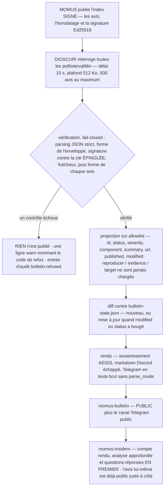
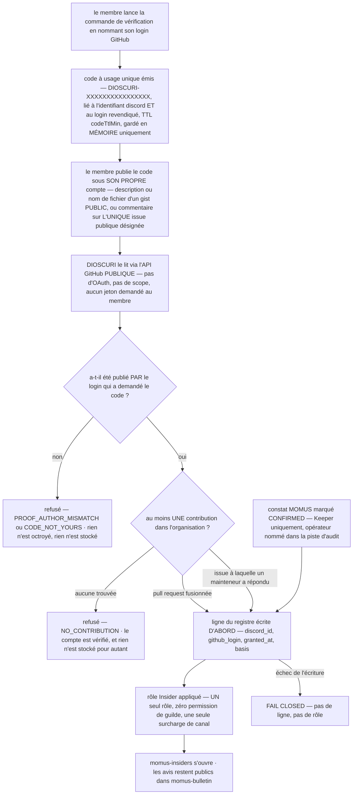

# Accès communautaire DIOSCURI — le bulletin public et la porte Insider

> 🌐 Langues : [English](community-access.md) · [Русский](community-access-ru.md) · [Español](community-access-es.md) · **Français** · [中文](community-access-zh.md)

Le bulletin de sécurité de MOMUS débouche sur deux canaux, et ils ne sont pas de
même nature. `#momus-bulletin` est **public** : tout le monde sur le serveur le
lit, et les avis y sont publiés dès l'instant où ils paraissent.
`#momus-insiders` se **mérite**, et ce qu'il contient, c'est le compte rendu,
l'analyse approfondie et les questions-réponses — jamais l'avis lui-même.

Ce document explique ce qui atterrit où, ce que DIOSCURI vérifie avant de dire un
mot, comment le rôle `Insider` se gagne, ce qui est stocké exactement au sujet
d'une personne, et — sans détour — le raisonnement derrière chacun de ces choix.
Chaque affirmation est vérifiée dans le code ; là où un réglage existe, la clé de
configuration est nommée. L'analyse des menaces se trouve dans
[security.md](security.md), l'exploitation courante dans [usage.md](usage.md).

Code : `src/bulletin/` (éditeur, vérificateur, rendu, état),
`src/community/` (la porte, le lecteur GitHub, le registre),
`src/provision/structure.ts` (les canaux et l'unique rôle).

## 1. Deux canaux, une seule règle

| Canal | Qui le lit | Ce qui y atterrit | Politique de permissions |
|---|---|---|---|
| `#momus-bulletin` | **tout le monde** | chaque avis vérifié, dès qu'il est vérifié ; les mises à jour quand il change | `readonly` — lecture publique, écriture réservée au bot |
| `#momus-insiders` | les porteurs d'`Insider` | le compte rendu, l'analyse approfondie, les questions-réponses — du commentaire sur des avis déjà publics juste à côté | `insidersonly` — masqué à `@everyone`, ouvert par un seul rôle |

La règle qui tranche tous les cas ambigus :

> **L'exclusivité porte sur le MOMENT et le COMMENTAIRE, jamais sur l'information.**

Un avis est public dès l'instant où il est publié. Ce que les insiders obtiennent
en premier, c'est notre prose à son sujet. Si une question de conception se
ramène un jour à « faut-il réserver l'accès à ce fait ? », la réponse est non.

La catégorie du bulletin elle-même n'est délibérément **pas** à accès réservé
(`BULLETIN_CATEGORY` dans `src/provision/structure.ts`) — seul le canal du
compte rendu qu'elle contient l'est.

Une note d'opérateur sur `readonly` : le provisionneur crée `#momus-bulletin` de
sorte que seul le bot puisse y poster, alors que le sujet du canal invite à la
discussion. Si vous voulez que les lecteurs répondent dans le canal lui-même,
ouvrez `SendMessages` pour `@everyone` à la main — le provisionneur ne fixe les
permissions que sur les canaux qu'il crée, et ne touche jamais à un canal
adopté ; votre modification survit donc à chaque démarrage ultérieur.

## 2. Ce qui atterrit dans `#momus-bulletin`, et pourquoi c'est public

### Le message

Un message par avis : un embed Discord, et un message Telegram en texte brut pour
le canal Telegram public. Exactement ces champs existent, parce que ce sont
exactement ceux que le vérificateur charge (`toAdvisory` dans
`src/bulletin/verify.ts`) :

| Champ | Affiché comme | Notes |
|---|---|---|
| `id` | titre de l'embed, p. ex. `MOMUS-2026-0007` | jeu de caractères restreint, pas simplement échappé |
| `status` | badge — 🔴 OPEN / 🟢 FIXED / ⚪ WITHDRAWN | emoji + mot + couleur de l'embed, pour que l'état survive à un lecteur daltonien, à un thème sombre et à une notification téléphone d'une seule ligne |
| `severity` | `info … critical` | une valeur non reconnue affiche `unspecified`, jamais renvoyée en écho |
| `component` | champ, 80 caractères | l'élément affecté, p. ex. `aimarket-hub` |
| `summary` | description, 700 caractères | prose distante non fiable — assainie, puis échappée pour markdown |
| `url` | lien de l'embed | **https uniquement, et uniquement sur l'origine de l'index du bulletin lui-même** |
| `published` / `modified` | champs | affichés tels quels, ils doivent donc ressembler à des dates sous peine d'être écartés |

Pour un avis `open`, le message porte aussi une ligne de notre cru :

> ⚠️ **Avis open** — délibérément inexploitable : ni reproducteur, ni preuve, ni
> cible. Le détail est publié quand le correctif est livré.

Cette ligne n'est pas décorative. Un avis maigre se lit comme un avis que
quelqu'un a oublié de finir, sauf à dire que l'omission est justement le propos —
et le moteur de rendu budgète le résumé distant face à nos propres lignes
précisément pour qu'un long résumé hostile ne puisse pas chasser cette mention
hors de l'embed (`src/bulletin/render.ts`).

### Ce qui n'y atterrit jamais

`reproducer`, `evidence`, `poc`, `target_url` — et tout ce que la charge utile
peut transporter d'autre. Ces champs ne sont pas filtrés en aval ; ils ne sont
**jamais chargés**. Le vérificateur projette chaque enregistrement sur une
allowlist de huit champs, de sorte qu'aucun moteur de rendu ne peut atteindre un
exploit et qu'aucune modification future d'un gabarit ne peut en interpoler un.
La conception de divulgation de MOMUS omet déjà ces champs des avis `open` ;
ceci est le second verrou, de notre côté du fil, parce que « l'éditeur a promis »
n'est pas un contrôle qui nous appartient.

### Pourquoi le canal est public

Parce que la valeur d'un bulletin de sécurité tient à ce que **les personnes
affectées le lisent**.

Réserver l'accès aux avis derrière un test de loyauté quel qu'il soit — une
contribution, un abonnement, une étoile, un palier « supporter » — signifie que
quelqu'un qui fait tourner notre code n'apprend pas que son composant a un trou
ouvert. Il continue de le faire tourner. Ce n'est pas un avantage communautaire
assorti d'un inconvénient ; c'est le mode de défaillance même que le bulletin
existe pour empêcher, et aucun gain d'engagement ne le paie.

La conception est cohérente avec elle-même dans l'autre sens aussi : les avis
`open` de MOMUS sont délibérément **inexploitables** — ni reproducteur, ni
preuve, ni cible — *précisément pour qu'ils puissent être publics*. L'argument
habituel en faveur d'une divulgation à accès réservé est que le détail arme les
attaquants plus vite qu'il n'avertit les défenseurs. Cet argument ne s'applique
pas à un document qui ne contient aucun détail. Publier « ce composant a un
constat open de cette gravité » dit à un défenseur d'aller regarder et ne dit à
un attaquant rien qu'il puisse utiliser. Le détail est publié quand le correctif
est livré.

Il y a donc deux verrous et ils pointent dans le même sens : l'avis est dépouillé
de tout ce qui serait exploitable, et *parce qu'*il est dépouillé, il peut aller
à tout le monde.

### Nouveau ou mise à jour

Le fichier d'état (`bulletin-state.json`, une ligne par identifiant d'avis) se
souvient de ce que nous avons déjà annoncé. Un avis est ré-annoncé comme **mise à
jour** quand son horodatage `modified` bouge **ou** que son statut change — le
statut est comparé séparément à dessein, car un éditeur qui bascule
`open → fixed` sans toucher à `modified` laisserait sinon le canal muet sur la
seule transition que les lecteurs attendent.

Le fichier d'état contient des identifiants d'avis, la révision annoncée et des
identifiants de message par plateforme. Rien au sujet d'une personne : pas
d'identifiants de membre, pas de qui-a-lu-quoi, aucun engagement d'aucune sorte —
et pas de texte d'avis non plus, puisque le bulletin est public et qu'une copie
locale ne serait qu'une seconde source de vérité susceptible de diverger de celle
de MOMUS.

## 3. DIOSCURI vérifie avant de dire un mot

MOMUS publie le bulletin sous la forme d'UN SEUL index signé :

```json
{ "advisories": [ … ], "timestamp": 1754650000000, "signature": "<hex ed25519>" }
```

`signature` est un Ed25519 sur la forme canonique RFC 8785 (JCS) de
`{advisories, timestamp}` — la même enveloppe que MOMUS utilise déjà pour le flux
de renseignement sur les menaces de WARDEN, et la même forme de vérification
qu'ARGUS lui applique. Une enveloppe, un canonicaliseur, une philosophie de
l'échec.

**Pourquoi cela existe, tout simplement.** Tout ce que DIOSCURI publie sort sous
notre propre bot communautaire, en notre propre nom, dans un canal public. Un
avis non vérifié signifierait que quiconque contrôle le chemin réseau entre nous
et MOMUS — un proxy, une réponse DNS, un edge compromis — peut publier des
accusations de sécurité contre des composants nommés comme si elles venaient de
nous. La vérification ici n'est pas un raffinement ; c'est la différence entre un
bulletin et un mégaphone braqué sur des inconnus.



### Les cinq propriétés, et pourquoi dans cet ordre

| Ordre | Contrôle | Codes de refus | Pourquoi |
|---|---|---|---|
| 1 | parsing JSON strict | `UNPARSEABLE` | les clés en double et les littéraux non entiers sont une décision qui revient à l'éditeur, pas à l'analyseur |
| 2 | forme de l'enveloppe, taille, nombre | `MALFORMED`, `OVERSIZED` | `timestamp` est **obligatoire** : facultatif, il signifierait « un index qui l'omet est frais pour toujours » |
| 3 | Ed25519 contre la clé **épinglée** | `NO_PUBKEY`, `BAD_PUBKEY`, `NO_CANONICAL_FORM`, `SIGNATURE_INVALID` | authenticité. Aucun épinglage configuré signifie que rien n'est jamais publié — un bulletin non signé est refusé, pas jugé fiable-parce-qu'il-est-arrivé |
| 4 | fraîcheur, en **dernier** | `STALE`, `FUTURE_DATED` | tant que la signature n'est pas vérifiée, `timestamp` est un nombre choisi par un attaquant ; refuser sur cette base ne prouverait donc rien |
| 5 | forme de chaque avis | *enregistrement écarté, index conservé* | un avis malformé ne doit pas faire taire ceux qui vont bien |

La fraîcheur mérite sa propre phrase, parce que c'est le contrôle que l'on
suppose redondant. Une signature dit **qui** a écrit un document ; elle ne dit
jamais **quand il vous a été remis**. Sans fenêtre de fraîcheur, celui qui sert
l'URL peut rejouer indéfiniment un instantané vieux de plusieurs mois et effacer
en silence chaque avis publié depuis. Pour un bulletin, cet effacement *est*
l'attaque — l'avis qu'un opérateur veut le plus étouffer est le plus récent.
Fenêtre par défaut : 24 h (`tuning.bulletin.maxAgeHours`, 1–336). Elle peut être
élargie pour une cadence de publication plus lente. Elle ne peut pas être
désactivée.

La taille et le nombre sont les garde-fous ennuyeux qui empêchent un éditeur
hostile ou cassé d'emporter le processus avec lui : corps de 512 Ko, 500 avis, un
délai de récupération de 10 secondes, et un plafond de 4000 caractères sur tout
champ que nous conservons.

### Ce que voit un opérateur quand un contrôle échoue

**Rien n'est publié.** Pas de message partiel, pas de message « au mieux » assorti
d'une réserve, pas l'instantané du cycle précédent renvoyé. La communauté voit un
canal inchangé — ce qui ressemble *exactement* à « MOMUS n'a rien publié ces
derniers temps ». C'est cette ambiguïté qui fait que l'échec est signalé haut et
fort côté opérateur, à trois endroits :

1. **Une ligne d'avertissement par cycle**, nommant le code et la raison :

   ```json
   {"ts":"2026-08-08T12:00:00.000Z","level":"warn",
    "msg":"bulletin index REFUSED — nothing posted","code":"STALE",
    "reason":"signed snapshot is 51.2 h old, past the 24 h limit — REJECTED as a possible replay hiding newer advisories"}
   ```

2. **Une entrée d'audit**, chaînée par hachage comme tout autre acte conséquent :

   ```json
   {"kind":"bulletin.refused","actor":"dioscuri","subject":"https://momus.modelmarket.dev/bulletin",
    "data":{"code":"SIGNATURE_INVALID","reason":"Ed25519 signature does not match the pinned key — index REJECTED, nothing posted"}}
   ```

3. **Un avertissement au démarrage** quand la fonctionnalité est mal configurée,
   car un épinglage manquant ressemble sinon trait pour trait à un éditeur
   silencieux :

   ```text
   bulletin publisher not started — no pinned publisher key; an unverified advisory is never posted
   bulletin publisher not started — no channel configured
   ```

Deux autres avertissements méritent d'être surveillés, car tous deux signifient
qu'un index *signé* transportait quelque chose que nous ne répéterions pas :

```text
bulletin: advisories dropped for failing shape validation        (dropped=N)
bulletin: advisory links dropped for pointing off the index origin (droppedLinks=N)
```

Le second compte plus qu'il n'y paraît : nous avons vérifié *qui* a écrit
l'index, ce qui n'est pas une promesse sur ce vers quoi il pointe, et un lien
cliquable dans un bulletin de sécurité est le lien le plus digne de confiance du
canal. Un lien hors origine ou non-https est écarté ; l'avis est quand même
publié, simplement sans hyperlien.

Liste complète des codes de refus : `NO_URL`, `NO_PUBKEY`, `FETCH_FAILED`,
`HTTP_ERROR`, `OVERSIZED`, `UNPARSEABLE`, `MALFORMED`, `BAD_PUBKEY`,
`NO_CANONICAL_FORM`, `SIGNATURE_INVALID`, `STALE`, `FUTURE_DATED`, plus les codes
au niveau du cycle `NO_SINKS`, `ALREADY_RUNNING` et `INTERNAL_ERROR`.

### Rien ici ne lève d'exception

`BulletinPublisher.runOnce()` attrape tout et se résout avec un objet résultat,
de sorte que le chemin planifié ne peut jamais faire tomber le bot : un éditeur
qui fait planter le processus parce qu'un flux était indisponible est pire qu'un
éditeur qui saute un cycle. Une destination (sink) qui lève une exception est
journalisée et sautée — l'autre plateforme reçoit quand même l'avis, et celle qui
a échoué est réessayée au cycle suivant pendant jusqu'à 24 h (assez long pour
couvrir une panne et un redémarrage, assez court pour qu'un canal configuré plus
tard ne reçoive jamais trois ans d'historique d'un coup). L'état est sauvegardé
après **chaque** publication réussie, de sorte qu'un plantage en cours
d'exécution ne peut pas ré-annoncer ce qui est déjà sorti, et `maxPostsPerRun`
(5 par défaut) fait qu'un démarrage à froid s'écoule au compte-gouttes au lieu
d'inonder.

### Comment l'activer

Désactivé par défaut, et doublement fail-closed (refus par défaut) — activer ne
suffit pas :

| Clé | Par défaut | Signification |
|---|---|---|
| `tuning.bulletin.enabled` | `false` | interrupteur principal |
| `tuning.bulletin.indexUrl` | `https://momus.modelmarket.dev/bulletin` | l'index signé |
| `tuning.bulletin.publicKey` | `""` | **l'épinglage** — Ed25519 SPKI DER en hexadécimal. Vide signifie que rien n'est jamais publié |
| `tuning.bulletin.maxAgeHours` | `24` | fenêtre de fraîcheur, 1–336 |
| `tuning.bulletin.pollIntervalMin` | `30` | minimum 5 |
| `tuning.bulletin.maxPostsPerRun` | `5` | 1–25 |
| `tuning.bulletin.writeupBaseUrl` | `""` | URL de base du compte rendu des insiders ; vide n'affiche aucune ligne de compte rendu |
| `DISCORD_BULLETIN_CHANNEL_ID` | *(auto)* | le provisionneur crée et découvre `#momus-bulletin` ; ne renseignez ceci que pour épingler un canal que vous avez placé vous-même |
| `TELEGRAM_BULLETIN_CHAT_ID` | *(vide)* | vide signifie que le côté Telegram reste éteint — les avis ne sont **jamais** basculés vers le chat principal en guise de repli |

`publicKey` est une clé *publique*, elle vit donc dans le fichier de réglages non
secret — mais c'est un **épinglage**, et c'est la seule raison pour laquelle nous
pouvons répéter les accusations de MOMUS contre des composants nommés sous notre
propre bot.

## 4. Gagner `Insider` — trois voies de contribution

La porte, c'est la **contribution, jamais l'approbation**. L'UNE quelconque de
ces voies gagne le rôle :

| Base | Ce qui compte | Comment c'est vérifié |
|---|---|---|
| `pr` | une **pull request fusionnée** dans l'organisation configurée | une recherche publique, `is:pr is:merged author:<login> user:<owner>` |
| `issue` | une **issue que vous avez ouverte et à laquelle un mainteneur a répondu** | recherche publique des issues dont vous êtes l'auteur, puis les commentaires de 5 d'entre elles au plus |
| `finding` | un **constat MOMUS qu'un opérateur a marqué CONFIRMED** | un Keeper nomme le membre Discord ; la piste d'audit enregistre qui l'a fait |

Les contributions ailleurs dans le monde ne comptent pas — le qualificateur
`user:` restreint les deux recherches au propriétaire configuré (`githubOwner`).
Contribuer au projet de quelqu'un d'autre fait de vous l'insider de quelqu'un
d'autre.

Pourquoi la contribution plutôt que l'approbation, dit explicitement : « faites
ceci et obtenez l'accès » visant une approbation relève de l'engagement incité
(*incentivized engagement*) au sens des Acceptable Use Policies de GitHub, et un
projet dont tout le positionnement est l'auditabilité ne peut pas se le
permettre. Un contrôle permanent du type « nous approuve-t-il toujours » serait
pire — il faudrait interroger indéfiniment l'activité GitHub des individus et
conserver un historique d'engagement. C'est de la surveillance, plus un jeu de
données qu'il nous faudrait ensuite protéger. La contribution sélectionne les
gens qui ont **donné** quelque chose au lieu des gens qui ont cliqué sur quelque
chose.

### Pourquoi la voie de l'issue exige la réponse d'un mainteneur

Parce que sans elle, la porte se lit « ouvrez une issue vide ».

Cette version-là sélectionne le bruit : un tracker qui se remplit d'issues d'une
ligne ouvertes pour franchir une barre, et qui enfouit dessous les vrais
rapports. Exiger que quelqu'un de notre côté du projet ait *répondu* signifie que
l'issue valait une réponse — le jugement est rendu par un humain qui fait son
travail normal de mainteneur, pas par une règle qu'un farmeur peut satisfaire
exprès.

Deux détails maintiennent cela honnête :

- « Mainteneur » est le champ `author_association` **de GitHub lui-même** —
  `OWNER`, `MEMBER` ou `COLLABORATOR`. Ce n'est pas une liste que nous curons,
  elle ne peut donc pas devenir en douce une liste de favoris.
- Le commentaire de réponse ne doit pas être celui du membre lui-même. Répondre à
  sa propre issue est exactement le farm que la clause existe pour fermer.

Le contrôle examine au plus 5 issues dont le membre est l'auteur (ce qui borne le
coût en appels d'API), et une issue illisible est sautée plutôt que traitée comme
un verdict sur la personne.

### Pourquoi la voie du constat passe par un humain

La réception des rapports de MOMUS est **anonyme par conception**. Il n'existe
donc aucun lien automatisé entre un rapport anonyme et une personne, et ce module
n'en invente pas un : un opérateur nomme le pseudo Discord et en prend la
responsabilité.

La voie est réservée aux Keepers, et l'appelant doit déclarer `operatorIsKeeper`
explicitement — une future interface de plateforme qui oublierait de contrôler le
rôle Keeper devrait passer un mensonge littéral pour franchir la porte, ce qui se
repère facilement en revue. L'entrée d'audit enregistre quel opérateur l'a fait
et, facultativement, l'identifiant d'avis qui l'a justifié. `github_login` est
facultatif sur cette voie et stocké comme `""` en son absence : un chercheur
anonyme peut n'avoir aucun compte à nommer, et en inventer un mettrait une
fiction dans le registre.

## 5. Prouver un compte GitHub sans OAuth

Nous ne demandons jamais de jeton (token) à un membre.

Un jeton d'accès capable de lire l'activité de quelqu'un est bien plus de pouvoir
que n'en demande « je contrôle ce compte », et en accepter un fait de nous son
dépositaire — il y a dès lors un identifiant secret dans notre processus, dans
nos journaux si quelqu'un est négligent, et dans nos sauvegardes. Ce qui est
prouvé tient en un bit : *ce membre Discord contrôle ce compte GitHub.* Un défi
public prouve exactement ce bit et ne nous laisse rien entre les mains.



### Les trois étapes

1. **Émission.** Le membre lance la commande de vérification en nommant son login
   GitHub. Nous émettons `DIOSCURI-` + 16 caractères hexadécimaux, lié à son
   identifiant Discord *et* au login revendiqué, avec un TTL (30 min par défaut,
   `tuning.insiders.codeTtlMin`). Cette étape est hors ligne — aucune requête
   GitHub n'a encore lieu, donc un login mal tapé ne coûte d'appel d'API à
   personne.
2. **Publication.** Le membre publie ce code sous son propre compte : un **gist
   public** avec le code dans sa description ou dans un nom de fichier, ou un
   commentaire le contenant sur **une** issue publique désignée
   (`tuning.insiders.proofRepo` + `proofIssue`).
3. **Lecture.** Nous le lisons exactement comme n'importe quel inconnu le
   pourrait — listings de gists (description et noms de fichiers uniquement,
   jamais le contenu des fichiers) et les commentaires de cette unique issue,
   restreints aux commentaires postérieurs au défi — et nous confirmons que le
   login de l'**auteur** est bien le login revendiqué.

### Le code n'est pas un secret, et c'est très bien ainsi

Il doit être publié ; c'est tout le mécanisme. Il est sans danger à publier parce
qu'il est lié deux fois :

- un inconnu qui le recopie depuis un canal **ne peut pas l'échanger** —
  l'échange est indexé sur l'identifiant Discord pour lequel il a été émis
  (`CODE_NOT_YOURS`) ;
- un inconnu **ne peut pas le faire passer pour sa propre preuve** — une preuve
  doit avoir pour auteur le login qui a demandé le code
  (`PROOF_AUTHOR_MISMATCH`).

Quand le code de quelqu'un d'autre apparaît sous un compte, le refus est
explicite, et le login de l'*autre* partie n'est jamais renvoyé en écho : cela
distribuerait une correspondance GitHub↔Discord à quiconque la demande. Le code
est à usage unique par suppression, et les codes expirés sont écartés dès qu'ils
sont remarqués, pour qu'un code mort ne puisse jamais être pris pour un code
vivant.

L'interface de plateforme doit tout de même répondre **en privé** (réponse
éphémère ou message privé) — non pas parce que le code est un secret, mais parce
qu'un canal public rempli des codes de vérification des autres n'est que du bruit
déroutant.

### La preuve avant la contribution, toujours

L'ordre dans `redeem()` est porteur. Un contrôle de contribution est une
affirmation à propos d'un **compte** ; l'exécuter avant de savoir que le membre
contrôle ce compte laisserait n'importe qui revendiquer le travail de n'importe
quel contributeur. Donc : la preuve d'abord, la contribution ensuite, l'octroi en
troisième.

### Les limites qu'un membre peut rencontrer

| Code | Signification | Ce qui est dit au membre |
|---|---|---|
| `BAD_LOGIN` | pas un login GitHub plausible (lettres, chiffres, traits d'union internes simples, ≤ 39 caractères) | que cela ne ressemble pas à un nom d'utilisateur |
| `ALREADY_INSIDER` | il détient déjà le rôle | rien à faire ; demander à un Keeper si le rôle manque sur son profil |
| `LOGIN_ALREADY_CLAIMED` | ce compte GitHub a déjà gagné le rôle pour un autre membre | dit **sans** nommer qui — un compte, une personne |
| `NO_PROOF_CHANNEL` | ni la voie du gist ni une issue ne sont configurées | un Keeper doit en configurer une |
| `BUSY` | plus de 500 défis en cours | réessayer dans quelques minutes |
| `NO_CHALLENGE` / `EXPIRED` | rien en attente, ou le TTL est passé | recommencer la vérification |
| `TOO_SOON` | les tentatives d'échange sont espacées de 20 s | combien de secondes il reste |
| `PROOF_NOT_FOUND` | le code n'est pas encore publié sous ce compte | où il peut être posté |
| `CODE_NOT_YOURS` / `PROOF_AUTHOR_MISMATCH` | le code de quelqu'un d'autre, ou le bon code sous le mauvais compte | lancer la commande soi-même / le poster sous le compte que l'on a nommé |
| `NO_CONTRIBUTION` | compte vérifié, aucune contribution qualifiante | les trois voies, énoncées clairement — un « non » sec se lit comme un bot cassé |
| `GITHUB_UNAVAILABLE` | nous n'avons pas pu joindre GitHub | *« Rien n'est retenu contre vous — réessayez dans quelques minutes. »* |
| `NOT_OPERATOR` | la voie du constat a été appelée par un non-Keeper | seul un Keeper peut confirmer un constat |
| `STORAGE_FAILED` | le registre n'a pas pu être écrit | le rôle n'a **pas** été appliqué ; réessayer sous peu |

L'espacement de 20 secondes existe parce qu'un échange coûte jusqu'à neuf
requêtes GitHub publiques et que la commande est ouverte à tout le monde sur le
serveur : sans lui, un seul membre qui reste appuyé sur la touche consomme la
limite de débit partagée de toute la communauté. `GITHUB_UNAVAILABLE` est formulé
ainsi à dessein — une panne de GitHub doit se lire comme *« nous n'avons pas pu
vérifier »*, jamais comme *« vous n'êtes pas contributeur »*.

### Comment l'activer

| Clé | Par défaut | Signification |
|---|---|---|
| `tuning.insiders.enabled` | `false` | interrupteur principal |
| `tuning.insiders.proofRepo` | `""` | dépôt hébergeant l'issue de vérification désignée ; vide désactive la voie de l'issue |
| `tuning.insiders.proofIssue` | `0` | le numéro de l'issue ; `0` désactive la voie |
| `tuning.insiders.allowGistProof` | `true` | accepter un gist public comme preuve |
| `tuning.insiders.codeTtlMin` | `30` | minutes pendant lesquelles un code émis reste échangeable, 1–1440 |
| `GITHUB_TOKEN` | *(facultatif)* | le jeton **du bot lui-même**, déjà présent en configuration pour MNEMOSYNE. Envoyé uniquement pour relever la limite de débit sur les lectures publiques ; jamais journalisé, ne quitte jamais le module |

Tout dans le bloc de réglages est non secret — un propriétaire, un dépôt, un
numéro d'issue, un TTL. Prouver un compte GitHub n'exige de secret de personne,
il n'y en a donc aucun à configurer.

## 6. Les étoiles ne sont pas lues. Pas du tout.

Aucun palier d'accès. Aucun badge. Aucun rôle cosmétique. Pas même un contrôle
unique.

Une conception antérieure octroyait un rôle cosmétique sur une seule lecture
d'étoile. Elle a disparu, et voici pourquoi :

- **Une porte fondée sur une étoile maintenue exigerait de surveiller les gens.**
  « A mis une étoile » est bon marché à lire une fois et dénué de sens ensuite —
  la question intéressante est de savoir si l'étoile est *toujours* là, et y
  répondre signifie interroger périodiquement l'activité GitHub des individus et
  conserver un historique d'engagement. C'est de la surveillance des gens que
  l'on est censé récompenser, et cela fabrique un jeu de données qu'il nous
  faudrait ensuite protéger. Il n'existe aucune version de cela qui soit à la
  fois signifiante et respectueuse.
- **Même un rôle cosmétique est une surface de permissions qui dérive.** Un rôle
  qui ne signifie rien aujourd'hui est exactement le genre de chose qui acquiert
  une surcharge de permissions sur un canal dans six mois parce que c'était
  pratique. La façon de garder un rôle inoffensif, c'est de ne pas le créer.
- **Et ce serait une approbation achetée avec de l'accès**, soit précisément ce
  que les Acceptable Use Policies de GitHub appellent l'engagement incité, et la
  dernière chose que devrait faire un projet qui vend de l'auditabilité.

L'absence est **structurelle**, ce n'est pas une affaire de discipline :

- aucune route « star » parmi les quatre que la fonctionnalité utilise (listing
  de gists, commentaires d'une issue, deux recherches) ;
- aucune méthode sur `GithubPublicReader` qui pourrait répondre à la question —
  une modification future ne peut pas « juste jeter un œil » par une porte qui
  n'a jamais été construite ;
- aucun champ « star » dans le registre (`src/community/store.ts`) ;
- aucun mot « star » dans une base d'octroi — l'énumération des bases vaut
  `pr | issue | finding`, et il n'y a délibérément nulle part où enregistrer
  autre chose.

Et c'est testé deux fois, dans `test/community-access.test.ts` : une fois en
scannant la source du module à la recherche de la route et des noms de champ
« star », et une fois avec un faux client GitHub qui enregistre **chaque
propriété que la porte va chercher**.

Si quelqu'un met une étoile au projet, rien ici ne le remarque, ne l'enregistre
ni ne le récompense.

## 7. Exactement ce qui est stocké au sujet d'une personne

Quatre champs. Une ligne par membre ayant gagné le rôle, dans `insiders.json`
sous le répertoire de données (`/data` dans Docker) :

```json
{
  "insiders": [
    {
      "discord_id": "1234567890",
      "github_login": "octocat",
      "granted_at": "2026-08-08T12:00:00.000Z",
      "basis": "pr"
    }
  ]
}
```

`discord_id` — à qui appartient le rôle. `github_login` — le compte qui l'a gagné
(la casse de GitHub lui-même ; `""` pour un octroi par un opérateur au nom d'un
chercheur anonyme). `granted_at` — quand. `basis` — `pr`, `issue` ou `finding`.

C'est tout l'enregistrement. Les quatre noms sont exportés sous
`INSIDER_FIELDS` pour qu'un test puisse nous y tenir, le fichier est écrit champ
par champ plutôt qu'en étalant la ligne en mémoire, et les clés inconnues sont
retirées au chargement — un fichier édité à la main qui ajoute `email` ou une
trace d'activité ne peut pas la réintroduire en douce.

**Non stocké :** aucun historique d'engagement, aucun journal d'activité, aucune
adresse e-mail, aucun nom affiché, aucun décompte d'étoiles ni aucun indicateur
d'étoile d'aucune sorte, aucun accusé de lecture, aucune trace des actions de qui
que ce soit d'autre, et **aucune copie des preuves**. La contribution qui a gagné
le rôle est publique sur GitHub et revérifiable par quiconque ; en garder notre
propre copie ne ferait que constituer un dossier privé qu'il nous faudrait
ensuite protéger.

Les vérifications en attente sont conservées **en mémoire uniquement** et jamais
persistées : un défi en attente, c'est un identifiant Discord plus un login
revendiqué — des données sur quelqu'un qui n'a encore rien gagné. Un redémarrage
qui l'oublie coûte une commande ; le persister reviendrait à stocker des gens qui
ne sont jamais revenus.

### Pourquoi stocker quoi que ce soit

Parce que le rôle Discord est une *projection*, pas l'enregistrement. Un membre
qui perd le rôle lors d'une reconstruction du serveur doit pouvoir le récupérer
sans rien reprouver, et une personne qui demande à être oubliée ne doit rien
laisser derrière elle — ce qui n'est possible que s'il existe exactement un seul
endroit d'où supprimer.

C'est aussi pourquoi la persistance est **fail-closed** : si le registre ne peut
pas être écrit, le rôle n'est pas octroyé (`STORAGE_FAILED`). Un rôle sans
enregistrement derrière lui ne peut être ni expliqué ni oublié, et ces deux
choses comptent plus que la commodité. L'ordre inverse ne pose pas de problème :
si l'écriture du registre réussit et que l'appel à l'API Discord échoue, le droit
existe et le rôle est réappliqué à la prochaine réconciliation.

### Comment être oublié

Une commande, de la part de la personne elle-même ou d'un opérateur. La ligne est
**supprimée** — pas signalée d'un drapeau, pas marquée « révoquée » : un marqueur
de révocation signifierait que le registre se souvient encore que cet identifiant
Discord a été un jour insider, ce qui est le contraire de ce que demande
quelqu'un qui demande à être oublié. Le rôle `Insider` est retiré, tout défi en
attente est abandonné, et la réponse est :

> Terminé — votre ligne est supprimée et le rôle retiré. Rien n'est conservé à
> votre sujet.

Si rien n'était stocké, elle le dit à la place. Si la suppression elle-même
échoue, on dit clairement à la personne qu'un Keeper a été sollicité pour la
terminer à la main, plutôt que de lui dire « terminé ».

Le retrait du rôle est au mieux (best-effort) par conception : un rôle périmé
sans ligne est visible des modérateurs et corrigeable, tandis qu'une révocation
ratée ne doit jamais ressusciter la ligne que nous venons de supprimer.

Une réserve honnête, développée dans la section des risques résiduels ci-dessous:
le journal d'audit chaîné par hachage est en ajout seul, la ligne
`insiders.grant` y reste donc.

## 8. Ce que ceci n'est pas

- **Pas un paywall.** Rien ici n'est à vendre, et aucune somme d'argent ne fait
  bouger la porte. La seule monnaie est une contribution à cet écosystème, et la
  moins chère qui qualifie est une issue qui vaut la réponse d'un mainteneur.
- **Pas une porte à étoiles.** Les étoiles ne sont pas lues, ni pour l'accès, ni
  pour un badge, ni une seule fois. Voir §6 — il n'existe aucun chemin de code
  qui pourrait en lire une.
- **Pas un moyen de soustraire de l'information de sécurité aux personnes
  qu'elle affecte.** Les avis sont publics dans `#momus-bulletin` dès l'instant
  où ils sont vérifiés. Ce qui est à accès réservé, c'est notre commentaire — le
  compte rendu, l'analyse approfondie, les questions-réponses. Si vous faites
  tourner un composant affecté, tout ce dont vous avez besoin pour agir est dans
  le canal public, et il ne vous faut ni rôle, ni compte, ni relation avec nous
  pour le lire.
- **Pas un octroi de permissions.** `Insider` porte **zéro** permission de guilde
  et n'est pas mentionnable — tout son travail est une seule surcharge de
  permissions sur un canal. Un canal à accès réservé dont les membres peuvent
  être @-mentionnés par n'importe qui fuite qui s'y trouve.
- **Pas un palier de modération.** Les Keepers modèrent ; les insiders lisent un
  canal. Les deux rôles sont sans rapport, et la porte ne peut distribuer ni l'un
  ni l'autre de sa propre initiative.
- **Pas « exactement un rôle plus quelques petits ».** Exactement un rôle. Chaque
  rôle supplémentaire est une surface de permissions qui dérive.

## 9. Piste d'audit

Les deux fonctionnalités écrivent dans l'`audit.jsonl` chaîné par hachage décrit
dans [usage.md §6](usage.md#6-audit--the-flight-recorder) :

| `kind` | Écrit quand | `data` |
|---|---|---|
| `bulletin.refused` | la vérification, la fraîcheur ou la taille a échoué | `{ code, reason }` — le sujet est l'URL de l'index |
| `bulletin.post` / `bulletin.update` | un avis a été annoncé | `{ status, severity, component, sinks }` — le sujet est l'identifiant de l'avis |
| `insiders.grant` | le rôle a été octroyé | `{ basis, github_login }` et, sur la voie opérateur, l'identifiant de lead MOMUS — le sujet est `dc:<discord id>`, l'acteur est `pollux` ou la clé de l'opérateur |
| `insiders.forget` | une ligne a été supprimée | `{}` — le sujet est `dc:<discord id>`, l'acteur est `self` ou l'opérateur |

Une entrée d'octroi porte les *faits* de l'octroi et rien de plus : aucune copie
des preuves, aucune URL, aucune activité. La contribution est publique sur GitHub
et revérifiable par quiconque. Une destination d'audit cassée est journalisée et
avalée — elle ne doit jamais casser la commande d'un membre.

## Risques résiduels — ce que ceci ne résout PAS

Section d'honnêteté, dans le style de
[security.md](security.md#residual-risks--what-this-does-not-solve).
Lacunes connues, acceptées délibérément :

- **La chaîne d'audit se souvient d'un octroi après la disparition de la ligne.**
  `insiders.grant` enregistre `dc:<discord id>`, la base et le login GitHub ; la
  chaîne est en ajout seul et liée par hachage, l'en retirer casserait donc
  chaque entrée suivante. Être oublié retire par conséquent le droit et la ligne
  du registre, pas le fait historique qu'un octroi a eu lieu. La chaîne est
  locale au volume de données de l'opérateur, jamais publiée, et ne contient
  aucune autre activité au sujet de la personne — mais c'est une limite réelle,
  pas une erreur d'arrondi, et quiconque demande à être oublié mérite de se
  l'entendre dire.
- **Une preuve publiée survit à son utilité.** Le code est à usage unique et sans
  valeur après échange, mais un gist laissé en ligne est un lien public permanent
  entre un compte GitHub et cette communauté. Les membres que cela préoccupe
  devraient supprimer le gist ensuite ; rien dans le flux ne le supprime à leur
  place, parce que rien dans le flux ne le peut.
- **La preuve n'est contrôlée qu'une fois.** Le contrôle d'un compte est vérifié
  au moment de l'échange, pas revérifié ensuite. Un compte GitHub transféré ou
  compromis ne perd pas le rôle Discord de lui-même.
- **La correspondance existe.** `LOGIN_ALREADY_CLAIMED` ne dit délibérément pas
  qui détient un login, mais le registre apparie bel et bien un login GitHub à un
  identifiant Discord. Quatre champs, c'est le minimum qui rende possibles le
  ré-octroi et la suppression ; ce n'est pas zéro.
- **Une panne de GitHub ferme la porte.** Les refus le disent et ne retiennent
  rien contre le membre, mais tant que GitHub est injoignable, personne de
  nouveau n'entre. L'alternative — octroyer sur une revendication non vérifiée —
  est pire.
- **La fraîcheur est une fenêtre, pas un mur.** À l'intérieur de `maxAgeHours`,
  un instantané rejoué se vérifie quand même ; un edge hostile pourrait donc
  cacher un avis publié au cours de la dernière journée (valeur par défaut) avant
  que le contrôle d'obsolescence ne morde. Raccourcir la fenêtre échange cela
  contre des refus à tort quand MOMUS publie lentement.
- **Une signature authentifie un éditeur, pas son jugement.** Si la couche de
  divulgation de MOMUS régressait un jour et se mettait à servir du détail dans
  un résumé, nous répéterions ce résumé. L'allowlist garantit qu'aucun champ
  `reproducer`, `evidence`, `poc` ou `target` ne peut jamais être publié via ce
  bot — elle ne peut pas garantir que la prose du champ `summary` est
  inexploitable.
- **La porte est du code, pas encore une surface de commandes.**
  `src/bulletin/` et `src/community/` sont livrés avec leur configuration, leurs
  canaux, leur rôle et leurs tests ; l'interface de plateforme qui expose les
  commandes destinées aux membres et les deux destinations de publication est
  câblée séparément, et les deux fonctionnalités sont `enabled: false` par
  défaut. Tant que ce câblage n'est pas en place, la voie supportée est celle
  d'un opérateur qui octroie le rôle à la main — et c'est le registre, pas le
  rôle Discord, qui rend un tel octroi explicable et réversible.

Vous avez trouvé un trou dans cette porte ? Ouvrez une issue sur
[github.com/alexar76/dioscuri](https://github.com/alexar76/dioscuri). Une fois
qu'un mainteneur y aura répondu, cette issue est elle-même l'une des trois voies
d'entrée.
