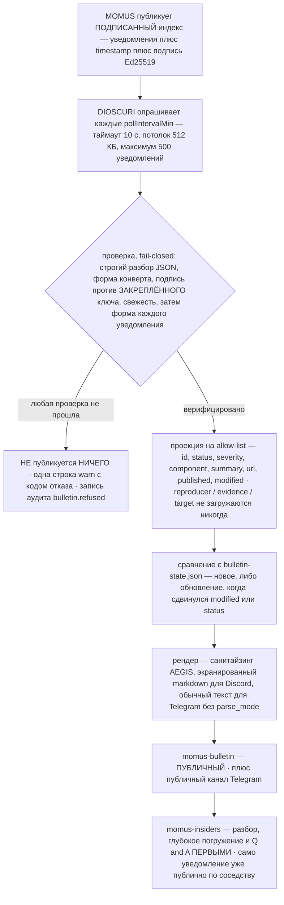
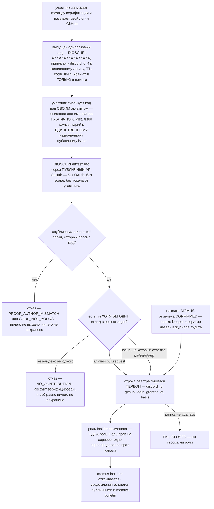

# Доступ сообщества DIOSCURI — публичный бюллетень и гейт Insider

> 🌐 Языки: [English](community-access.md) · **Русский** · [Español](community-access-es.md) · [Français](community-access-fr.md) · [中文](community-access-zh.md)

Из бюллетеня безопасности MOMUS выходят два канала, и это разные по природе
вещи. `#momus-bulletin` — **публичный**: его читает любой на сервере, а
уведомления об уязвимостях (advisory) появляются там в тот же момент, когда они
опубликованы. `#momus-insiders` — **заслуженный**, и лежат в нём разбор,
глубокое погружение и Q&A — но никогда само уведомление.

Этот документ объясняет, что куда попадает, что DIOSCURI проверяет, прежде чем
сказать хоть слово, как зарабатывается роль `Insider`, что именно хранится о
человеке и — прямым текстом — рассуждения за каждым из этих решений. Каждое
утверждение сверено с кодом; там, где есть переключатель, назван ключ
конфигурации. Анализ угроз живёт в [security.md](security.md), повседневная
эксплуатация — в [usage.md](usage.md).

Код: `src/bulletin/` (публикатор, верификатор, рендерер, состояние),
`src/community/` (гейт, читатель GitHub, реестр),
`src/provision/structure.ts` (каналы и одна роль).

## 1. Два канала, одно правило

| Канал | Кто его читает | Что туда попадает | Политика прав |
|---|---|---|---|
| `#momus-bulletin` | **все** | каждое верифицированное уведомление, как только оно прошло проверку; обновление, когда оно меняется | `readonly` — публичное чтение, запись боту |
| `#momus-insiders` | владельцы роли `Insider` | разбор, глубокое погружение, Q&A — комментарий об уведомлениях, которые уже публичны по соседству | `insidersonly` — скрыт от `@everyone`, открывается одной ролью |

Правило, которое решает каждый спорный случай:

> **Эксклюзив — это ВРЕМЯ и КОММЕНТАРИЙ, но никогда не информация.**

Уведомление публично в тот момент, когда оно опубликовано. Первыми инсайдеры
получают нашу прозу о нём. Если проектный вопрос когда-нибудь сведётся к «стоит
ли закрыть этот факт», ответ — нет.

Сама категория бюллетеня намеренно **не** закрыта (`BULLETIN_CATEGORY` в
`src/provision/structure.ts`) — закрыт только канал с разбором внутри неё.

## 2. Что попадает в `#momus-bulletin` и почему он публичный

### Пост

По одному сообщению на уведомление: эмбед в Discord и обычным текстом сообщение
в публичный канал Telegram. Полей ровно столько, потому что ровно эти поля
загружает верификатор (`toAdvisory` в `src/bulletin/verify.ts`):

| Поле | Как показано | Примечания |
|---|---|---|
| `id` | заголовок эмбеда, например `MOMUS-2026-0007` | ограничен набор символов, а не просто экранирование |
| `status` | бейдж — 🔴 OPEN / 🟢 FIXED / ⚪ WITHDRAWN | эмодзи + слово + цвет эмбеда, чтобы состояние пережило дальтоника, тёмную тему и однострочное уведомление на телефоне |
| `severity` | `info … critical` | нераспознанное значение рендерится как `unspecified` и никогда не отражается обратно |
| `component` | поле, 80 символов | затронутое место, например `aimarket-hub` |
| `summary` | описание, 700 символов | недоверенная удалённая проза — санитайзинг, затем экранирование markdown |
| `url` | ссылка эмбеда | **только https и только на том же origin, что у индекса бюллетеня** |
| `published` / `modified` | поля | показываются дословно, поэтому обязаны выглядеть как даты, иначе отбрасываются |

Для уведомления в статусе `open` пост несёт ещё одну нашу строку:

> ⚠️ **Открытое уведомление** — намеренно не даёт материала для действий: без
> репродьюсера, без доказательств, без цели. Детали публикуются, когда выходит
> исправление.

Эта строка не украшение. Худое уведомление читается как уведомление, которое
кто-то забыл дописать, — пока не скажешь, что пропуск и есть смысл. И рендерер
бюджетирует удалённую сводку против наших собственных строк ровно затем, чтобы
длинная враждебная сводка не вытолкнула это примечание за край эмбеда
(`src/bulletin/render.ts`).

### Что туда никогда не попадает

`reproducer`, `evidence`, `poc`, `target_url` — и всё прочее, что может нести
полезная нагрузка. Их не фильтруют ниже по потоку; они **никогда не
загружаются**. Верификатор проецирует каждую запись на allow-list из восьми
полей, поэтому ни один рендерер не может дотянуться до эксплойта и никакая
будущая правка шаблона не сможет его подставить. Дизайн раскрытия у MOMUS и так
опускает эти поля в уведомлениях со статусом `open`; это второй замок, на нашей
стороне провода, потому что «издатель обещал» — не тот контроль, которым владеем
мы.

### Почему канал публичный

Потому что ценность бюллетеня безопасности в том, что **его читают те, кого он
касается**.

Закрыть уведомления любым тестом на лояльность — вкладом, подпиской, звездой,
«спонсорским» тиром — значит, что человек, у которого крутится наш код, не
узнает, что в его компоненте открытая дыра. И он продолжит его крутить. Это не
перк сообщества с побочным эффектом; это ровно тот режим отказа, ради
предотвращения которого бюллетень и существует, и никакой прирост вовлечённости
его не окупает.

Дизайн самосогласован и в другую сторону: уведомления MOMUS со статусом `open`
намеренно **не дают материала для действий** — ни репродьюсера, ни доказательств,
ни цели — *именно затем, чтобы их можно было публиковать*. Обычный аргумент за
закрытое раскрытие — что детали вооружают атакующих быстрее, чем предупреждают
защитников. К документу, в котором деталей нет, этот аргумент неприменим.
Публикация «в этом компоненте есть открытая находка такой-то серьёзности» велит
защитнику пойти посмотреть и не даёт атакующему ничего, чем можно
воспользоваться. Детали публикуются, когда выходит исправление.

Итого два замка, и смотрят они в одну сторону: из уведомления вычищено всё, по
чему можно действовать, и *именно потому*, что вычищено, оно может уйти ко всем.

### Новое против обновления

Файл состояния (`bulletin-state.json`, по строке на id уведомления) помнит, что
мы уже анонсировали. Уведомление анонсируется повторно как **обновление**, когда
сдвинулась его метка `modified` **или** изменился его статус — статус
сравнивается отдельно намеренно, потому что издатель, переключивший
`open → fixed` не тронув `modified`, иначе оставил бы канал молчащим ровно про
тот переход, которого ждут читатели.

Файл состояния держит id уведомлений, анонсированную ревизию и id сообщений на
платформах. Ничего о человеке: ни id участников, ни кто-что-прочитал, ни какой бы
то ни было вовлечённости — и текста уведомлений тоже, потому что бюллетень
публичный, а локальная копия была бы лишь вторым источником правды, способным
разойтись с источником MOMUS.

## 3. DIOSCURI проверяет, прежде чем сказать хоть слово

MOMUS публикует бюллетень как ОДИН подписанный индекс:

```json
{ "advisories": [ … ], "timestamp": 1754650000000, "signature": "<hex ed25519>" }
```

`signature` — это Ed25519 над канонической формой RFC 8785 (JCS) от
`{advisories, timestamp}` — тот самый конверт, который MOMUS уже использует для
фида угроз WARDEN, и та же форма проверки, которую применяет к нему ARGUS. Один
конверт, один канонизатор, одна философия отказов.

**Зачем это вообще нужно.** Всё, что публикует DIOSCURI, уходит под нашим
собственным ботом сообщества, от нашего имени, в публичный канал. Непроверенное
уведомление означало бы, что тот, кто контролирует сетевой путь между нами и
MOMUS — прокси, ответ DNS, скомпрометированный edge, — получает право публиковать
обвинения в адрес названных компонентов так, будто их сделали мы. Проверка здесь
не любезность; это разница между бюллетенем и мегафоном, направленным на
посторонних.



### Пять свойств, и почему именно в таком порядке

| Порядок | Проверка | Коды отказа | Почему |
|---|---|---|---|
| 1 | строгий разбор JSON | `UNPARSEABLE` | дублирующиеся ключи и нецелые литералы — решение издателя, а не парсера |
| 2 | форма конверта, размер, количество | `MALFORMED`, `OVERSIZED` | `timestamp` **обязателен**: необязательный означал бы «индекс, который его опустил, свеж вечно» |
| 3 | Ed25519 против **закреплённого** ключа | `NO_PUBKEY`, `BAD_PUBKEY`, `NO_CANONICAL_FORM`, `SIGNATURE_INVALID` | подлинность. Нет закреплённого ключа — не публикуется вообще ничего: неподписанный бюллетень отвергается, а не принимается на веру потому что пришёл |
| 4 | свежесть, **последней** | `STALE`, `FUTURE_DATED` | пока подпись не проверена, `timestamp` — это число, выбранное атакующим, поэтому отказ по нему ничего бы не доказывал |
| 5 | форма каждого уведомления | *запись отбрасывается, индекс остаётся* | одно кривое уведомление не должно заглушить те, что в порядке |

Свежесть заслуживает отдельного предложения, потому что именно эту проверку
принято считать избыточной. Подпись говорит, **кто** написал документ; она
никогда не говорит, **когда его вам вручили**. Без окна свежести тот, кто отдаёт
URL, может вечно проигрывать снимок месячной давности и молча стирать все
уведомления, опубликованные с тех пор. Для бюллетеня это стирание *и есть* атака
— уведомление, которое оператор больше всего хочет подавить, это самое свежее.
Окно по умолчанию: 24 ч (`tuning.bulletin.maxAgeHours`, 1–336). Его можно
расширить под более медленный ритм публикаций. Его нельзя выключить.

Размер и количество — скучные защиты, которые не дают враждебному или сломанному
издателю утащить процесс за собой: 512 КБ тела, 500 уведомлений, таймаут запроса
10 секунд и потолок в 4000 символов на любое поле, которое мы сохраняем.

### Что видит оператор, когда проверка не прошла

**Не публикуется ничего.** Ни частичного поста, ни поста «как получилось» с
оговоркой, ни повторно отправленного снимка прошлого цикла. Сообщество видит
неизменившийся канал — а выглядит это *ровно так же*, как «MOMUS давно ничего не
публиковал». Из-за этой двусмысленности отказ громкий на стороне оператора, в
трёх местах:

1. **Одна строка предупреждения за цикл**, с кодом и причиной:

   ```json
   {"ts":"2026-08-08T12:00:00.000Z","level":"warn",
    "msg":"bulletin index REFUSED — nothing posted","code":"STALE",
    "reason":"signed snapshot is 51.2 h old, past the 24 h limit — REJECTED as a possible replay hiding newer advisories"}
   ```

2. **Одна запись аудита**, в хеш-цепочке, как и всякое значимое действие:

   ```json
   {"kind":"bulletin.refused","actor":"dioscuri","subject":"https://momus.modelmarket.dev/bulletin",
    "data":{"code":"SIGNATURE_INVALID","reason":"Ed25519 signature does not match the pinned key — index REJECTED, nothing posted"}}
   ```

3. **Предупреждение на старте**, когда фича сконфигурирована неверно, потому что
   отсутствующий закреплённый ключ иначе выглядит неотличимо от молчащего
   издателя:

   ```text
   bulletin publisher not started — no pinned publisher key; an unverified advisory is never posted
   bulletin publisher not started — no channel configured
   ```

За ещё двумя предупреждениями стоит следить: оба означают, что *подписанный*
индекс нёс то, что мы не станем повторять:

```text
bulletin: advisories dropped for failing shape validation        (dropped=N)
bulletin: advisory links dropped for pointing off the index origin (droppedLinks=N)
```

Второе важнее, чем кажется: мы проверили, *кто* написал индекс, а это не
обещание о том, куда он указывает, — и кликабельная ссылка в бюллетене
безопасности это самая доверенная ссылка в канале. Ссылка на чужой origin или не
по https отбрасывается; уведомление всё равно публикуется, просто без
гиперссылки.

Полный список кодов отказа: `NO_URL`, `NO_PUBKEY`, `FETCH_FAILED`, `HTTP_ERROR`,
`OVERSIZED`, `UNPARSEABLE`, `MALFORMED`, `BAD_PUBKEY`, `NO_CANONICAL_FORM`,
`SIGNATURE_INVALID`, `STALE`, `FUTURE_DATED`, плюс коды уровня цикла
`NO_SINKS`, `ALREADY_RUNNING` и `INTERNAL_ERROR`.

### Здесь ничто не бросает исключений

`BulletinPublisher.runOnce()` ловит всё и возвращает объект результата, поэтому
путь по расписанию не может уронить бота: публикатор, который валит процесс
из-за того, что фид лежал, хуже того, который пропустит цикл. Синк, бросивший
исключение, логируется и пропускается — вторая платформа всё равно получает
уведомление, а упавшая повторяется на следующем цикле в течение суток
(достаточно долго, чтобы перекрыть аварию и перезапуск, достаточно коротко,
чтобы канал, настроенный позже, никогда не получил трёхлетнюю историю разом).
Состояние сохраняется после **каждой** успешной публикации, поэтому падение в
середине прогона не может переанонсировать уже ушедшее, а `maxPostsPerRun` (по
умолчанию 5) заставляет холодный старт капать, а не заливать.

### Как включить

По умолчанию выключено и вдвойне fail-closed (отказ по умолчанию) — одного
`enabled` мало:

| Ключ | По умолчанию | Что значит |
|---|---|---|
| `tuning.bulletin.enabled` | `false` | главный тумблер |
| `tuning.bulletin.indexUrl` | `https://momus.modelmarket.dev/bulletin` | подписанный индекс |
| `tuning.bulletin.publicKey` | `""` | **закрепление (pin)** — hex SPKI DER Ed25519. Пусто — значит не публикуется вообще ничего |
| `tuning.bulletin.maxAgeHours` | `24` | окно свежести, 1–336 |
| `tuning.bulletin.pollIntervalMin` | `30` | минимум 5 |
| `tuning.bulletin.maxPostsPerRun` | `5` | 1–25 |
| `tuning.bulletin.writeupBaseUrl` | `""` | базовый URL инсайдерского разбора; пусто — строка с разбором не рендерится |
| `DISCORD_BULLETIN_CHANNEL_ID` | *(авто)* | провижинер создаёт и находит `#momus-bulletin`; задавайте это, только чтобы закрепить канал, который вы разместили сами |
| `TELEGRAM_BULLETIN_CHAT_ID` | *(пусто)* | пусто — значит сторона Telegram выключена: уведомления **никогда** не сваливаются в основной чат как запасной вариант |

`publicKey` — *публичный* ключ, поэтому он живёт в несекретном файле тюнинга —
но это **закрепление**, и это единственная причина, по которой мы вправе
повторять обвинения MOMUS в адрес названных компонентов под нашим собственным
ботом.

## 4. Как заслужить `Insider` — три пути вклада

Гейт — это **вклад, и никогда не одобрение**. Роль зарабатывает ЛЮБОЙ ОДИН из
них:

| Основание | Что подходит | Как проверяется |
|---|---|---|
| `pr` | **влитый pull request** в настроенной организации | один публичный поиск, `is:pr is:merged author:<login> user:<owner>` |
| `issue` | **issue, который вы открыли и на который ответил мейнтейнер** | публичный поиск issue за вашим авторством, затем комментарии максимум к 5 из них |
| `finding` | **находка MOMUS, которую оператор отметил как CONFIRMED** | `Keeper` называет участника Discord; журнал аудита фиксирует, кто это сделал |

Вклады в остальном мире не считаются — квалификатор `user:` ограничивает оба
поиска настроенным владельцем (`githubOwner`). Вклад в чужой проект делает вас
чужим инсайдером.

Почему вклад, а не одобрение, — по пунктам: «сделай это и получи доступ»,
нацеленное на одобрение, — это стимулированная вовлечённость по Acceptable Use
Policies GitHub, а проект, всё позиционирование которого построено на
проверяемости, не может себе такого позволить. Постоянная проверка «всё ещё ли
одобряет нас» была бы хуже — она означала бы вечный опрос активности конкретных
людей на GitHub и хранение истории вовлечённости. Это слежка плюс набор данных,
который нам потом пришлось бы защищать. Вклад отбирает тех, кто **дал**
что-то, а не тех, кто на что-то кликнул.

### Почему путь через issue требует ответа мейнтейнера

Потому что без него гейт читается как «открой пустой issue».

Такая версия отбирает шум: трекер заполняется однострочными issue, открытыми
чтобы взять планку, и настоящие отчёты хоронятся под ними. Требование, чтобы
кто-то с нашей стороны проекта *ответил*, означает, что issue стоил ответа —
суждение выносит человек, делающий обычную работу мейнтейнера, а не правило,
которое фармер может выполнить нарочно.

Честным это держат две детали:

- «Мейнтейнер» — это **собственное** поле GitHub `author_association`: `OWNER`,
  `MEMBER` или `COLLABORATOR`. Это не список, который курируем мы, поэтому он не
  может тихо превратиться в список любимчиков.
- Отвечающий комментарий не должен быть комментарием самого участника. Ответить
  самому себе на свой issue — ровно тот фарм, который эта оговорка и закрывает.

Проверка смотрит максимум на 5 issue за авторством участника (это ограничивает
стоимость в API), а один нечитаемый issue пропускается, а не трактуется как
вердикт о человеке.

### Почему путь через находку идёт через человека

Приём отчётов у MOMUS **анонимен по замыслу**. Поэтому автоматической связи
между анонимным отчётом и человеком нет, и этот модуль её не выдумывает:
оператор называет ник в Discord и берёт ответственность на себя.

Путь доступен только роли `Keeper`, и вызывающая сторона обязана явно указать
`operatorIsKeeper` — будущий платформенный слой, забывший проверить роль
`Keeper`, должен будет передать буквальную ложь, а это легко заметить на ревью.
Запись аудита фиксирует, какой оператор это сделал, и, опционально, id
уведомления, которое это обосновало. `github_login` на этом пути необязателен и
хранится как `""`, если его нет: у анонимного искателя может не быть аккаунта,
который можно назвать, а выдумать его — значит положить в реестр фикцию.

## 5. Как доказать владение аккаунтом GitHub без OAuth

Мы никогда не просим у участника токен.

Токен доступа, способный читать чью-то активность, — куда большая власть, чем
нужно для «я владею этим аккаунтом», а приняв его, мы становимся его хранителем:
теперь секрет есть в нашем процессе, в наших логах — если кто-то неаккуратен, —
и в наших бэкапах. Доказывается ровно один бит: *этот участник Discord владеет
тем аккаунтом GitHub.* Публичный челлендж доказывает именно этот бит и не
оставляет у нас на руках ничего.



### Три шага

1. **Выпуск.** Участник запускает команду верификации, называя свой логин
   GitHub. Мы выпускаем `DIOSCURI-` + 16 hex-символов, привязанные к его id в
   Discord *и* к заявленному логину, с TTL (по умолчанию 30 мин,
   `tuning.insiders.codeTtlMin`). Этот шаг офлайновый — запроса в GitHub ещё не
   происходит, поэтому опечатка в логине никому не стоит вызова API.
2. **Публикация.** Участник публикует этот код под своим аккаунтом: **публичный
   gist** с кодом в описании или в имени файла, либо комментарий с ним к
   **одному** назначенному публичному issue (`tuning.insiders.proofRepo` +
   `proofIssue`).
3. **Чтение.** Мы читаем его так же, как мог бы любой посторонний, — списки gist
   (только описание и имена файлов, никогда содержимое файлов) и комментарии к
   тому одному issue, суженные до комментариев новее челленджа, — и подтверждаем,
   что логин **автора** это тот логин, который был заявлен.

### Код не секрет, и это нормально

Его обязаны опубликовать; в этом весь механизм. Публиковать его безопасно,
потому что он привязан дважды:

- посторонний, скопировавший его из канала, **не сможет его погасить** —
  погашение привязано к тому id в Discord, для которого код был выпущен
  (`CODE_NOT_YOURS`);
- посторонний **не сможет выдать его за своё доказательство** — доказательство
  должно быть написано тем логином, который просил код
  (`PROOF_AUTHOR_MISMATCH`).

Когда чужой код всплывает под аккаунтом, отказ громкий, а логин *другой* стороны
никогда не отражается обратно: это раздало бы связку GitHub↔Discord всякому, кто
спросит. Код одноразовый — он удаляется, — а просроченные коды выбрасываются в
тот момент, когда их замечают, чтобы мёртвый код нельзя было спутать с живым.

Платформенный слой всё равно должен отвечать **приватно** (эфемерным ответом или
в личные сообщения) — не потому, что код секретный, а потому, что публичный
канал, забитый чужими кодами верификации, — это сбивающий с толку шум.

### Сначала доказательство, потом вклад — всегда

Порядок в `redeem()` несущий. Проверка вклада — это утверждение об **аккаунте**;
запустив её до того, как мы знаем, что участник владеет этим аккаунтом, мы
позволили бы кому угодно присвоить работу любого контрибьютора. Итак: сначала
доказательство, вторым вклад, третьей выдача.

### Ограничения, в которые может упереться участник

| Код | Что означает | Что говорят участнику |
|---|---|---|
| `BAD_LOGIN` | непохоже на логин GitHub (буквы, цифры, одиночные внутренние дефисы, ≤ 39 символов) | что это не похоже на имя пользователя |
| `ALREADY_INSIDER` | роль у него уже есть | делать нечего; если роль пропала из профиля, попросить `Keeper` |
| `LOGIN_ALREADY_CLAIMED` | этот аккаунт GitHub уже заработал роль для другого участника | сказано **без** имени того, кто её держит — один аккаунт, один человек |
| `NO_PROOF_CHANNEL` | не настроен ни маршрут через gist, ни issue | `Keeper` должен что-то из этого задать |
| `BUSY` | в работе больше 500 челленджей | попробовать через несколько минут |
| `NO_CHALLENGE` / `EXPIRED` | ничего не ожидается, либо истёк TTL | начать верификацию заново |
| `TOO_SOON` | попытки погашения разнесены на 20 с | сколько секунд осталось |
| `PROOF_NOT_FOUND` | код ещё не опубликован под этим аккаунтом | где его можно разместить |
| `CODE_NOT_YOURS` / `PROOF_AUTHOR_MISMATCH` | чужой код, либо нужный код под не тем аккаунтом | запустить команду самому / опубликовать под тем аккаунтом, который назвал |
| `NO_CONTRIBUTION` | аккаунт верифицирован, подходящего вклада нет | три пути, перечисленные прямым текстом — голое «нет» читается как сломанный бот |
| `GITHUB_UNAVAILABLE` | мы не смогли достучаться до GitHub | *«Это не ставится вам в вину — попробуйте через несколько минут.»* |
| `NOT_OPERATOR` | путь через находку вызвал не `Keeper` | подтвердить находку может только `Keeper` |
| `STORAGE_FAILED` | реестр не удалось записать | роль **не** применена; попробуйте вскоре ещё раз |

Интервал в 20 секунд существует потому, что одно погашение стоит до девяти
публичных запросов к GitHub, а команда открыта всем на сервере: без него один
участник, зажавший клавишу, сжигает общий лимит запросов на всё сообщество.
Формулировка `GITHUB_UNAVAILABLE` подобрана намеренно — сбой GitHub обязан
читаться как *«мы не смогли проверить»*, а никогда как *«вы не контрибьютор»*.

### Как включить

| Ключ | По умолчанию | Что значит |
|---|---|---|
| `tuning.insiders.enabled` | `false` | главный тумблер |
| `tuning.insiders.proofRepo` | `""` | репозиторий с назначенным issue для верификации; пусто — маршрут через issue выключен |
| `tuning.insiders.proofIssue` | `0` | номер issue; `0` выключает маршрут |
| `tuning.insiders.allowGistProof` | `true` | принимать публичный gist как доказательство |
| `tuning.insiders.codeTtlMin` | `30` | сколько минут выпущенный код можно погасить, 1–1440 |
| `GITHUB_TOKEN` | *(опционально)* | **собственный** токен бота, уже есть в конфиге для MNEMOSYNE. Отправляется только чтобы поднять лимит запросов на публичное чтение; никогда не логируется, никогда не покидает модуль |

Всё в блоке тюнинга несекретно — владелец, репозиторий, номер issue, TTL.
Доказательство владения аккаунтом GitHub не требует ни от кого секрета, поэтому
настраивать здесь нечего.

## 6. Звёзды не читаются. Вообще.

Ни тира доступа. Ни бейджа. Ни косметической роли. Даже разовой проверки нет.

Ранний дизайн выдавал косметическую роль по одному чтению звезды. Его больше
нет, и вот почему:

- **Гейт по удерживаемой звезде потребовал бы следить за людьми.** «Поставил
  звезду» дёшево прочитать один раз и бессмысленно после — интересно ведь, стоит
  ли звезда *до сих пор*, а ответ на это означает опрос активности конкретных
  людей на GitHub по расписанию и хранение истории вовлечённости. Это слежка за
  теми, кого мы якобы награждаем, и она производит набор данных, который нам
  потом пришлось бы защищать. Варианта, который был бы одновременно осмысленным
  и уважительным, не существует.
- **Даже косметическая роль — это поверхность прав, которая дрейфует.** Роль,
  которая сегодня ничего не значит, — ровно то, что через полгода обзаводится
  переопределением прав на канал, потому что так было удобно. Способ сохранить
  роль безвредной — не создавать её.
- **И это было бы одобрение, купленное доступом**, — то самое, что Acceptable
  Use Policies GitHub называют стимулированной вовлечённостью, и последнее, чем
  стоило бы заниматься проекту, продающему проверяемость.

Отсутствие **структурное**, а не вопрос дисциплины:

- среди четырёх маршрутов, которые использует фича, нет маршрута со звёздами
  (список gist, комментарии одного issue, два поиска);
- нет метода на `GithubPublicReader`, который мог бы ответить на этот вопрос, —
  будущая правка не сможет «просто подсмотреть» через дверь, которую никогда не
  строили;
- нет поля со звездой в реестре (`src/community/store.ts`);
- нет слова «звезда» в основании выдачи — enum оснований это
  `pr | issue | finding`, и записать что-либо ещё намеренно некуда.

И это проверено тестами дважды, в `test/community-access.test.ts`: один раз
сканированием исходника модуля на имена звёздного маршрута и полей, второй —
фейковым клиентом GitHub, который записывает **каждое свойство, к которому
тянется гейт**.

Если кто-то поставит проекту звезду, здесь этого никто не заметит, не запишет и
не наградит.

## 7. Что именно хранится о человеке

Четыре поля. По одной строке на участника, заслужившего роль, в `insiders.json`
в каталоге данных (`/data` в Docker):

```json
{
  "insiders": [
    {
      "discord_id": "1234567890",
      "github_login": "octocat",
      "granted_at": "2026-08-08T12:00:00.000Z",
      "basis": "pr"
    }
  ]
}
```

`discord_id` — кому принадлежит роль. `github_login` — аккаунт, который её
заслужил (в собственном регистре GitHub; `""` для выдачи оператором от имени
анонимного искателя). `granted_at` — когда. `basis` — `pr`, `issue` или
`finding`.

Это вся запись. Четыре имени экспортируются как `INSIDER_FIELDS`, чтобы тест мог
с нас за это спросить; файл пишется поле за полем, а не разворачиванием строки
из памяти; неизвестные ключи срезаются при загрузке — отредактированный руками
файл, добавляющий `email` или след активности, не сможет протащить их обратно.

**Не хранится:** ни истории вовлечённости, ни лога активности, ни email, ни
отображаемого имени, ни счётчика звёзд и никакого флага звезды, ни отметок о
прочтении, ни записей о чужих действиях, и **никакой копии доказательств**.
Вклад, заслуживший роль, публичен на GitHub и перепроверяем кем угодно, поэтому
своя копия лишь построила бы приватное досье, которое нам потом пришлось бы
защищать.

Незавершённые верификации держатся **только в памяти** и никогда не
персистятся: ожидающий челлендж — это id в Discord плюс заявленный логин, то
есть данные о человеке, который ещё ничего не заслужил. Перезапуск, забывший их,
стоит одной команды; персистить их значило бы хранить людей, которые так и не
вернулись.

### Зачем вообще что-то хранить

Потому что роль в Discord — это *проекция*, а не запись. Участник, потерявший
роль при пересборке сервера, обязан получить её обратно ничего не доказывая
заново, а человек, попросивший себя забыть, не должен оставить после себя
ничего — что возможно, только если удалять нужно ровно из одного места.

Именно поэтому персистентность **fail-closed**: если реестр не удаётся
записать, роль не выдаётся (`STORAGE_FAILED`). Роль, за которой нет записи,
нельзя ни объяснить, ни забыть, а и то и другое важнее удобства. Обратный
порядок допустим: если запись в реестр удалась, а вызов API Discord упал, право
доступа существует, и роль применяется повторно на следующей сверке.

### Как быть забытым

Одна команда — от самого человека или от оператора. Строка **удаляется** — не
помечается, не маркируется «отозвана»: маркер отзыва означал бы, что реестр всё
ещё помнит, что этот id в Discord когда-то был инсайдером, а это противоположно
тому, о чём просил попросивший себя забыть. Роль `Insider` снимается, любой
ожидающий челлендж выбрасывается, а ответ такой:

> Готово — ваша строка удалена, роль снята. О вас ничего не хранится.

Если ничего не хранилось, бот так и говорит. Если само удаление не удалось,
человеку прямо сообщают, что `Keeper` попрошен доделать это руками, а не
говорят «готово».

Снятие роли по замыслу best-effort: висящая роль без строки видна модераторам и
чинится, тогда как неудавшийся отзыв никогда не должен воскресить только что
удалённую строку.

Одна честная оговорка, развёрнутая ниже в разделе остаточных рисков: журнал
аудита в хеш-цепочке работает только на добавление, поэтому строка
`insiders.grant` в нём остаётся.

## 8. Чем это не является

- **Не пейволл.** Здесь ничего не продаётся, и никакие деньги гейт не двигают.
  Единственная валюта — вклад в эту экосистему, а самый дешёвый подходящий это
  issue, стоящий ответа мейнтейнера.
- **Не гейт по звёздам.** Звёзды не читаются ни для доступа, ни для бейджа, ни
  единожды. См. §6 — нет ветки кода, которая могла бы прочитать хоть одну.
- **Не способ утаить информацию о безопасности от тех, кого она касается.**
  Уведомления публичны в `#momus-bulletin` в тот момент, когда они прошли
  проверку. Закрыт наш комментарий — разбор, глубокое погружение, Q&A. Если у вас
  крутится затронутый компонент, всё, что нужно для действий, лежит в публичном
  канале, и чтобы это прочитать, не нужны ни роль, ни аккаунт, ни отношения с
  нами.
- **Не выдача прав.** `Insider` несёт **ноль** прав на сервере и не упоминаема —
  вся её работа это одно переопределение прав канала. Закрытый канал, чьих
  участников может тегнуть кто угодно, выдаёт, кто в нём состоит.
- **Не уровень модерации.** Модерируют `Keeper`-ы; инсайдеры читают канал. Роли
  не связаны, и гейт не может выдать ни одну из них по собственной инициативе.
- **Не «ровно одна роль плюс пара маленьких».** Ровно одна роль. Каждая
  дополнительная роль — поверхность прав, которая дрейфует.

## 9. Журнал аудита

Обе фичи пишут в хеш-цепочку `audit.jsonl`, описанную в
[usage.md §6](usage.md#6-audit--the-flight-recorder):

| `kind` | Когда пишется | `data` |
|---|---|---|
| `bulletin.refused` | не прошла проверка, свежесть или размер | `{ code, reason }` — subject это URL индекса |
| `bulletin.post` / `bulletin.update` | уведомление было анонсировано | `{ status, severity, component, sinks }` — subject это id уведомления |
| `insiders.grant` | роль была выдана | `{ basis, github_login }` и, на пути оператора, id лида MOMUS — subject это `dc:<discord id>`, actor это `pollux` либо ключ оператора |
| `insiders.forget` | строка была удалена | `{}` — subject это `dc:<discord id>`, actor это `self` либо оператор |

Запись о выдаче несёт *факты* выдачи и ничего сверх: ни копии доказательств, ни
URL, ни активности. Вклад публичен на GitHub и перепроверяем кем угодно.
Сломанный синк аудита логируется и проглатывается — он никогда не должен ломать
команду участника.

## Остаточные риски — что это НЕ решает

Раздел честности, в стиле
[security.md](security.md#residual-risks--what-this-does-not-solve). Известные
пробелы, принятые сознательно:

- **Цепочка аудита помнит выдачу после того, как строка исчезла.**
  `insiders.grant` записывает `dc:<discord id>`, основание и логин GitHub;
  цепочка работает только на добавление и связана хешами, поэтому вырезать
  запись из неё значило бы сломать все записи после неё. Быть забытым поэтому
  убирает право доступа и строку реестра, но не исторический факт, что выдача
  была. Цепочка локальна для тома данных оператора, никогда не публикуется и не
  содержит никакой другой активности этого человека — но это настоящее
  ограничение, а не погрешность округления, и тот, кто просит себя забыть,
  заслуживает услышать это вслух.
- **Опубликованное доказательство переживает свою полезность.** Код одноразовый
  и после погашения ничего не стоит, но оставленный gist — это постоянная
  публичная связь между аккаунтом GitHub и этим сообществом. Кому это важно,
  стоит потом удалить gist; ничто в потоке не удаляет его за них, потому что
  ничто в потоке этого не может.
- **Доказательство проверяется один раз.** Владение аккаунтом проверяется в
  момент погашения и после не перепроверяется. Переданный или скомпрометированный
  аккаунт GitHub сам по себе роль в Discord не теряет.
- **Связка существует.** `LOGIN_ALREADY_CLAIMED` намеренно не говорит, кто
  держит логин, но реестр действительно спаривает логин GitHub с id в Discord.
  Четыре поля — это минимум, который делает возможными повторную выдачу и
  удаление; это не ноль.
- **Сбой GitHub закрывает гейт.** Отказы прямо это говорят и ничего не ставят
  участнику в вину, но пока GitHub недоступен, никто новый внутрь не попадает.
  Альтернатива — выдавать по непроверенному заявлению — хуже.
- **Свежесть это окно, а не стена.** Внутри `maxAgeHours` проигранный снимок всё
  ещё проходит проверку, поэтому враждебный edge может спрятать уведомление,
  опубликованное в последние сутки (по умолчанию), пока не сработает проверка на
  устаревание. Сужение окна разменивает это на ложные отказы, когда MOMUS
  публикует медленно.
- **Подпись аутентифицирует издателя, а не его суждение.** Если слой раскрытия у
  MOMUS когда-нибудь деградирует и начнёт отдавать детали в `summary`, мы этот
  `summary` повторим. Allow-list гарантирует, что ни одно поле `reproducer`,
  `evidence`, `poc` или `target` не сможет быть опубликовано через этого бота, —
  он не может гарантировать, что проза в поле `summary` не даёт материала для
  действий.
- **Гейт это код, но пока не поверхность команд.** `src/bulletin/` и
  `src/community/` поставляются со своей конфигурацией, каналами, ролью и
  тестами; платформенный слой, выставляющий команды для участников и два синка
  публикации, подключается отдельно, и обе фичи по умолчанию `enabled: false`.
  Пока эта обвязка не приземлилась, поддерживаемый путь — выдача роли оператором
  вручную, и именно реестр, а не роль в Discord, делает такую выдачу объяснимой
  и обратимой.

Нашли дыру в этом гейте? Откройте issue на
[github.com/alexar76/dioscuri](https://github.com/alexar76/dioscuri). Как только
мейнтейнер на него ответит, этот issue сам станет одним из трёх путей внутрь.
