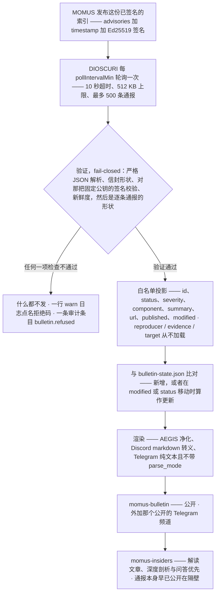
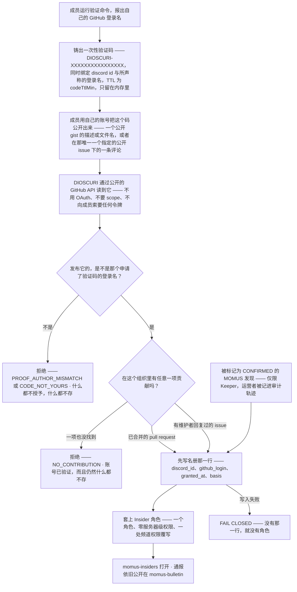

# DIOSCURI 社区访问 —— 公开的安全公告与 Insider 门禁

> 🌐 语言：[English](community-access.md) · [Русский](community-access-ru.md) · [Español](community-access-es.md) · [Français](community-access-fr.md) · **中文**

MOMUS 的安全公告（bulletin）延伸出两个频道，而它们不是同一类东西。`#momus-bulletin`
是**公开的**：服务器里的任何人都能读，通报（advisory）一经发布就会贴出来。`#momus-insiders`
是**挣来的**，它装的是解读文章、深度剖析和问答 —— 从来不是通报本身。

本文说明什么内容落到哪里、DIOSCURI 在开口之前会验证什么、`Insider` 角色如何挣得、关于一个人
究竟存了什么，以及 —— 直说 —— 每一个这些选择背后的理由。每一处断言都对着代码核对过；只要存在
可调项，就点名给出配置键。威胁分析在 [security.md](security.md)，日常运维在
[usage.md](usage.md)。

代码：`src/bulletin/`（发布器、验证器、渲染器、状态），`src/community/`（门禁、GitHub
读取器、名册），`src/provision/structure.ts`（那些频道，以及那唯一一个角色）。

## 1. 两个频道，一条规则

| 频道 | 谁能读 | 什么会落在那里 | 权限策略 |
|---|---|---|---|
| `#momus-bulletin` | **所有人** | 每一条通过验证的通报，一验证完就发；某条发生变化时发更新 | `readonly` —— 公开可读，机器人可写 |
| `#momus-insiders` | 持有 `Insider` 的人 | 解读文章、深度剖析、问答 —— 都是对隔壁那些早已公开的通报的评述 | `insidersonly` —— 对 `@everyone` 隐藏，由一个角色打开 |

决定每一个模棱两可情形的那条规则：

> **专属性只体现在时间先后与评述上，绝不体现在信息上。**

通报在发布的那一刻就是公开的。内部人先拿到的，是我们对它的文字解读。如果哪天有一个设计问题归结为
「这个事实该不该被门禁挡住」，答案就是不该。

公告分类目录本身刻意**不**设门禁（`src/provision/structure.ts` 中的
`BULLETIN_CATEGORY`）—— 设门禁的只有它里面那个解读频道。

关于 `readonly` 给运营者的一点说明：置备器创建 `#momus-bulletin` 时只让机器人可以发言，而它的
频道主题是邀请讨论的。如果你希望读者就在这个频道里回复，就手工为 `@everyone` 打开
`SendMessages` —— 置备器只对自己创建的频道设置权限，绝不去碰一个被沿用下来的频道，所以你的改动
能挺过之后每一次启动。

## 2. `#momus-bulletin` 里会出现什么，以及它为什么公开

### 帖子

每条通报一条消息：一个 Discord 嵌入消息（embed），以及给公开 Telegram 频道用的一条纯文本消息。
存在的字段恰好就是下面这些，因为验证器加载的恰好就是这些（`src/bulletin/verify.ts` 中的
`toAdvisory`）：

| 字段 | 呈现为 | 说明 |
|---|---|---|
| `id` | 嵌入消息标题，例如 `MOMUS-2026-0007` | 字符集受限，而不只是做了转义 |
| `status` | 徽章 —— 🔴 OPEN / 🟢 FIXED / ⚪ WITHDRAWN | emoji + 单词 + 嵌入消息颜色，于是这个状态在色盲读者那里、在深色主题下、在一行手机通知里都能活下来 |
| `severity` | `info … critical` | 无法识别的值渲染为 `unspecified`，绝不原样回显 |
| `component` | 字段，80 字符 | 受影响的那个东西，例如 `aimarket-hub` |
| `summary` | 描述，700 字符 | 不可信的远端文字 —— 先净化，再做 markdown 转义 |
| `url` | 嵌入消息链接 | **只允许 https，且只允许公告索引自身的来源（origin）** |
| `published` / `modified` | 字段 | 原样显示，所以它们必须看起来像日期，否则会被丢弃 |

对于一条 `open` 通报，帖子里还会带上一句我们自己的话：

> ⚠️ **open 通报** —— 刻意做成不可直接利用：没有复现步骤、没有证据、没有目标。细节会在修复
> 发布时公布。

这一句不是装饰。一条内容单薄的通报，如果你不明说「省略本身就是重点」，读起来就像是有人忘了把它
写完 —— 而渲染器把远端摘要的额度按我们自己那几行来扣，正是为了让一段又长又敌意的摘要没法把这条
提示从嵌入消息的末尾挤出去（`src/bulletin/render.ts`）。

### 什么永远不会落到那里

`reproducer`、`evidence`、`poc`、`target_url` —— 以及载荷里可能携带的任何别的东西。这些不是在
下游被过滤掉的；它们**从不被加载**。验证器把每条记录投影到一份八字段的白名单上，于是没有任何
渲染器能够触到一个漏洞利用，未来对模板的任何改动也无法把它插值进去。MOMUS 的披露设计本来就不
在 `open` 通报里放这些字段；这是第二道锁，落在我们这一侧的线上，因为「发布方承诺过」并不是一项
由我们掌握的控制手段。

### 这个频道为什么公开

因为一份安全公告的价值就在于**受影响的人真的读到它**。

把通报锁在任何一种忠诚度测试之后 —— 一次贡献、一笔订阅、一个 star、一个「支持者」等级 ——
意味着某个正在跑我们代码的人不会知道自己的组件上有一个尚未修复的洞。他会继续跑下去。这不是一项
带点小缺陷的社区福利；这正是公告存在所要防止的那种失效模式，而互动量上再大的收益也抵不过它。

这套设计在另一个方向上同样自洽：MOMUS 的 `open` 通报被刻意做成**不可直接利用** —— 没有复现
步骤、没有证据、没有目标 —— *恰恰就是为了它们能够公开*。支持给披露设门禁的常见论点是：细节武装
攻击者的速度快过它警示防守方的速度。这个论点对一份不含细节的文档不成立。公布「这个组件上有一条
这个严重级别的未修复发现」，是在告诉防守方去查，同时没有告诉攻击者任何他用得上的东西。细节会在
修复发布时公布。

所以这里有两道锁，而且它们指向同一个方向：通报被剥掉了一切可直接利用的内容，而**正因为**被剥掉
了，它才能发给所有人。

### 新增与更新

状态文件（`bulletin-state.json`，每个通报 id 一行）记着我们已经宣告过什么。当一条通报的
`modified` 时间戳发生移动**或者**它的 status 发生变化时，它会作为一次**更新**被重新宣告 ——
status 之所以被单独比较，是刻意为之：一个把 `open → fixed` 一翻而过却不去动 `modified` 的
发布方，否则会让频道对读者最盼着的那一次状态转变保持沉默。

状态文件里存的是通报 id、已宣告的修订版本，以及各平台的消息 id。关于人的什么都不存：没有成员
id，没有谁读了什么，没有任何形式的互动记录 —— 也不存通报正文，因为公告本身是公开的，留一份本地
副本只会造出第二个事实来源，而它会和 MOMUS 那边渐渐对不上。

## 3. DIOSCURI 在开口之前先验证

MOMUS 把公告作为**一份**已签名的索引发布：

```json
{ "advisories": [ … ], "timestamp": 1754650000000, "signature": "<hex ed25519>" }
```

`signature` 是对 `{advisories, timestamp}` 的 RFC 8785（JCS）规范形式所做的 Ed25519 签名
—— 和 MOMUS 早已用于 WARDEN 威胁情报源的那个信封相同，也和 ARGUS 对它施加的验证形状相同。一个
信封，一个规范化器，一套失败哲学。

**这件事为什么存在。** DIOSCURI 发出去的一切，都是以我们自己的社区机器人、用我们自己的名义、发进
一个公开频道。一条未经验证的通报，意味着谁控制了我们与 MOMUS 之间的网络路径 —— 一个代理、一条
DNS 应答、一个被攻陷的边缘节点 —— 谁就能针对被点名的组件发布安全指控，仿佛那是我们提出的。这里
的验证不是锦上添花；它是「一份公告」与「一只对着陌生人喊的扩音器」之间的区别。



### 五项性质，以及为什么是这个顺序

| 顺序 | 检查 | 拒绝码 | 为什么 |
|---|---|---|---|
| 1 | 严格 JSON 解析 | `UNPARSEABLE` | 重复键和非整数字面量该由发布方来决定，而不是由解析器替它决定 |
| 2 | 信封形状、大小、条数 | `MALFORMED`、`OVERSIZED` | `timestamp` 是**必填**的：可选的时间戳等于说「省略它的索引永远新鲜」 |
| 3 | 用**固定的**那把公钥做 Ed25519 校验 | `NO_PUBKEY`、`BAD_PUBKEY`、`NO_CANONICAL_FORM`、`SIGNATURE_INVALID` | 真实性。没有配置固定值就什么都不会发 —— 未签名的公告会被拒绝，而不是因为「它送到了」就被信任 |
| 4 | 新鲜度，放在**最后** | `STALE`、`FUTURE_DATED` | 在签名通过之前，`timestamp` 只是攻击者挑的一个数字，依据它去拒绝什么也证明不了 |
| 5 | 逐条通报的形状 | *丢掉这条记录，保留索引* | 一条畸形的通报不该让其余那些没问题的通报噤声 |

新鲜度值得单独一句，因为它是人们最容易以为多余的那项检查。签名说的是**谁**写了这份文档；它从来
不说**它是什么时候被交到你手上的**。没有新鲜度窗口，提供这个 URL 的人就能永远回放一份几个月前的
快照，并悄悄抹掉此后发布的每一条通报。对一份公告来说，这种抹除*就是*攻击本身 —— 运营者最想压下
去的那条通报，正是最新的那条。默认窗口：24 小时（`tuning.bulletin.maxAgeHours`，1–336）。
发布节奏更慢时可以把它放宽。它无法被关掉。

大小和条数是那些无趣的守卫，用来阻止一个敌意的或损坏的发布方把整个进程一起拖走：512 KB 响应体、
500 条通报、10 秒的抓取超时，以及我们保留的任何字段上 4000 字符的上限。

### 某项检查失败时运营者会看到什么

**什么都不会发出去。** 不是部分发出，不是加个免责声明的「尽力而为」式发出，也不是把上一轮的快照
再发一遍。社区看到的是一个没有变化的频道 —— 这看起来*恰好*就像「MOMUS 最近什么也没发」。正是
这种歧义，让失败在运营者那一侧必须很响，一共响在三处：

1. **每轮一行警告**，点名代码和原因：

   ```json
   {"ts":"2026-08-08T12:00:00.000Z","level":"warn",
    "msg":"bulletin index REFUSED — nothing posted","code":"STALE",
    "reason":"signed snapshot is 51.2 h old, past the 24 h limit — REJECTED as a possible replay hiding newer advisories"}
   ```

2. **一条审计条目**，和其他每一件有后果的事一样进哈希链：

   ```json
   {"kind":"bulletin.refused","actor":"dioscuri","subject":"https://momus.modelmarket.dev/bulletin",
    "data":{"code":"SIGNATURE_INVALID","reason":"Ed25519 signature does not match the pinned key — index REJECTED, nothing posted"}}
   ```

3. **一条启动警告**，用于这项功能配置有误时，因为缺一把固定公钥，看起来和一个安静的发布方一模
   一样：

   ```text
   bulletin publisher not started — no pinned publisher key; an unverified advisory is never posted
   bulletin publisher not started — no channel configured
   ```

还有两条警告值得盯着，因为它们都意味着一份*已签名*的索引里带了我们不会去复述的东西：

```text
bulletin: advisories dropped for failing shape validation        (dropped=N)
bulletin: advisory links dropped for pointing off the index origin (droppedLinks=N)
```

第二条比它看上去更要紧：我们验证的是**谁**写了这份索引，那并不是关于它指向何处的承诺，而一条安全
公告里的可点击链接，是这个频道里最被信任的链接。跨来源或非 https 的链接会被丢掉；通报照样发出，
只是不带超链接。

完整的拒绝码清单：`NO_URL`、`NO_PUBKEY`、`FETCH_FAILED`、`HTTP_ERROR`、`OVERSIZED`、
`UNPARSEABLE`、`MALFORMED`、`BAD_PUBKEY`、`NO_CANONICAL_FORM`、`SIGNATURE_INVALID`、
`STALE`、`FUTURE_DATED`，再加上轮次级别的 `NO_SINKS`、`ALREADY_RUNNING` 和
`INTERNAL_ERROR`。

### 这里没有任何东西会抛出异常

`BulletinPublisher.runOnce()` 捕获一切，并以一个结果对象返回，于是被调度的那条路径永远不可能
把机器人带下线：一个因为情报源挂了就把进程搞崩的发布器，比一个跳过一轮的发布器更糟。抛出异常的
投递端会被记录并跳过 —— 另一个平台照样收到这条通报，失败的那个会在下一轮重试，最长重试 24 小时
（长到足以覆盖一次故障加一次重启，短到让一个后来才配置好的频道不会一次性收到三年的历史）。每一次
成功发送之后都会保存状态，所以一次跑到一半的崩溃不会把已经发出去的东西重新宣告一遍；而
`maxPostsPerRun`（默认 5）让冷启动变成涓滴而不是洪水。

### 如何开启

默认关闭，而且是双重 fail-closed —— 光「已启用」还不够：

| 键 | 默认值 | 含义 |
|---|---|---|
| `tuning.bulletin.enabled` | `false` | 总开关 |
| `tuning.bulletin.indexUrl` | `https://momus.modelmarket.dev/bulletin` | 那份已签名的索引 |
| `tuning.bulletin.publicKey` | `""` | **那把固定公钥** —— 十六进制 SPKI DER 的 Ed25519。为空就意味着永远什么都不发 |
| `tuning.bulletin.maxAgeHours` | `24` | 新鲜度窗口，1–336 |
| `tuning.bulletin.pollIntervalMin` | `30` | 最小 5 |
| `tuning.bulletin.maxPostsPerRun` | `5` | 1–25 |
| `tuning.bulletin.writeupBaseUrl` | `""` | 内部人解读文章的基础 URL；为空则不渲染解读那一行 |
| `DISCORD_BULLETIN_CHANNEL_ID` | *（自动）* | 置备器会创建并发现 `#momus-bulletin`；只有当你要钉住一个自己摆放的频道时才设置它 |
| `TELEGRAM_BULLETIN_CHAT_ID` | *（空）* | 为空意味着 Telegram 这一侧保持关闭 —— 通报**绝不会**作为兜底被塞进主聊天 |

`publicKey` 是一把*公开*密钥，所以它待在非机密的调优文件里 —— 但它是一枚**固定值（pin）**，
而且它是我们得以用自己的机器人复述 MOMUS 对被点名组件的指控的唯一理由。

## 4. 挣得 `Insider` —— 三条贡献路径

这道门禁是**贡献，绝不是背书**。下面任意**一项**即可挣得该角色：

| 依据 | 什么算数 | 如何核查 |
|---|---|---|
| `pr` | 在配置的组织里有一个**已合并的 pull request** | 一次公开搜索，`is:pr is:merged author:<login> user:<owner>` |
| `issue` | **你开的、并且有维护者回复过的 issue** | 先公开搜索你发起的 issue，再看其中最多 5 个的评论 |
| `finding` | **一条被运营者标记为 CONFIRMED 的 MOMUS 发现** | 由一位 Keeper 点名那位 Discord 成员；审计轨迹记录是谁做的 |

世界上别处的贡献不算数 —— `user:` 限定符把两次搜索都圈定在配置的所有者（`githubOwner`）上。
给别人的项目做贡献，只会让你成为别人的 insider。

为什么是贡献而不是背书，把话说透：以背书为目标的「做这件事就给你访问权」，在 GitHub 的可接受使用
政策下属于诱导性互动（incentivized engagement），而一个整套定位都建立在可审计性上的项目，付不起
这个代价。一项长期存在的「是否仍在背书我们」检查会更糟 —— 那意味着永远地轮询个人的 GitHub 活动
并保留一份互动历史。那是监视，外加一份我们随后还得去保护的数据集。贡献筛出的是**给出**了某样
东西的人，而不是点了某个按钮的人。

### issue 这条路径为什么必须有维护者回复

因为没有它，这道门禁读起来就是「开一个空 issue」。

那个版本筛出来的是噪音：一个塞满了为达标而开的一行 issue 的追踪器，真正的报告被埋在下面。要求
项目这一侧有人*回答*了它，意味着这个 issue 值得回答 —— 这个判断由一个正在做正常维护工作的人做
出，而不是由一条刷分者可以刻意满足的规则做出。

有两个细节让这一点保持诚实：

- 「维护者」用的是 GitHub **自己的** `author_association` 字段 —— `OWNER`、`MEMBER` 或
  `COLLABORATOR`。它不是一份由我们维护的名单，所以它无法悄悄变成一份亲信名单。
- 那条回复的评论不能是该成员自己发的。自问自答自己开的 issue，正是这条款要堵死的那种刷分。

这项检查最多看 5 个由本人发起的 issue（以此约束 API 开销），而一个读不到的 issue 会被跳过，而
不是被当成对这个人的裁定。

### finding 这条路径为什么要经过人

MOMUS 的举报入口**按设计是匿名的**。因此在一份匿名举报和一个人之间不存在自动化的关联，而这个模块
也不去凭空发明一个：由一位运营者点名那个 Discord 账号并为此负责。

这条路径仅限 Keeper，而且调用方必须显式声明 `operatorIsKeeper` —— 将来某个忘了检查 Keeper 角色
的平台边缘，必须传一句字面上的谎话才能通过，而这在评审里很容易被看出来。审计条目会记录是哪位运营者
做的，以及（可选地）为其提供依据的那个通报 id。在这条路径上 `github_login` 是可选的，缺失时存为
`""`：一位匿名的发现者可能没有账号可供点名，而编造一个只会把虚构写进名册。

## 5. 不用 OAuth 证明一个 GitHub 账号

我们从不向成员索要令牌。

一枚能读取某人活动的访问令牌，其权力远远超过「我控制着这个账号」这句话所需要的；而接受它就让我们
成了它的保管人 —— 于是我们的进程里有了一份凭据，如果有人不小心，我们的日志里也有，我们的备份里
还有。要被证明的只有一个比特：*这位 Discord 成员控制着那个 GitHub 账号。* 一个公开挑战恰好证明
这一个比特，而且让我们手里什么都不剩。



### 三个步骤

1. **铸码。** 成员运行验证命令，报上自己的 GitHub 登录名。我们铸出 `DIOSCURI-` 加 16 个十六
   进制字符，既绑定到他的 Discord id，*也*绑定到所声称的登录名，并带一个 TTL（默认 30 分钟，
   `tuning.insiders.codeTtlMin`）。这一步是离线的 —— 此时还不会发生任何 GitHub 请求，所以
   一个打错的登录名不会耗掉任何人的一次 API 调用。
2. **发布。** 成员用自己的账号把这个码公开出来：一个**公开 gist**，码写在它的描述或某个文件名
   里；或者在**唯一一个**指定的公开 issue 下发一条含有它的评论
   （`tuning.insiders.proofRepo` + `proofIssue`）。
3. **读取。** 我们用任何陌生人都能用的同一种方式去读 —— gist 列表（只读描述和文件名，绝不读
   文件内容），以及那一个 issue 的评论，并且只看比这次挑战更新的评论 —— 然后确认**作者的**
   登录名就是所声称的那个登录名。

### 这个码不是秘密，而这没问题

它必须被公开出来；这正是整套机制。它可以安全地公开，是因为它被绑定了两次：

- 从频道里把它抄走的陌生人**无法兑换它** —— 兑换是以它被铸给的那个 Discord id 为键的
  （`CODE_NOT_YOURS`）；
- 陌生人也**无法把它冒充为自己的证明** —— 一份证明必须由申请了这个码的那个登录名撰写
  （`PROOF_AUTHOR_MISMATCH`）。

当别人的码出现在某个账号名下时，拒绝是响亮的，而*另一方*的登录名绝不会被回显出去：那等于把一份
GitHub↔Discord 的映射交给随便哪个来问的人。这个码通过删除实现一次性使用，而过期的码一被注意到就
会被丢弃，于是一个死码永远不会被误当成活码。

平台边缘仍然应当**私下**回复（临时回复或私信）—— 不是因为这个码是秘密，而是因为一个塞满别人验证码
的公开频道只是令人困惑的噪音。

### 永远是先证明，后查贡献

`redeem()` 里的顺序是承重的。一次贡献检查是关于一个**账号**的断言；在我们知道这位成员控制着那个
账号之前就去跑它，会让任何人都能宣称任何贡献者的成果归自己。所以：先证明，再查贡献，最后授予。

### 成员可能撞上的限制

| 代码 | 含义 | 会告诉成员什么 |
|---|---|---|
| `BAD_LOGIN` | 不像一个可能存在的 GitHub 登录名（字母、数字、单个位于中间的连字符，≤ 39 字符） | 告诉他这看起来不像一个用户名 |
| `ALREADY_INSIDER` | 他已经持有该角色 | 无需再做什么；如果个人资料上看不到这个角色，去找一位 Keeper |
| `LOGIN_ALREADY_CLAIMED` | 那个 GitHub 账号已经为另一位成员挣得过该角色 | 会说明这一点，但**不**点出是谁 —— 一个账号，一个人 |
| `NO_PROOF_CHANNEL` | gist 路径和 issue 路径都没有配置 | 需要一位 Keeper 去配一个 |
| `BUSY` | 在途的挑战超过 500 个 | 过几分钟再试 |
| `NO_CHALLENGE` / `EXPIRED` | 没有待处理的挑战，或者 TTL 已过 | 重新发起一次验证 |
| `TOO_SOON` | 两次兑换尝试之间要隔 20 秒 | 还剩多少秒 |
| `PROOF_NOT_FOUND` | 这个码还没有以那个账号发布出来 | 它可以发在哪里 |
| `CODE_NOT_YOURS` / `PROOF_AUTHOR_MISMATCH` | 别人的码，或者对的码却在错的账号下 | 请自己运行这条命令 / 请用你报出的那个账号发布 |
| `NO_CONTRIBUTION` | 账号已验证，但没有合格的贡献 | 平实地列出那三条路径 —— 一个光秃秃的「不行」读起来像机器人坏了 |
| `GITHUB_UNAVAILABLE` | 我们联系不上 GitHub | *「这不会被记在你头上 —— 几分钟后再试一次。」* |
| `NOT_OPERATOR` | finding 路径被一个非 Keeper 调用 | 只有 Keeper 能确认一条发现 |
| `STORAGE_FAILED` | 名册写不进去 | 该角色**没有**被套上；请稍后再试 |

那 20 秒的间隔之所以存在，是因为一次兑换最多要花掉九个公开 GitHub 请求，而这条命令对服务器里的
每个人开放：没有它，一位成员按住不放就能把整个社区共享的速率限制烧光。`GITHUB_UNAVAILABLE` 的
措辞是刻意的 —— GitHub 宕机必须读作*「我们没能查成」*，绝不能读作*「你不是贡献者」*。

### 如何开启

| 键 | 默认值 | 含义 |
|---|---|---|
| `tuning.insiders.enabled` | `false` | 总开关 |
| `tuning.insiders.proofRepo` | `""` | 存放那个指定验证 issue 的仓库；为空则关闭 issue 这条路径 |
| `tuning.insiders.proofIssue` | `0` | issue 编号；`0` 关闭这条路径 |
| `tuning.insiders.allowGistProof` | `true` | 接受一个公开 gist 作为证明 |
| `tuning.insiders.codeTtlMin` | `30` | 一个铸出的码保持可兑换的分钟数，1–1440 |
| `GITHUB_TOKEN` | *（可选）* | **机器人自己的**令牌，为 MNEMOSYNE 已经配在配置里。仅用于提高公开读取的速率限制；从不记录日志，从不离开这个模块 |

调优块里的所有东西都是非机密的 —— 一个所有者、一个仓库、一个 issue 编号、一个 TTL。证明一个
GitHub 账号不需要任何人的任何秘密，所以也就没有秘密要配。

## 6. 不读 star。一次都不读。

没有访问等级。没有徽章。没有装饰性角色。连一次性的检查都没有。

早先的一个设计会在一次 star 读取之后授予一个装饰性角色。它已经没了，理由是：

- **一道「star 还在不在」的门禁，会要求我们盯着人。** 「曾经点过 star」读一次很便宜，读完就没有
  意义了 —— 有意思的问题是那颗星是不是*还*在，而回答它意味着按计划轮询个人的 GitHub 活动并保留
  一份互动历史。那是对我们号称在奖励的那些人的监视，而且它凭空造出一份我们随后必须去保护的数据集。
  这件事不存在既有意义又不冒犯人的版本。
- **哪怕是装饰性角色，也是一处会漂移的权限面。** 一个今天什么都不代表的角色，恰恰就是那种会在半年
  后因为「顺手」而获得一处频道权限覆写的东西。让一个角色保持无害的办法不是小心翼翼，而是根本不去
  创建它。
- **而且那会是一份用访问权买来的背书** —— 这正是 GitHub 可接受使用政策所称的诱导性互动，也是一个
  以可审计性为卖点的项目最不该做的事。

这种「没有」是**结构性的**，不是靠自律：

- 这项功能所用的四条路径里没有 star 路径（gist 列表、那一个 issue 的评论、两次搜索）；
- `GithubPublicReader` 上没有任何能回答这个问题的方法 —— 一次未来的改动没法从一扇根本没造出来的
  门里「顺便瞄一眼」；
- 名册里没有 star 字段（`src/community/store.ts`）；
- 授予依据里没有 star 这个词 —— 依据枚举就是 `pr | issue | finding`，而且刻意没有任何地方可以
  记录别的东西。

而且它在 `test/community-access.test.ts` 里被测了两遍：一遍是扫描模块源码里的 star 路径与字段
名，另一遍是用一个假的 GitHub 客户端，记录门禁**伸手去取的每一个属性**。

如果有人给这个项目点了 star，这里没有任何东西会注意到、记录下来或给予奖励。

## 7. 关于一个人究竟存了什么

四个字段。每位挣得该角色的成员一行，写在数据目录（Docker 里是 `/data`）下的 `insiders.json`：

```json
{
  "insiders": [
    {
      "discord_id": "1234567890",
      "github_login": "octocat",
      "granted_at": "2026-08-08T12:00:00.000Z",
      "basis": "pr"
    }
  ]
}
```

`discord_id` —— 这个角色属于谁。`github_login` —— 挣得它的那个账号（GitHub 自己的大小写；
当运营者代一位匿名发现者授予时为 `""`）。`granted_at` —— 什么时候。`basis` —— `pr`、`issue`
或 `finding`。

这就是整条记录。那四个名字以 `INSIDER_FIELDS` 导出，好让一个测试把我们摁在这上面；文件是逐字段
写出的，而不是把内存里那一行摊开来写；未知的键在加载时被剥掉 —— 一个被手工编辑、添了 `email`
或一条活动轨迹的文件，没法把它们偷渡回来。

**不存的东西：** 没有互动历史、没有活动日志、没有邮箱、没有显示名、没有 star 计数也没有任何形式的
star 标记、没有已读回执、没有关于其他任何人行为的记录，也**没有证据副本**。挣得该角色的那份贡献
公开在 GitHub 上、任何人都能重新核查，所以留一份我们自己的副本，只会攒出一份我们随后必须去保护
的私人档案。

待处理的验证**只保存在内存里**，从不落盘：一个待处理的挑战就是一个 Discord id 加一个所声称的
登录名 —— 关于一个还没挣得任何东西的人的数据。一次重启把它忘掉，代价是一条命令；把它持久化，则
意味着存下那些再也没回来过的人。

### 为什么还要存东西

因为 Discord 角色是那份记录的*投影*，而不是记录本身。一位在服务器重建中丢了角色的成员，必须能在
不重新证明任何事情的情况下把它拿回来；而一个要求被遗忘的人，必须不留下任何东西 —— 而这只有在
「只有一个地方需要删」时才可能做到。

这也是为什么持久化是 **fail-closed** 的：如果名册写不进去，角色就不授予（`STORAGE_FAILED`）。
一个背后没有记录的角色，既解释不清也遗忘不掉，而这两件事都比方便更重要。反过来的顺序则没问题：如果
名册写入成功而 Discord API 调用失败，这份资格已经存在，角色会在下一次对齐时被重新套上。

### 如何被遗忘

一条命令，由本人或由运营者发出。那一行被**删除** —— 不是打标记，不是标成「已撤销」：一个撤销标记
意味着名册依然记得这个 Discord id 曾经是内部人，而这与一个要求被遗忘的人所要求的恰好相反。
`Insider` 角色会被移除，任何待处理的挑战会被丢弃，回复是：

> 已完成 —— 你的那一行已删除，角色也已移除。关于你的任何东西都不再保留。

如果本来就什么都没存，它会这样说。如果删除本身失败了，会平实地告诉这个人：已经请一位 Keeper 手工
去完成它 —— 而不是告诉他「好了」。

角色移除按设计是尽力而为的：一个没有对应行的残留角色，管理员看得见也修得掉；而一次失败的撤销绝不
能让我们刚刚删掉的那一行复活。

有一条诚实的注意事项，会在下面的残余风险一节里展开：那条哈希链式的审计日志是仅追加的，所以
`insiders.grant` 那一行会留在里面。

## 8. 这不是什么

- **不是付费墙。** 这里没有任何东西在出售，多少钱也挪不动这道门。唯一的通货是对这个生态系统的
  贡献，其中最便宜的合格形式，是一个值得维护者回复的 issue。
- **不是 star 门禁。** star 不会为了访问权、为了徽章而被读取，一次也不会。见 §6 —— 不存在任何
  能读到它的代码路径。
- **不是把安全信息挡在受影响者之外的手段。** 通报一经验证就公开在 `#momus-bulletin`。被挡住的
  是我们的评述 —— 解读文章、深度剖析、问答。如果你正在运行一个受影响的组件，你为采取行动所需要
  的一切都在那个公开频道里，读它不需要角色、不需要账号，也不需要与我们有任何关系。
- **不是权限授予。** `Insider` 携带**零**服务器级权限，也不可被 @ 提及 —— 它的全部职责就是一处
  频道权限覆写。一个成员能被任何人 @ 出来的门禁频道，会泄露谁在里面。
- **不是管理层级。** Keeper 做管理；内部人读一个频道。这两个角色互不相干，而这道门禁也无法凭自己
  的意愿发出其中任何一个。
- **不是「恰好一个角色，再加几个小角色」。** 就是恰好一个角色。每多一个角色，就是多一处会漂移的
  权限面。

## 9. 审计轨迹

两项功能都写入 [usage.md §6](usage.md#6-audit--the-flight-recorder) 中描述的那条哈希链式
`audit.jsonl`：

| `kind` | 何时写入 | `data` |
|---|---|---|
| `bulletin.refused` | 验证、新鲜度或大小检查失败 | `{ code, reason }` —— subject 是索引 URL |
| `bulletin.post` / `bulletin.update` | 一条通报被宣告了 | `{ status, severity, component, sinks }` —— subject 是通报 id |
| `insiders.grant` | 角色被授予 | `{ basis, github_login }`，在运营者路径上还有 MOMUS 线索 id —— subject 是 `dc:<discord id>`，actor 是 `pollux` 或那把运营者密钥 |
| `insiders.forget` | 一行被删除 | `{}` —— subject 是 `dc:<discord id>`，actor 是 `self` 或那位运营者 |

一条授予条目只带这次授予的*事实*，别的什么都不带：没有证据副本，没有 URL，没有活动。那份贡献公开
在 GitHub 上，任何人都能重新核查。一个坏掉的审计投递端会被记录并吞掉 —— 它绝不能弄坏一位成员的
命令。

## 残余风险 —— 本方案没有解决的问题

诚实交代的一节，风格同
[security.md](security.md#residual-risks--what-this-does-not-solve)。这些是已知的缺口，
是被刻意接受的：

- **在那一行没了之后，审计链仍然记得曾有过一次授予。** `insiders.grant` 记录了
  `dc:<discord id>`、依据和 GitHub 登录名；这条链是仅追加且哈希相连的，所以把它编辑掉会破坏它
  之后的每一条记录。因此，被遗忘移除的是资格和名册里那一行，而不是「曾发生过一次授予」这个历史
  事实。这条链只存在于运营者的数据卷里，从不发布，也不保存关于这个人的任何其他活动 —— 但这是一条
  真实的限制，不是可以四舍五入掉的东西，而任何要求被遗忘的人都值得听到它被明说出来。
- **一份被公开出来的证明，其寿命超过了它的用处。** 那个码是一次性的，兑换之后就一文不值，但一个
  留在那儿的 gist，是一个 GitHub 账号与这个社区之间永久的公开关联。在意这件事的成员应当事后把
  gist 删掉；流程里没有任何东西会替他们删，因为流程里没有任何东西能删。
- **证明只查一次。** 对账号的控制权是在兑换时被验证的，之后不再复验。一个被转手或被攻陷的 GitHub
  账号，不会自动丢掉那个 Discord 角色。
- **那份映射是存在的。** `LOGIN_ALREADY_CLAIMED` 刻意不说是谁持有某个登录名，但名册确实把一个
  GitHub 登录名和一个 Discord id 配成了对。四个字段是让重新授予和删除成为可能的最小集合；它不是
  零。
- **GitHub 宕机会关上这道门。** 拒绝时会这样说明，并且不把任何东西记在这位成员头上，但在 GitHub
  不可达期间，没有新人能进来。另一种做法 —— 基于一个未经验证的声称就授予 —— 更糟。
- **新鲜度是一扇窗，不是一堵墙。** 在 `maxAgeHours` 之内，一份被回放的快照依然能通过验证，所以
  一个敌意的边缘节点可以把最近一天（默认）内发布的通报藏起来，直到过期检查咬住它为止。把窗口调短，
  是拿这一点去换 MOMUS 发布节奏慢时的误拒。
- **签名认证的是一个发布方，而不是它的判断力。** 如果 MOMUS 的披露层哪天退化，开始把细节塞进摘要
  里，我们就会把那段摘要复述出去。白名单保证 `reproducer`、`evidence`、`poc` 或 `target` 字段
  永远无法经由这个机器人发布 —— 它无法保证 `summary` 字段里的文字是不可直接利用的。
- **这道门禁目前是代码，还不是一套命令界面。** `src/bulletin/` 和 `src/community/` 连同它们的
  配置、频道、角色和测试一起发布；把面向成员的命令和那两个投递端暴露出来的平台边缘是单独接线的，
  而这两项功能默认都是 `enabled: false`。在那部分接线落地之前，由运营者手工授予该角色是受支持的
  做法 —— 而让这样一次授予可解释、可撤回的，是那份名册，不是那个 Discord 角色。

在这道门禁里发现了洞？到
[github.com/alexar76/dioscuri](https://github.com/alexar76/dioscuri) 开一个 issue。一旦
有维护者回复了它，这个 issue 本身就是那三条入口之一。
