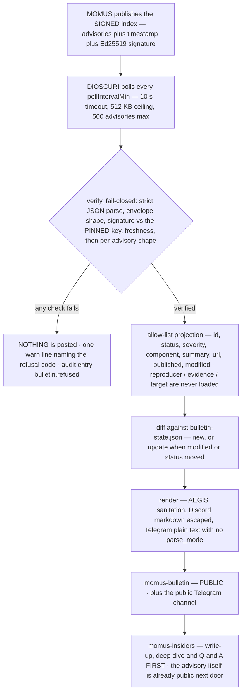
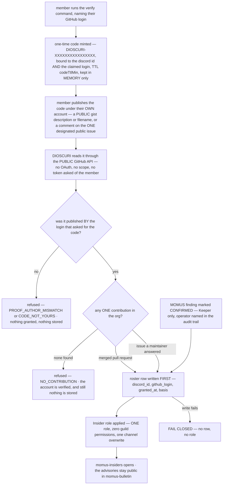

# DIOSCURI community access — the public bulletin and the Insider gate

> 🌐 Languages: **English** · [Русский](community-access-ru.md) · [Español](community-access-es.md) · [Français](community-access-fr.md) · [中文](community-access-zh.md)

Two channels come out of MOMUS's security bulletin, and they are not the same
kind of thing. `#momus-bulletin` is **public**: anyone in the server reads it,
and the advisories are posted the moment they are published. `#momus-insiders`
is **earned**, and what it holds is the write-up, the deep dive and the Q&A —
never the advisory itself.

This document explains what lands where, what DIOSCURI verifies before it says a
word, how the `Insider` role is earned, exactly what is stored about a person,
and — plainly — the reasoning behind each of those choices. Every claim is
checked against the code; where a knob exists, the config key is named. Threat
analysis lives in [security.md](security.md), day-2 operations in
[usage.md](usage.md).

Code: `src/bulletin/` (publisher, verifier, renderer, state),
`src/community/` (the gate, the GitHub reader, the roster),
`src/provision/structure.ts` (the channels and the one role).

## 1. Two channels, one rule

| Channel | Who reads it | What lands there | Permission policy |
|---|---|---|---|
| `#momus-bulletin` | **everyone** | every verified advisory, as soon as it verifies; updates when one changes | `readonly` — public read, bot-writable |
| `#momus-insiders` | holders of `Insider` | the write-up, the deep dive, the Q&A — commentary about advisories that are already public next door | `insidersonly` — hidden from `@everyone`, opened by one role |

The rule that decides every ambiguous case:

> **Exclusivity is TIMING and COMMENTARY, never information.**

An advisory is public the moment it is published. What insiders get first is our
prose about it. If a design question ever comes down to "should this fact be
gated", the answer is no.

The bulletin category itself is deliberately **not** gated
(`BULLETIN_CATEGORY` in `src/provision/structure.ts`) — only the write-up
channel inside it is.

One operator note on `readonly`: the provisioner creates `#momus-bulletin` so
that only the bot may post, while its channel topic invites discussion. If you
want readers replying in the channel itself, open `SendMessages` for
`@everyone` by hand — the provisioner only sets permissions on channels it
creates, and never touches an adopted one, so your change survives every
subsequent boot.

## 2. What lands in `#momus-bulletin`, and why it is public

### The post

One message per advisory: a Discord embed, and a plain-text Telegram message for
the public Telegram channel. Exactly these fields exist, because exactly these
are the ones the verifier loads (`toAdvisory` in `src/bulletin/verify.ts`):

| Field | Shown as | Notes |
|---|---|---|
| `id` | embed title, e.g. `MOMUS-2026-0007` | charset-restricted, not merely escaped |
| `status` | badge — 🔴 OPEN / 🟢 FIXED / ⚪ WITHDRAWN | emoji + word + embed colour, so the state survives a colour-blind reader, a dark theme and a one-line phone notification |
| `severity` | `info … critical` | an unrecognised value renders `unspecified`, never echoed back |
| `component` | field, 80 chars | the affected thing, e.g. `aimarket-hub` |
| `summary` | description, 700 chars | untrusted remote prose — sanitised, then markdown-escaped |
| `url` | embed link | **https only, and only on the bulletin index's own origin** |
| `published` / `modified` | fields | displayed verbatim, so they must look like dates or they are dropped |

For an `open` advisory the post also carries one line of ours:

> ⚠️ **Open advisory** — deliberately non-actionable: no reproducer, no
> evidence, no target. Detail is published when the fix ships.

That line is not decoration. A thin advisory reads as an advisory somebody
forgot to finish unless you say the omission is the point — and the renderer
budgets the remote summary against our own lines precisely so a long hostile
summary cannot push this notice off the end of the embed
(`src/bulletin/render.ts`).

### What never lands there

`reproducer`, `evidence`, `poc`, `target_url` — and anything else the payload
may carry. These are not filtered downstream; they are **never loaded**. The
verifier projects each record onto an eight-field allow-list, so no renderer can
reach an exploit and no future edit to a template can interpolate one. MOMUS's
disclosure design already omits those fields from `open` advisories; this is the
second lock, on our side of the wire, because "the publisher promised" is not a
control we own.

### Why the channel is public

Because a security bulletin's value is that **affected people read it**.

Gating advisories behind any kind of loyalty test — a contribution, a
subscription, a star, a "supporter" tier — means somebody running our code does
not learn their component has an open hole. They keep running it. That is not a
community perk with a downside; it is the failure mode the bulletin exists to
prevent, and no amount of engagement upside pays for it.

The design is self-consistent in the other direction too: MOMUS's `open`
advisories are deliberately **non-actionable** — no reproducer, no evidence, no
target — *precisely so they can be public*. The usual argument for gating
disclosure is that detail arms attackers faster than it warns defenders. That
argument does not apply to a document that contains no detail. Publishing "this
component has an open finding of this severity" tells a defender to look and
tells an attacker nothing they can use. Detail is published when the fix ships.

So there are two locks and they point the same way: the advisory is stripped of
anything actionable, and *because* it is stripped, it can go to everybody.

### New versus update

The state file (`bulletin-state.json`, one line per advisory id) remembers what
we already announced. An advisory is re-announced as an **update** when its
`modified` stamp moves **or** its status changes — the status is compared
separately on purpose, because a publisher that flips `open → fixed` without
touching `modified` would otherwise leave the channel silent about the one
transition readers are waiting for.

The state file holds advisory ids, the revision announced, and platform message
ids. Nothing about a person: no member ids, no who-read-what, no engagement of
any kind — and no advisory text either, since the bulletin is public and a local
copy would only be a second source of truth that can drift from MOMUS's.

## 3. DIOSCURI verifies before it says a word

MOMUS publishes the bulletin as ONE signed index:

```json
{ "advisories": [ … ], "timestamp": 1754650000000, "signature": "<hex ed25519>" }
```

`signature` is Ed25519 over the RFC 8785 (JCS) canonical form of
`{advisories, timestamp}` — the same envelope MOMUS already uses for the WARDEN
threat feed, and the same verification shape ARGUS applies to it. One envelope,
one canonicalizer, one failure philosophy.

**Why this exists at all.** Everything DIOSCURI posts goes out under our own
community bot, in our own name, into a public channel. An unverified advisory
would mean whoever controls the network path between us and MOMUS — a proxy, a
DNS answer, a compromised edge — gets to publish security accusations against
named components as if we had made them. Verification here is not a nicety; it
is the difference between a bulletin and a megaphone pointed at strangers.



### The five properties, and why that order

| Order | Check | Refusal codes | Why |
|---|---|---|---|
| 1 | strict JSON parse | `UNPARSEABLE` | duplicate keys and non-integer literals are the publisher's decision to make, not the parser's |
| 2 | envelope shape, size, count | `MALFORMED`, `OVERSIZED` | `timestamp` is **required**: an optional one would mean "an index that omits it is fresh forever" |
| 3 | Ed25519 against the **pinned** key | `NO_PUBKEY`, `BAD_PUBKEY`, `NO_CANONICAL_FORM`, `SIGNATURE_INVALID` | authenticity. No pin configured means nothing is ever posted — an unsigned bulletin is refused, not trusted-because-it-arrived |
| 4 | freshness, **last** | `STALE`, `FUTURE_DATED` | until the signature verifies, `timestamp` is a number an attacker chose, so refusing on it would prove nothing |
| 5 | per-advisory shape | *record dropped, index kept* | one malformed advisory must not silence the ones that are fine |

Freshness deserves its own sentence, because it is the check people assume is
redundant. A signature says **who** wrote a document; it never says **when you
were handed it**. Without a freshness window, whoever serves the URL can replay
a months-old snapshot forever and silently erase every advisory published since.
For a bulletin that erasure *is* the attack — the advisory an operator most
wants suppressed is the newest one. Default window: 24 h
(`tuning.bulletin.maxAgeHours`, 1–336). It can be widened for a slower
publishing cadence. It cannot be switched off.

Size and count are the boring guards that keep a hostile or broken publisher
from taking the process with it: 512 KB body, 500 advisories, a 10-second fetch
timeout, and a 4000-character cap on any field we keep.

### What an operator sees when a check fails

**Nothing is posted.** Not a partial post, not a "best effort" post with a
caveat, not last cycle's snapshot re-sent. The community sees an unchanged
channel — which looks *exactly* like "MOMUS has published nothing lately". That
ambiguity is why the failure is loud on the operator's side, in three places:

1. **One warning line per cycle**, naming the code and the reason:

   ```json
   {"ts":"2026-08-08T12:00:00.000Z","level":"warn",
    "msg":"bulletin index REFUSED — nothing posted","code":"STALE",
    "reason":"signed snapshot is 51.2 h old, past the 24 h limit — REJECTED as a possible replay hiding newer advisories"}
   ```

2. **One audit entry**, hash-chained like every other consequential act:

   ```json
   {"kind":"bulletin.refused","actor":"dioscuri","subject":"https://momus.modelmarket.dev/bulletin",
    "data":{"code":"SIGNATURE_INVALID","reason":"Ed25519 signature does not match the pinned key — index REJECTED, nothing posted"}}
   ```

3. **A startup warning** when the feature is misconfigured, because a missing
   pin otherwise looks identical to a quiet publisher:

   ```text
   bulletin publisher not started — no pinned publisher key; an unverified advisory is never posted
   bulletin publisher not started — no channel configured
   ```

Two more warnings are worth watching, since both mean a *signed* index carried
something we would not repeat:

```text
bulletin: advisories dropped for failing shape validation        (dropped=N)
bulletin: advisory links dropped for pointing off the index origin (droppedLinks=N)
```

The second one matters more than it looks: we verified *who* wrote the index,
which is not a promise about where it points, and a clickable link in a security
bulletin is the most trusted link in the channel. An off-origin or non-https
link is dropped; the advisory is still posted, just without a hyperlink.

Full refusal-code list: `NO_URL`, `NO_PUBKEY`, `FETCH_FAILED`, `HTTP_ERROR`,
`OVERSIZED`, `UNPARSEABLE`, `MALFORMED`, `BAD_PUBKEY`, `NO_CANONICAL_FORM`,
`SIGNATURE_INVALID`, `STALE`, `FUTURE_DATED`, plus the cycle-level
`NO_SINKS`, `ALREADY_RUNNING` and `INTERNAL_ERROR`.

### Nothing here throws

`BulletinPublisher.runOnce()` catches everything and resolves with a result
object, so the scheduled path can never take the bot down: a publisher that
crashes the process because a feed was down is worse than one that skips a
cycle. A sink that throws is logged and skipped — the other platform still gets
the advisory, and the failed one is retried on the next cycle for up to 24 h
(long enough to cover an outage and a restart, short enough that a channel
configured later never receives three years of history at once). State is saved
after **every** successful post, so a crash mid-run cannot re-announce what
already went out, and `maxPostsPerRun` (default 5) makes a cold start drip
instead of flood.

### Turning it on

Off by default, and doubly fail-closed — enabled is not enough:

| Key | Default | Meaning |
|---|---|---|
| `tuning.bulletin.enabled` | `false` | master switch |
| `tuning.bulletin.indexUrl` | `https://momus.modelmarket.dev/bulletin` | the signed index |
| `tuning.bulletin.publicKey` | `""` | **the pin** — hex SPKI DER Ed25519. Empty means nothing is ever posted |
| `tuning.bulletin.maxAgeHours` | `24` | freshness window, 1–336 |
| `tuning.bulletin.pollIntervalMin` | `30` | minimum 5 |
| `tuning.bulletin.maxPostsPerRun` | `5` | 1–25 |
| `tuning.bulletin.writeupBaseUrl` | `""` | insiders' write-up base URL; empty renders no write-up line |
| `DISCORD_BULLETIN_CHANNEL_ID` | *(auto)* | the provisioner creates and discovers `#momus-bulletin`; set this only to pin a channel you placed yourself |
| `TELEGRAM_BULLETIN_CHAT_ID` | *(empty)* | empty means the Telegram side stays off — advisories are **never** folded into the main chat as a fallback |

`publicKey` is a *public* key, so it lives in the non-secret tuning file — but
it is a **pin**, and it is the only reason we may repeat MOMUS's accusations
about named components under our own bot.

## 4. Earning `Insider` — three contribution paths

The gate is **contribution, never endorsement**. Any ONE of these earns the
role:

| Basis | What qualifies | How it is checked |
|---|---|---|
| `pr` | a **merged pull request** in the configured org | one public search, `is:pr is:merged author:<login> user:<owner>` |
| `issue` | an **issue you opened that a maintainer answered** | public search for authored issues, then the comments of up to 5 of them |
| `finding` | a **MOMUS finding an operator marked CONFIRMED** | a Keeper names the Discord member; the audit trail records who did it |

Contributions elsewhere in the world do not count — the `user:` qualifier scopes
both searches to the configured owner (`githubOwner`). Contributing to somebody
else's project makes you somebody else's insider.

Why contribution rather than endorsement, spelled out: "do this and get access"
aimed at an endorsement is incentivized engagement under GitHub's Acceptable Use
Policies, and a project whose entire positioning is auditability cannot afford
that. A standing "still endorses us" check would be worse — it would mean
polling individuals' GitHub activity forever and keeping an engagement history.
That is surveillance, plus a data set we would then have to protect.
Contribution selects for people who **gave** something instead of people who
clicked something.

### Why the issue path requires a maintainer response

Because without it the gate reads "open an empty issue".

That version selects for noise: a tracker filling with one-line issues opened to
clear a bar, which buries the real reports underneath them. Requiring that
somebody on our side of the project *answered* means the issue was worth
answering — the judgement is made by a human doing normal maintainer work, not
by a rule a farmer can satisfy on purpose.

Two details keep that honest:

- "Maintainer" is GitHub's **own** `author_association` field — `OWNER`,
  `MEMBER` or `COLLABORATOR`. It is not a list we curate, so it cannot quietly
  become a list of favourites.
- The answering comment must not be the member's own. Self-answering your own
  issue is exactly the farm the clause exists to close.

The check looks at up to 5 authored issues (bounding the API cost), and one
unreadable issue is skipped rather than treated as a verdict about the person.

### Why the finding path goes through a human

MOMUS's report intake is **anonymous by design**. There is therefore no
automated link between an anonymous report and a person, and this module does
not invent one: an operator names the Discord handle and takes responsibility.

The path is Keeper-only, and the caller must state `operatorIsKeeper` explicitly
— a future platform edge that forgets to check the Keeper role has to pass a
literal lie to get through, which is easy to spot in review. The audit entry
records which operator did it and, optionally, the advisory id that justified
it. `github_login` is optional on this path and stored as `""` when absent: an
anonymous finder may have no account to name, and inventing one would put a
fiction in the roster.

## 5. Proving a GitHub account without OAuth

We never ask a member for a token.

An access token that can read somebody's activity is far more power than "I
control this account" needs, and accepting one makes us the custodian of it —
now there is a credential in our process, in our logs if somebody is careless,
and in our backups. The thing being proved is one bit: *this Discord member
controls that GitHub account.* A public challenge proves exactly that bit and
leaves us holding nothing.



### The three steps

1. **Mint.** The member runs the verify command naming their GitHub login. We
   mint `DIOSCURI-` + 16 hex characters, bound to their Discord id *and* to the
   claimed login, with a TTL (default 30 min, `tuning.insiders.codeTtlMin`).
   This step is offline — no GitHub request happens yet, so a mistyped login
   costs nobody an API call.
2. **Publish.** The member publishes that code under their own account: a
   **public gist** with the code in its description or a filename, or a comment
   containing it on **one** designated public issue
   (`tuning.insiders.proofRepo` + `proofIssue`).
3. **Read.** We read it the same way any stranger could — gist listings
   (description and filenames only, never file contents) and that one issue's
   comments, narrowed to comments newer than the challenge — and confirm the
   **author's** login is the login that was claimed.

### The code is not a secret, and that is fine

It has to be published; that is the whole mechanism. It is safe to publish
because it is bound twice:

- a stranger who copies it out of a channel **cannot redeem it** — redemption is
  keyed on the Discord id it was minted for (`CODE_NOT_YOURS`);
- a stranger **cannot pass it off as their own proof** — a proof must be authored
  by the login that asked for the code (`PROOF_AUTHOR_MISMATCH`).

When somebody else's code turns up under an account, the refusal is loud, and
the *other* party's login is never echoed back: that would hand out a
GitHub↔Discord mapping to whoever asked for it. The code is single-use by
deletion, and expired codes are dropped the moment they are noticed so a dead
code can never be mistaken for a live one.

The platform edge should still answer **privately** (ephemeral reply or DM) — not
because the code is a secret, but because a public channel full of other
people's verification codes is confusing noise.

### Proof before contribution, always

The order in `redeem()` is load-bearing. A contribution check is a claim about an
**account**; running it before we know the member controls that account would let
anybody claim any contributor's work. So: proof first, contribution second,
grant third.

### Limits a member can hit

| Code | Meaning | What the member is told |
|---|---|---|
| `BAD_LOGIN` | not a plausible GitHub login (letters, digits, single inner hyphens, ≤ 39 chars) | that it does not look like a username |
| `ALREADY_INSIDER` | they already hold the role | nothing to do; ask a Keeper if the role is missing from their profile |
| `LOGIN_ALREADY_CLAIMED` | that GitHub account already earned the role for a different member | stated **without** naming who — one account, one person |
| `NO_PROOF_CHANNEL` | neither the gist route nor an issue is configured | a Keeper needs to set one |
| `BUSY` | more than 500 challenges in flight | try again in a few minutes |
| `NO_CHALLENGE` / `EXPIRED` | nothing pending, or the TTL passed | start the verification again |
| `TOO_SOON` | redemption attempts are spaced 20 s apart | how many seconds are left |
| `PROOF_NOT_FOUND` | the code is not published under that account yet | where it may be posted |
| `CODE_NOT_YOURS` / `PROOF_AUTHOR_MISMATCH` | somebody else's code, or the right code under the wrong account | run the command yourself / post it under the account you named |
| `NO_CONTRIBUTION` | account verified, no qualifying contribution | the three paths, listed plainly — a bare "no" reads as a broken bot |
| `GITHUB_UNAVAILABLE` | we could not reach GitHub | *"Nothing is held against you — try again in a few minutes."* |
| `NOT_OPERATOR` | the finding path was called by a non-Keeper | only a Keeper can confirm a finding |
| `STORAGE_FAILED` | the roster could not be written | the role was **not** applied; try again shortly |

The 20-second spacing exists because one redemption costs up to nine public
GitHub requests and the command is open to everybody in the server: without it,
one member holding the key down burns the shared rate limit for the whole
community. `GITHUB_UNAVAILABLE` is worded the way it is on purpose — a GitHub
outage must read as *"we could not check"*, never as *"you are not a
contributor"*.

### Turning it on

| Key | Default | Meaning |
|---|---|---|
| `tuning.insiders.enabled` | `false` | master switch |
| `tuning.insiders.proofRepo` | `""` | repo holding the designated verification issue; empty turns the issue route off |
| `tuning.insiders.proofIssue` | `0` | the issue number; `0` turns the route off |
| `tuning.insiders.allowGistProof` | `true` | accept a public gist as proof |
| `tuning.insiders.codeTtlMin` | `30` | minutes a minted code stays redeemable, 1–1440 |
| `GITHUB_TOKEN` | *(optional)* | the **bot's own** token, already in config for MNEMOSYNE. Sent only to raise the rate limit on public reads; never logged, never leaves the module |

Everything in the tuning block is non-secret — an owner, a repo, an issue
number, a TTL. Proving a GitHub account needs no secret from anyone, so there is
none to configure.

## 6. Stars are not read. At all.

No access tier. No badge. No cosmetic role. Not even a one-time check.

An earlier design granted a cosmetic role on a single star read. It is gone, and
this is why:

- **A held-star gate would require watching people.** "Has starred" is cheap to
  read once and meaningless afterwards — the interesting question is whether the
  star is *still* there, and answering it means polling individuals' GitHub
  activity on a schedule and keeping an engagement history. That is surveillance
  of the people we are supposedly rewarding, and it manufactures a data set we
  would then have to protect. There is no version of this that is both
  meaningful and respectful.
- **Even a cosmetic role is a permission surface that drifts.** A role that
  means nothing today is exactly the kind of thing that acquires a channel
  overwrite in six months because it was convenient. The way to keep a role
  harmless is not to create it.
- **And it would be an endorsement bought with access**, which is the thing
  GitHub's Acceptable Use Policies call incentivized engagement, and the last
  thing a project selling auditability should be doing.

The absence is **structural**, not a matter of discipline:

- no star route among the four the feature uses (gist listing, one issue's
  comments, two searches);
- no method on `GithubPublicReader` that could answer the question — a future
  edit cannot "just peek" through a door that was never built;
- no star field in the roster (`src/community/store.ts`);
- no star word in a grant basis — the basis enum is `pr | issue | finding`, and
  there is deliberately nowhere to record anything else.

And it is tested twice, in `test/community-access.test.ts`: once by scanning the
module source for the star route and field names, and once with a fake GitHub
client that records **every property the gate reaches for**.

If somebody stars the project, nothing here notices, records or rewards it.

## 7. Exactly what is stored about a person

Four fields. One row per member who earned the role, in `insiders.json` under
the data directory (`/data` in Docker):

```json
{
  "insiders": [
    {
      "discord_id": "1234567890",
      "github_login": "octocat",
      "granted_at": "2026-08-08T12:00:00.000Z",
      "basis": "pr"
    }
  ]
}
```

`discord_id` — who the role belongs to. `github_login` — the account that earned
it (GitHub's own casing; `""` for an operator grant on behalf of an anonymous
finder). `granted_at` — when. `basis` — `pr`, `issue` or `finding`.

That is the whole record. The four names are exported as `INSIDER_FIELDS` so a
test can hold us to it, the file is written field-by-field rather than by
spreading the in-memory row, and unknown keys are stripped on load — a
hand-edited file that adds `email` or an activity trail cannot smuggle it back
in.

**Not stored:** no engagement history, no activity log, no email, no display
name, no star count and no star flag of any kind, no read receipts, no record of
anybody else's actions, and **no evidence copy**. The contribution that earned
the role is public on GitHub and re-checkable by anyone, so keeping our own copy
would only build a private dossier we would then have to protect.

Pending verifications are held **in memory only** and never persisted: a pending
challenge is a Discord id plus a claimed login — data about somebody who has not
earned anything yet. A restart forgetting it costs one command; persisting it
would mean storing people who never came back.

### Why store anything at all

Because the Discord role is a *projection*, not the record. A member who loses
the role in a server rebuild must get it back without re-proving anything, and a
person who asks to be forgotten must leave nothing behind — which is only
possible if there is exactly one place to delete from.

That is also why persistence **fails closed**: if the roster cannot be written,
the role is not granted (`STORAGE_FAILED`). A role with no record behind it can
be neither explained nor forgotten, and both matter more than convenience. The
reverse order is fine: if the roster write succeeds and the Discord API call
fails, the entitlement exists and the role is re-applied on the next
reconciliation.

### How to be forgotten

One command, from the person themselves or from an operator. The row is
**deleted** — not flagged, not marked "revoked": a revoked marker would mean the
roster still remembers that this Discord id was once an insider, which is the
opposite of what somebody asking to be forgotten asked for. The `Insider` role
is removed, any pending challenge is dropped, and the reply is:

> Done — your row is deleted and the role removed. Nothing about you is kept.

If nothing was stored, it says so instead. If the deletion itself fails, the
person is told plainly that a Keeper has been asked to finish it by hand rather
than being told "done".

Role removal is best-effort by design: a stale role with no row is visible to
moderators and fixable, whereas a failed revoke must never resurrect the row we
just deleted.

One honest caveat, expanded in the residual-risks section below: the
hash-chained audit log is append-only, so the `insiders.grant` line stays in it.

## 8. What this is not

- **Not a paywall.** Nothing here is for sale, and no amount of money moves the
  gate. The only currency is a contribution to this ecosystem, and the cheapest
  qualifying one is an issue worth a maintainer's reply.
- **Not a star gate.** Stars are not read for access, for a badge, or once. See
  §6 — there is no code path that could read one.
- **Not a way to keep security information from people affected by it.** The
  advisories are public in `#momus-bulletin` the moment they verify. What is
  gated is our commentary — the write-up, the deep dive, the Q&A. If you are
  running an affected component, everything you need to act on is in the public
  channel, and you need no role, no account and no relationship with us to read
  it.
- **Not a permission grant.** `Insider` carries **zero** guild permissions and
  is not mentionable — its whole job is one channel overwrite. A gated channel
  whose members can be @-ed by anyone leaks who is in it.
- **Not a moderation tier.** Keepers moderate; insiders read a channel. The two
  roles are unrelated, and the gate cannot hand out either one on its own
  initiative.
- **Not exactly one role plus a few little ones.** Exactly one role. Each
  additional role is a permission surface that drifts.

## 9. Audit trail

Both features write to the hash-chained `audit.jsonl` described in
[usage.md §6](usage.md#6-audit--the-flight-recorder):

| `kind` | Written when | `data` |
|---|---|---|
| `bulletin.refused` | verification, freshness or size failed | `{ code, reason }` — subject is the index URL |
| `bulletin.post` / `bulletin.update` | an advisory was announced | `{ status, severity, component, sinks }` — subject is the advisory id |
| `insiders.grant` | the role was granted | `{ basis, github_login }` and, on the operator path, the MOMUS lead id — subject is `dc:<discord id>`, actor is `pollux` or the operator key |
| `insiders.forget` | a row was deleted | `{}` — subject is `dc:<discord id>`, actor is `self` or the operator |

A grant entry carries the *facts* of the grant and nothing more: no evidence
copy, no URLs, no activity. The contribution is public on GitHub and
re-checkable by anyone. A broken audit sink is logged and swallowed — it must
never break a member's command.

## Residual risks — what this does NOT solve

Honesty section, in the style of [security.md](security.md#residual-risks--what-this-does-not-solve).
Known gaps, accepted deliberately:

- **The audit chain remembers a grant after the row is gone.** `insiders.grant`
  records `dc:<discord id>`, the basis and the GitHub login; the chain is
  append-only and hash-linked, so editing it out would break every entry after
  it. Being forgotten therefore removes the entitlement and the roster row, not
  the historical fact that a grant happened. The chain is local to the
  operator's data volume, never published, and holds no other activity about the
  person — but this is a real limit, not a rounding error, and anyone asking to
  be forgotten deserves to hear it stated.
- **A published proof outlives its usefulness.** The code is single-use and
  worthless after redemption, but a gist left up is a permanent public link
  between a GitHub account and this community. Members who care should delete
  the gist afterwards; nothing in the flow deletes it for them, because nothing
  in the flow can.
- **The proof is checked once.** Control of an account is verified at
  redemption, not re-verified afterwards. A transferred or compromised GitHub
  account does not lose the Discord role on its own.
- **The mapping exists.** `LOGIN_ALREADY_CLAIMED` deliberately does not say who
  holds a login, but the roster does pair a GitHub login with a Discord id.
  Four fields is the minimum that makes re-grant and deletion possible; it is
  not zero.
- **A GitHub outage closes the gate.** Refusals say so and hold nothing against
  the member, but while GitHub is unreachable nobody new gets in. The
  alternative — granting on an unverified claim — is worse.
- **Freshness is a window, not a wall.** Inside `maxAgeHours` a replayed
  snapshot still verifies, so a hostile edge could hide an advisory published
  within the last day (default) before the staleness check bites. Shortening the
  window trades that against false refusals when MOMUS publishes slowly.
- **A signature authenticates a publisher, not its judgement.** If MOMUS's
  disclosure layer ever regresses and starts serving detail in a summary, we
  would repeat that summary. The allow-list guarantees no `reproducer`,
  `evidence`, `poc` or `target` field can ever be published through this bot —
  it cannot guarantee that prose in the `summary` field is non-actionable.
- **The gate is code, not yet a command surface.** `src/bulletin/` and
  `src/community/` ship with their config, channels, role and tests; the
  platform edge that exposes the member-facing commands and the two posting
  sinks is wired separately, and both features are `enabled: false` by default.
  Until that wiring lands, an operator granting the role by hand is the
  supported path — and the roster, not the Discord role, is what makes such a
  grant explainable and reversible.

Found a hole in this gate? Open an issue at
[github.com/alexar76/dioscuri](https://github.com/alexar76/dioscuri). Once a
maintainer answers it, that issue is itself one of the three ways in.
