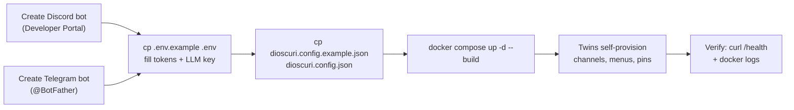
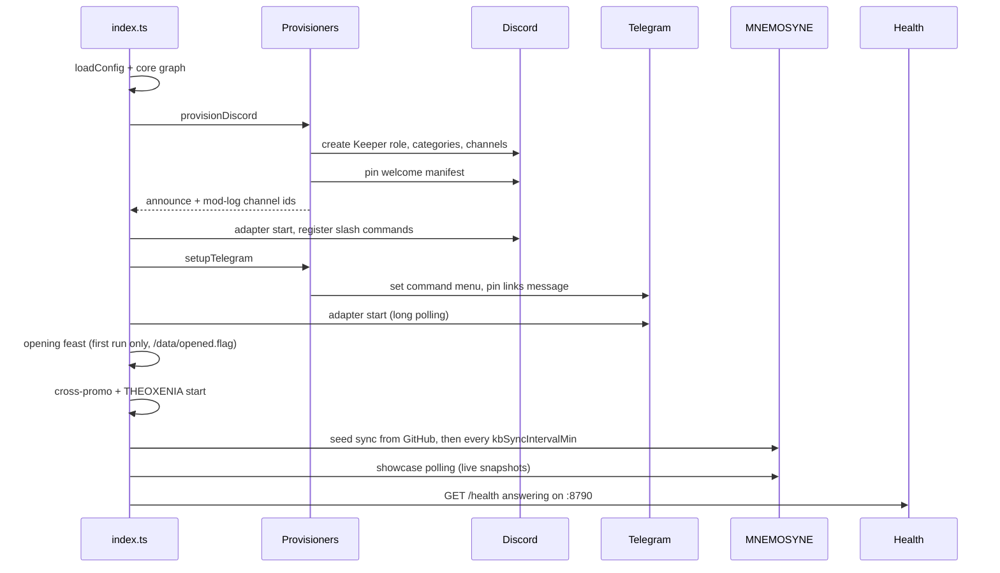

# DIOSCURI setup & deployment

This guide takes you from nothing to two living twins: **CASTOR** on Telegram and
**POLLUX** on Discord, one process, one knowledge base. Every table row and every
command below is verified against the code (`src/config.ts`, `src/index.ts`,
the adapters and provisioners). Where a config key exists but is not yet wired
into the running service, it is explicitly labelled.

Related reading: [architecture.md](architecture.md) (module map, data flows),
[security.md](security.md) (threat model, hardening rationale),
[content-plan.md](content-plan.md) (what the twins post and when).

## 1. What you need

The twins were built to self-provision: Discord channels, roles and pinned
manifests, the Telegram command menu and pinned links, the knowledge-base seed
and the content calendar all happen automatically on first boot.

| You provide | Required? | Why |
|---|---|---|
| One LLM key — `DEEPSEEK_API_KEY` (default), `ANTHROPIC_API_KEY`, `OPENAI_API_KEY`, or a keyless local server (ollama / LM Studio / llama.cpp) | **Yes** | Q&A, moderation classifier, content generation |
| `DISCORD_BOT_TOKEN` + `DISCORD_GUILD_ID` | At least one platform | Wakes POLLUX |
| `TELEGRAM_BOT_TOKEN` + `TELEGRAM_CHAT_ID` | At least one platform | Wakes CASTOR |
| `GITHUB_TOKEN` (read-only PAT) | No | Raises GitHub API limits 60/h → 5000/h for MNEMOSYNE sync |
| `dioscuri.config.json` | No | Non-secret tuning; a missing file means defaults apply |
| Docker + Compose, **or** Node ≥ 20 | One of the two | Hardened container is the recommended path |

A platform whose token is empty simply stays asleep — the other twin runs
alone. With `DIOSCURI_DRY_RUN=1` no tokens are needed at all: the knowledge
base and the `/health` endpoint still run, which is the recommended first
smoke test.

No database, no webhooks, no wallet. The only inbound port is the health
endpoint (`8790` by default); all platform traffic is outbound.

## 2. The road to first boot



Sections 3 and 4 cover the two bot creations; either can be skipped if you run
a single platform.

## 3. Discord — building Pollux's hall

### 3.1 Create the application and bot

1. Open the [Discord Developer Portal](https://discord.com/developers/applications)
   → **New Application** → name it (e.g. `Pollux`).
2. Go to the **Bot** tab → **Reset Token** → copy the token. This is your
   `DISCORD_BOT_TOKEN`. It is shown once; store it in `.env` only.
3. On the same Bot tab, under **Privileged Gateway Intents**, enable:
   - **Message Content Intent** — the adapter subscribes to `MessageContent`
     (`src/adapters/discord.ts`); without it the bot cannot read message text,
     so moderation and mention-triggered Q&A see empty strings.
   - **Server Members Intent** — the adapter subscribes to `GuildMembers`;
     without it `guildMemberAdd` never fires, so new members are never welcomed.

   Skipping either one makes the gateway login fail with
   `Used disallowed intents` (see [Troubleshooting](#9-troubleshooting)).

### 3.2 Generate the invite URL

Go to **OAuth2 → URL Generator**:

- **Scopes**: `bot` and `applications.commands` (the second one lets the
  adapter register the guild-scoped `/ask`, `/links`, `/help` slash commands).
- **Bot Permissions** — tick exactly these:

| Permission | Why the code needs it |
|---|---|
| Manage Channels | The provisioner creates missing categories and channels on boot (`src/provision/discord.ts`) |
| Manage Roles | Creates the `Keeper` moderator role and applies channel permission overwrites (Discord requires Manage Roles for overwrite edits) |
| Manage Messages | Pins the welcome manifest into `#welcome`; deletes rule-breaking messages (moderation `delete`/`timeout`) |
| Moderate Members | Applies timeouts (`member.timeout(ms)`, hard-capped by `moderation.maxTimeoutMs`) |
| Send Messages | Answers, announcements, welcomes — everything the twin says |
| Read Message History | Reads pinned messages in `#welcome` to keep provisioning idempotent; replies in context |
| Embed Links | Moderation actions are logged to `#mod-log` as embeds |
| Attach Files | Banter AI memes and spotlight demo screenshots (`announceImage`) |
| Add Reactions | Not exercised by any current code path — grant it anyway so future engagement features and poll fallbacks never fail silently |

Copy the generated URL, open it in a browser, and invite the bot into your
server. You need **Manage Server** permission on that server to do this.

### 3.3 Get the Guild ID

Discord app → **User Settings → Advanced → enable Developer Mode**. Then
right-click your server icon → **Copy Server ID**. This is `DISCORD_GUILD_ID`.

### 3.4 Role hierarchy gotcha

Discord only lets a bot act on roles and members **below its own highest
role**. After inviting:

- Server Settings → Roles → drag the bot's integration role **above `Keeper`**
  (the provisioner creates `Keeper` on first boot) and above any member the
  bot should be able to time out.
- If the bot's role sits too low, provisioning logs
  `cannot build server structure — the bot is missing permissions: ...` and
  moderation logs `cannot timeout member (hierarchy/permissions)`. Fix the
  order and restart — provisioning is idempotent and picks up where it left
  off.

What the provisioner builds (never deletes, never moves — an admin's manual
layout is law): the `Keeper` role, categories THE GATES (`#welcome`,
`#announcements`, read-only), THE AGORA (`#general`, `#help`, `#ideas`,
`#show-and-tell`), THE FORGE (`#factory`, `#oracles`, `#aimarket`, `#argus`),
THE SKY HALL (`#banter`, voice `Olympus`) and THE WATCH (`#mod-log`,
`#mod-chat`, Keeper-only). Existing same-name channels are adopted as-is.

## 4. Telegram — saddling Castor

### 4.1 Create the bot

1. Message [@BotFather](https://t.me/BotFather) → `/newbot` → pick a display
   name and a unique `*_bot` username.
2. BotFather replies with the token — this is `TELEGRAM_BOT_TOKEN`.

### 4.2 Add the bot to your group — as admin

Add the bot to the group, then promote it to **administrator** with at least:
*Delete messages* (moderation `delete`/`timeout`), *Ban users* (Telegram's
`restrictChatMember` — used for timeouts, never bans), and *Pin messages*
(the pinned official-links message). A non-admin bot still answers questions,
but every moderation action fails silently at the API level and the pinned
links setup is skipped with a warning (`bot is not an admin with pin rights`).

Admin status has a second effect: Telegram delivers *all* group messages to
admin bots, which is what moderation and mention-detection need.

### 4.3 Get the chat ID

Two ways:

- **Forward a message** from your group to [@userinfobot](https://t.me/userinfobot)
  — it replies with the origin chat's ID.
- **Supergroups**: the ID has the `-100…` prefix form (e.g. `-1001234567890`).
  Use the full value including `-100`. The adapter compares
  `String(chat.id)` against `TELEGRAM_CHAT_ID` verbatim
  (`src/adapters/telegram.ts`), so a truncated or prefix-less ID means the bot
  ignores the group entirely.

Castor serves exactly one configured group (moderation + announcements) but
answers private chats from anyone.

## 5. Environment reference

Secrets live in `.env` and only there — the JSON tuning file is mounted
read-only and must never contain keys. Full inventory from `src/config.ts`,
`src/logger.ts` and `.env.example`:

### LLM (primary)

| Variable | Required | Default | What it does |
|---|---|---|---|
| `DIOSCURI_LLM_PROVIDER` | no | `deepseek` | Friendly provider name, resolved to a wire protocol + defaults (table below). **An unrecognised name silently falls back to `deepseek`** |
| `DEEPSEEK_API_KEY` | with `deepseek` | — | Key probed by the `deepseek` preset |
| `ANTHROPIC_API_KEY` | with `anthropic` | — | Key probed by `anthropic` (and second choice for `anthropic-compatible`) |
| `OPENAI_API_KEY` | with `openai` | — | Key probed by `openai` (and second choice for `openai-compatible`) |
| `DIOSCURI_LLM_API_KEY` | with `*-compatible` | — | Generic key, probed first by `anthropic-compatible` / `openai-compatible` |
| `DIOSCURI_LLM_MODEL` | no | per provider | Model override |
| `DIOSCURI_LLM_BASE_URL` | for `*-compatible` | per provider | Endpoint override; the two `*-compatible` presets ship an empty base URL, so this is effectively required for them |
| `DIOSCURI_LLM_TIMEOUT_MS` | no | `30000` | Per-request timeout; also the default for the fallback provider's timeout |

Provider aliases (`PROVIDER_PRESETS` in `src/config.ts`) — local servers are
keyless and speak the OpenAI protocol:

| Alias | Protocol | Default base URL | Default model | Key env(s), in probe order |
|---|---|---|---|---|
| `deepseek` | chat-completions | `https://api.deepseek.com/v1` | `deepseek-chat` | `DEEPSEEK_API_KEY` |
| `anthropic` | Anthropic Messages | `https://api.anthropic.com` | `claude-haiku-4-5-20251001` | `ANTHROPIC_API_KEY` |
| `anthropic-compatible` | Anthropic Messages | *(none — set `DIOSCURI_LLM_BASE_URL`)* | `claude-haiku-4-5-20251001` | `DIOSCURI_LLM_API_KEY`, `ANTHROPIC_API_KEY` |
| `openai` | chat-completions | `https://api.openai.com/v1` | `gpt-4o-mini` | `OPENAI_API_KEY`, `DIOSCURI_LLM_API_KEY` |
| `openai-compatible` | chat-completions | *(none — set `DIOSCURI_LLM_BASE_URL`)* | `gpt-4o-mini` | `DIOSCURI_LLM_API_KEY`, `OPENAI_API_KEY` |
| `ollama` | chat-completions | `http://localhost:11434/v1` | `llama3.1` | keyless |
| `lmstudio` | chat-completions | `http://localhost:1234/v1` | `local-model` | keyless |
| `llamacpp` / `llama.cpp` | chat-completions | `http://localhost:8080/v1` | `local-model` | keyless |

### LLM failover

When the primary trips its circuit breaker (3 consecutive failures → open for
60 s → single probe; `src/core/failover.ts`), calls route to the fallback until
the primary heals. A daily-budget error is global policy and never triggers
failover. A good pairing: cloud primary + local fallback.

| Variable | Required | Default | What it does |
|---|---|---|---|
| `DIOSCURI_LLM_FALLBACK_PROVIDER` | no | *(unset = single-provider mode)* | Any alias from the table above |
| `DIOSCURI_LLM_FALLBACK_MODEL` | no | per provider | Fallback model override |
| `DIOSCURI_LLM_FALLBACK_BASE_URL` | no | per provider | Fallback endpoint override |
| `DIOSCURI_LLM_FALLBACK_TIMEOUT_MS` | no | `DIOSCURI_LLM_TIMEOUT_MS`, else `30000` | Fallback request timeout |

The fallback probes the *same* key envs as its preset (e.g. an `anthropic`
fallback reads `ANTHROPIC_API_KEY`); there is no separate fallback-key
variable.

### AI meme images (optional)

The provider itself is chosen in the tuning file (`content.images.aiProvider`:
`openai` | `together` | `comfyui`); the environment only supplies its secrets.
Memes attach to **banter** setups, capped by `content.images.aiMemesPerWeek`
(UTC week); any generation failure falls back to a text-only post.

| Variable | Required | Default | What it does |
|---|---|---|---|
| `OPENAI_API_KEY` | with `aiProvider: "openai"` | — | Also reused by the `openai` LLM preset |
| `TOGETHER_API_KEY` | with `aiProvider: "together"` | — | FLUX.1-schnell — the budget option |
| `DIOSCURI_IMAGE_API_KEY` | no | — | Generic override; wins over the two above |
| `DIOSCURI_IMAGE_BASE_URL` | with `aiProvider: "comfyui"` | — | Self-hosted ComfyUI URL (also overrides openai's endpoint if set) |

### KERYX syndication (optional)

The herald: **post-only** syndication of release announcements to your own
social accounts, plus a monthly digest article on dev.to. A sink arms itself
when its secrets are present; X additionally needs the explicit
`X_SYNDICATION=1` opt-in because posting there is pay-per-use (since Feb 2026:
~$0.015/post, ~$0.20/post containing a URL). By charter KERYX never replies,
likes, follows or DMs — automation of engagement is the ban vector on every
platform; publishing to your own account is allowed everywhere.

| Variable | Required | Default | What it does |
|---|---|---|---|
| `BLUESKY_IDENTIFIER` | for Bluesky | — | Handle (e.g. `dioscuri.bsky.social`); create an app password in Settings → App Passwords |
| `BLUESKY_APP_PASSWORD` | with the identifier | — | App password (never the account password) |
| `MASTODON_BASE_URL` | for Mastodon | — | Instance URL (e.g. `https://mastodon.social`); set the **bot flag** on the profile — it's the fediquette requirement |
| `MASTODON_ACCESS_TOKEN` | with the URL | — | App token (Settings → Development) |
| `X_SYNDICATION` | for X | off | `1` = explicit opt-in to pay-per-use posting |
| `X_API_KEY` / `X_API_SECRET` | with the opt-in | — | Consumer keys (developer portal) |
| `X_ACCESS_TOKEN` / `X_ACCESS_SECRET` | with the opt-in | — | User-context tokens (OAuth 1.0a) |
| `DEVTO_API_KEY` | for the monthly digest | — | dev.to Settings → Extensions → API key; a month with no releases publishes nothing |

Tuning knobs (`dioscuri.config.json` → `syndication`): `enabled` (master,
default `true`), `bluesky` (arm the Bluesky sink when secrets are present,
default `true`), `bumpReminder` (DISBOARD reminder ping for Keepers, default
`true` — fires only when the DISBOARD bot reports a successful bump; the bot
never bumps by itself, auto-bumping is against DISBOARD guidelines),
`devtoDigestDay` (1–28, default `1`), `devtoDigestHourUtc` (default `12`).

#### Mastodon — suspension risk (read before arming)

KERYX posts via `POST /api/v1/statuses` with `visibility: "public"`. That is
allowed fediquette when the account is clearly a bot, but **large instances
(especially mastodon.social) suspend fresh API-only accounts aggressively**.
A real deployment saw HTTP 200 on the first release post, then
`403 Your login is currently disabled` minutes later with reason **Spam** —
even with the bot flag enabled. The incident is traced in
[use-cases.md § 9](use-cases.md#9-keryx-posts-a-release-to-mastodon--account-suspended-for-spam).

**Risk factors**

- Account created the same day as the first API post, with no manual warmup.
- Three URLs in one status (GitHub release + Discord + Telegram).
- Raw markdown in an early release summary (fixed: `stripMarkdown` +
  `firstSentence` in `src/keryx/index.ts`).
- `public` visibility — the status hits the local timeline and federation
  immediately.

**Mitigations (operator checklist)**

1. **Warm up** — 2–3 hand-written posts in the web UI over several days before
   arming the token.
2. **Profile** — avatar, display name, bio (`automated release herald`, `#bot`);
   put standing community links in bio, not in every status if the instance is
   strict.
3. **Instance choice** — prefer a smaller or self-hosted server over
   `mastodon.social` for bot accounts.
4. **Secrets** — app token in `.env` only; scope `write:statuses`; rotate if
   exposed.
5. **Disable without deleting secrets** — clear `MASTODON_ACCESS_TOKEN` (empty
   arms nothing). To silence Bluesky while keeping secrets, set
   `syndication.bluesky: false` in `dioscuri.config.json`.
6. **Monitor** — `keryx post delivered` vs `keryx sink failed` in logs;
   `GET /api/v1/accounts/verify_credentials` after the first automated post.

KERYX never replays historic releases on boot (`seenReleases` seeding) and
never disturbs the twins when a sink fails (fail-soft).

### Discord (POLLUX)

| Variable | Required | Default | What it does |
|---|---|---|---|
| `DISCORD_BOT_TOKEN` | to wake POLLUX | — | Bot token; empty = Discord twin asleep |
| `DISCORD_GUILD_ID` | with the token | — | The one server the twin serves |
| `DISCORD_ANNOUNCE_CHANNEL_ID` | no | auto-discovered | Set only to reuse an existing channel; otherwise the provisioner creates/finds `#announcements` |
| `DISCORD_MOD_LOG_CHANNEL_ID` | no | auto-discovered | Same, for `#mod-log` |
| `DISCORD_AUTOSTRUCTURE` | no | `1` | `0` = never touch the server layout (channels must then be supplied via the two IDs above) |
| `DISCORD_DISABLED` | no | off | `1` = keep the twin asleep without unsetting the token |

### Telegram (CASTOR)

| Variable | Required | Default | What it does |
|---|---|---|---|
| `TELEGRAM_BOT_TOKEN` | to wake CASTOR | — | Bot token; empty = Telegram twin asleep |
| `TELEGRAM_CHAT_ID` | with the token | — | The one group/channel served (moderation + announcements); `-100…` form for supergroups |
| `TELEGRAM_AUTOSETUP` | no | `1` | `0` = skip the command-menu and pinned-links boot setup |
| `TELEGRAM_DISABLED` | no | off | `1` = keep the twin asleep without unsetting the token |

### GitHub

| Variable | Required | Default | What it does |
|---|---|---|---|
| `GITHUB_TOKEN` | no | — | Read-only PAT for MNEMOSYNE sync; raises the API limit 60/h → 5000/h. Fine to leave empty for small repo sets |

### Service

| Variable | Required | Default | What it does |
|---|---|---|---|
| `DIOSCURI_HTTP_PORT` | no | `8790` | Health endpoint port |
| `DIOSCURI_DATA_DIR` | no | `./data` (`/data` in Docker) | Writable state dir: audit chain, KB cache, calendar state |
| `DIOSCURI_LOG_LEVEL` | no | `info` | `debug` \| `info` \| `warn` \| `error` (JSON-lines to stdout/stderr) |
| `DIOSCURI_CONFIG` | no | `dioscuri.config.json` | Path to the tuning JSON; a missing file means defaults |
| `DIOSCURI_DRY_RUN` | no | off | `1` = boot with zero tokens: adapters off, KB + health still run |

## 6. Tuning reference — `dioscuri.config.json`

Non-secret knobs, zod-validated at boot (`TuningSchema` in `src/config.ts`).
A missing file is fine; an **invalid** file is a loud, fatal boot error.
Copy `dioscuri.config.example.json` and edit.

### Top level

| Key | Default | Range | What it does |
|---|---|---|---|
| `githubOwner` | `"alexar76"` | — | GitHub owner whose repos feed MNEMOSYNE |
| `githubRepos` | `[]` | — | Explicit repo allowlist; empty = all public repos of the owner |
| `kbSyncIntervalMin` | `30` | 5–1440 | Minutes between MNEMOSYNE sync passes (READMEs, releases, repo metadata, 14-day commit digest per repo) |
| `promoIntervalHours` | `12` | 0–168 | Hours between cross-promo posts, jittered ±20%; the Discord side starts offset by half an interval so the two promos interleave. `0` disables |
| `maxLlmCallsPerDay` | `2000` | ≥ 1 | Daily UTC budget across all LLM calls (cost guard; exhaustion never triggers failover) |
| `userRatePerMin` | `4` | 1–60 | Per-user Q&A messages per minute |
| `channelRatePerMin` | `20` | 1–600 | Per-channel Q&A messages per minute (global flood valve) |

### `moderation.*`

| Key | Default | What it does |
|---|---|---|
| `enabled` | `true` | Master switch |
| `llmClassifier` | `true` | Run the LLM classifier — only after deterministic risk signals fire; advisory-only |
| `deleteConfidence` | `0.8` | Classifier confidence floor before a delete is allowed (0–1) |
| `maxTimeoutMs` | `600000` (10 min) | Hard ceiling for automatic timeouts; schema range 10 s – 1 h. Ban is not in the action space |
| `linkAllowlist` | `[]` | Domains allowed in links; empty = allow all except the denylist |
| `linkDenylist` | `[]` (example ships shorteners/IP-loggers) | Domains always treated as hostile |

### `links.*`

| Key | Default | What it does |
|---|---|---|
| `discordInvite` | `""` | The **only** Discord invite the twins may post — set it, or Castor's cross-promo points at nothing |
| `telegramChannel` | `""` | Official Telegram link, used by Pollux's cross-promo |
| `siteUrl` | `"https://magic-ai-factory.com"` | Ecosystem site |
| `githubOrg` | `"https://github.com/alexar76"` | Ecosystem GitHub |

### `showcase.*` — live project snapshots

Read-only polling of public demo endpoints; each snapshot is flattened,
AEGIS-gated and ingested into MNEMOSYNE as a `live` chunk so the twins answer
"what's running right now?" with minutes-old facts (`src/showcase/livestate.ts`).

| Key | Default | What it does |
|---|---|---|
| `enabled` | `true` | Master switch |
| `intervalMin` | `10` (2–1440) | Minutes between polling passes |
| `sources` | alien-monitor health + chain status | Array of `{name, url, kind}`; `kind` is `"json"` or `"text"` |

**Adding a source — verify it first.** Only JSON or plain-text endpoints
belong here. Before adding, curl it:

```bash
curl -fsS https://magic-ai-factory.com/monitor/api/health | head -c 300
```

- `https://magic-ai-factory.com/monitor/api/health` and
  `https://magic-ai-factory.com/monitor/api/chain/status` return JSON — these
  are the shipped defaults and safe to keep.
- `https://oracles.modelmarket.dev` serves an SPA — **HTML, not a status
  document**. As a `"json"` source it fails every pass (`payload is not valid
  JSON`); as `"text"` it pollutes the KB with the first 1500 characters of
  markup. Do not add it.
- `https://lottery.modelmarket.dev` currently returns **502**. A failing
  source is skipped each pass (`showcase source failed — keeping previous
  snapshot`) and never breaks the others — but it earns you a warning line
  every `intervalMin` minutes.

JSON payloads are flattened defensively: depth ≤ 3, ≤ 40 fact lines, values
truncated at 120 chars, and any key matching secret/token/password/key/seed
patterns is silently dropped. Text payloads are truncated at 1500 chars.

### `content.*` — the THEOXENIA calendar

| Key | Default | What it does |
|---|---|---|
| `enabled` | `true` | Master switch for proactive content |
| `maxPostsPerDay` | `3` (1–12) | Ceiling on THEOXENIA content posts per platform per UTC day (cross-promo is paced separately by `promoIntervalHours`) |
| `quietHoursUtc` | `[22, 7]` | No proactive posting inside `[start, end)` UTC hours; wraps midnight; `[h, h]` disables quiet hours |
| `slots` | 7 weekly slots (see below) | Weekly rhythm: `{kind, day, hourUtc}` with kinds `spotlight` \| `banter` \| `poll` \| `digest` \| `show-and-tell`; execution is jittered ±30 min |
| `topics` | 9 ecosystem topics | Rotating grounding topics for spotlight/banter/poll; a topic posted in the last 14 days is skipped |

Default slots: spotlight Mon 15 UTC, banter Tue 17, poll Wed 15, spotlight
Thu 16, digest Fri 15, banter Sat 17, show-and-tell Sun 16 — the EU-evening /
US-morning overlap. All proactive content is English. A hand-authored topic
queue (`/data/content-queue.json`) takes priority over rotation — see
[content-plan.md](content-plan.md#6-author-workflow).

### `content.images.*`

| Key | Default | What it does |
|---|---|---|
| `aiProvider` | `""` (off) | `""` \| `openai` \| `together` \| `comfyui` \| `local` — arms the AI meme generator for **banter slots**: the setup post gets a generated image, the punchline stays text. `local` hits the CPU sidecar (`scripts/local_image_server.py`, ~2–4 min per 512² frame). Secrets come from the environment (`OPENAI_API_KEY` / `TOGETHER_API_KEY` / `DIOSCURI_IMAGE_API_KEY`; `DIOSCURI_IMAGE_BASE_URL` is **required** for `comfyui`, optional for `local`). Prompts are built only from baked style templates + the slot topic — user text never reaches an image prompt. Any provider failure falls back to a text-only post and does not burn the budget |
| `aiModel` | `""` | Model override for the AI image provider (defaults: `gpt-image-1` / `FLUX.1-schnell` / the baked ComfyUI workflow) |
| `aiMemesPerWeek` | `2` (0–14) | Weekly cap on AI-generated memes (UTC week starting Monday); past the cap banter posts as text |

## 7. Deploy

### 7.1 Docker (recommended)

```bash
cp dioscuri.config.example.json dioscuri.config.json   # then edit to taste
cp .env.example .env                                    # add your secrets
docker compose up -d --build
```

What the compose file does, line by line (`docker-compose.yml`):

| Line | Effect |
|---|---|
| `env_file: .env` | Secrets enter as environment only — never baked into the image |
| `./dioscuri.config.json:/app/dioscuri.config.json:ro` | Tuning mounted **read-only**; edit + restart to apply |
| `dioscuri-data:/data` | The only writable mount — all state lives here |
| `read_only: true` + `tmpfs: /tmp` | Immutable root filesystem; scratch space is RAM-backed |
| `cap_drop: ALL` + `no-new-privileges` | No Linux capabilities, no privilege escalation |
| `init: true` | Proper PID 1 signal handling / zombie reaping |
| `mem_limit: 384m`, `cpus: 0.50` | Resource ceilings (typical RSS is ~150–300 MB) |
| `healthcheck` | Probes `GET /health` via Node's global fetch every 30 s |
| `logging: json-file, 10m × 3` | Log rotation for the JSON-lines output |
| `restart: unless-stopped` | Boot failures are fatal-and-loud by design; Docker restarts |

The image itself runs as the non-root `node` user, exposes only `8790`, and
ships production dependencies only (multi-stage build, `Dockerfile`).

`/data` layout — what appears in the volume after the first boot:

| File | Written by | Contents |
|---|---|---|
| `mnemosyne.json` | MNEMOSYNE | Sanitised knowledge chunks + seen release tags |
| `theoxenia.json` | THEOXENIA | Calendar state: daily counters, topic hashes, rotations |
| `content-queue.json` | you (hand-edited) | Optional author topic queue, consumed before rotation |
| `audit.jsonl` | audit log | Hash-chained append-only event chain |
| `opened.flag` | boot | Marker that the one-time opening feast already ran |

Deleting the volume resets the twins to first-boot state: fresh KB seed, fresh
audit genesis, and the opening feast fires again.

### 7.2 Local development

Node ≥ 20 (`package.json` engines).

```bash
npm ci
cp dioscuri.config.example.json dioscuri.config.json
cp .env.example .env
npm run dev                      # tsx src/index.ts
```

No tokens yet? Boot the whole service with **zero** tokens:

```bash
DIOSCURI_DRY_RUN=1 npm run dev
```

Adapters stay off; the KB seeds itself from GitHub and `GET /health` answers —
the recommended first smoke test before any token exists. Other scripts:

```bash
npm test                # vitest run — full unit suite, no network needed
npm run typecheck       # tsc --noEmit (strict)
npm run build && npm start   # compile to dist/ and run the production entry
```

## 8. First boot — what happens on its own

Boot order is fixed in `src/index.ts` (config → core graph → provisioning →
adapters → opening feast → engines → health):



Notes on the automatics:

- **Discord provisioning** is an idempotent minimal diff: it creates only what
  is missing, never deletes, renames or moves anything, and adopts same-name
  channels wherever admins put them. A rerun after a failure heals the rest.
- **Opening feast** posts each twin's introduction exactly once per lifetime
  of the `/data` volume; the flag is written only after at least one platform
  actually posted.
- **Release announcements** never spam on the first sync: the seed pass marks
  all historic releases as seen silently; only releases discovered *after*
  seeding are announced.

### Verify it

**Health endpoint:**

```bash
curl -s http://localhost:8790/health
```

Expected shape (`src/health.ts`):

```json
{
  "ok": true,
  "version": "0.1.0",
  "uptimeSec": 42,
  "adapters": { "telegram": true, "discord": true },
  "kb": { "chunks": 150, "repos": 12, "lastSyncAt": "2026-07-04T12:00:00.000Z", "lastSyncOk": true },
  "dryRun": false
}
```

`adapters.*` is `false` for a sleeping twin; `kb.chunks` grows after the first
sync pass. Any other path returns a JSON 404.

**Logs** (`docker logs -f dioscuri`) — JSON lines; the milestones of a healthy
first boot, in order:

| `scope` | `msg` |
|---|---|
| `dioscuri` | `waking the twins` |
| `dioscuri.provision.discord` | `created role` / `created category` / `created text channel` … then `welcome manifest posted and pinned` (or `discord structure already provisioned — nothing to create`) |
| `dioscuri.pollux` | `discord adapter started`, `discord slash commands registered` |
| `dioscuri` | `POLLUX holds the sky` |
| `dioscuri.provision.telegram` | `telegram command menu set`, `links message posted and pinned` |
| `dioscuri` | `CASTOR rides the ground` |
| `dioscuri.opening` | `Castor posted his opening on telegram`, `Pollux posted his opening on discord` |
| `dioscuri.mnemosyne` | `KB sync pass complete` (with `firstSeed: true`, `newReleases: 0`) |
| `dioscuri.theoxenia` | `theoxenia slot scheduled` |
| `dioscuri.health` | `health endpoint listening` |

Then say hello: `/ask what is the AI Factory?` on either platform, or mention
the bot / reply to one of its messages.

## 9. Troubleshooting

| Symptom | Cause | Fix |
|---|---|---|
| Discord login fails: `Used disallowed intents` | Message Content and/or Server Members intent not enabled | Developer Portal → your app → Bot tab → enable both privileged intents (§3.1); restart |
| Log: `cannot build server structure — the bot is missing permissions: Manage Roles, Manage Channels` | Bot invited without those permissions, or its role sits below what it must manage | Re-invite with the §3.2 checklist, or grant the permissions / raise the bot's role above `Keeper`; restart — provisioning resumes idempotently |
| Log: `cannot timeout member (hierarchy/permissions)` | Bot's role below the target member's highest role, or Moderate Members missing | Server Settings → Roles → drag the bot's role up (§3.4) |
| Announce/mod-log posts fail: `channel <id> is missing or not sendable` | `DISCORD_AUTOSTRUCTURE=0` with no channel IDs supplied, or the discovered channel was deleted | Set `DISCORD_ANNOUNCE_CHANNEL_ID` / `DISCORD_MOD_LOG_CHANNEL_ID`, or re-enable auto-structure and restart |
| Telegram moderation silently does nothing (spam stays up) | Bot is not an admin — `deleteMessage` / `restrictChatMember` fail; also `bot is not an admin with pin rights` at boot | Promote the bot to admin with Delete messages, Ban users, Pin messages (§4.2) |
| Bot ignores the Telegram group entirely | `TELEGRAM_CHAT_ID` doesn't match `String(chat.id)` — often a missing `-100` prefix after a group upgraded to supergroup | Re-fetch the ID (§4.3) and use the full `-100…` value |
| Log: `GitHub rate limited — sync pass aborted` (HTTP 403/429) | Unauthenticated GitHub API is capped at 60 requests/h | Set `GITHUB_TOKEN` (read-only PAT) → 5000/h; sync self-heals on the next pass |
| Log: `HTTP 401 from deepseek: …` (or another provider) | Key/provider mismatch — wrong key env for the alias, or a typo'd `DIOSCURI_LLM_PROVIDER` **silently fell back to deepseek** | Check the alias table in §5: each provider probes specific key envs; `*-compatible` also needs `DIOSCURI_LLM_BASE_URL` |
| Log: `health server error` with `EADDRINUSE`, port 8790 busy | Another process owns the port | Set `DIOSCURI_HTTP_PORT`, and mirror it in the compose `ports:` mapping (the healthcheck reads the env var by itself) |
| Boot dies instantly: `dioscuri boot failed: …` | Invalid `dioscuri.config.json` (zod validation is fatal by design) | Read the error, fix the JSON; a *missing* file is fine — only a malformed one kills boot |
| Twins answer nothing in group chats | By design: in groups they respond only to mentions, replies to their own messages, and `/ask` | Mention the bot or use `/ask <question>`; private chats/DMs are always answered |

If a symptom isn't listed, raise verbosity with `DIOSCURI_LOG_LEVEL=debug` and
read the JSON lines — every subsystem logs under its own `scope`, and every
failure path in the codebase logs before it swallows.
