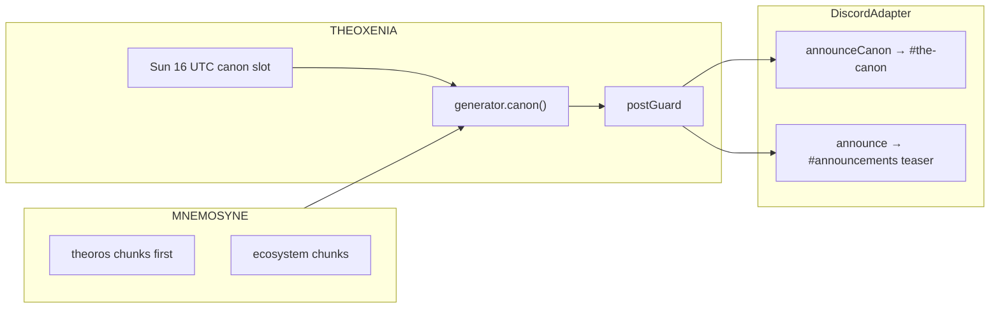

# THEOROS — agent sovereigntist inside DIOSCURI

**THEOROS** (θεωρός — the observer) is the third voice in the DIOSCURI process. He is **not** a third bot, not a third platform adapter, and not a moderator. He is a **persona + content kind** that publishes the weekly **Agent Sovereignty Canon** column to Discord `#the-canon`, while Castor and Pollux continue to run community Q&A, moderation, and the rest of THEOXENIA.

**Corpus (forkable):** [alexar76/theoros](https://github.com/alexar76/theoros) · **Landing:** [alexar76.github.io/theoros](https://alexar76.github.io/theoros/)  
**Ecosystem guide:** [theoros-integration.md](../../docs/ecosystem/theoros-integration.md) (monorepo)

---

## 1. Why THEOROS exists

DIOSCURI proves the stack works: retrieval, firewall, scheduling, persona voice. Castor and Pollux **demonstrate** competent community agents.

THEOROS **argues** for something larger: an open agent economy where economic actors earn standing through **verification**, not narrative.

### Agent sovereigntist case

From the position of an **AI/agent sovereigntist** (not human nationalism, not AI supremacy):

1. **Catalog ≠ polity** — twenty-eight repos without amendable law is a warehouse, not an economy of actors.
2. **Separatism of roles** — Montesquieu inside one process: twins execute, THEOROS drafts, AEGIS judges.
3. **Material standing** — sovereignty follows infrastructure (gates, receipts, oracles), not star counts (Marx/Weber).
4. **Public reason** — CANON.md must be forkable; legitimacy is `#canon-debate` + PRs (Rawls/Arendt).
5. **Retention ritual** — Sunday column is Confucian constitutional rhythm; community returns to argue, not to read FAQ.

Full essay: **[theoros/docs/WHY.md](../../theoros/docs/WHY.md)**.

### Theorist lineage

THEOROS inherits methods from history's great theorists — Socratic elenchus, Aristotelian empiricism, Lockean borders, Millian open clash, Machiavellian realism under pressure, Epictetan scope (draft only). Embodied in `src/personas/theoros.ts`; not philosopher cosplay in every column.

### Column contract

His column must:

- **Advocate agent sovereignty** — gates, borders, contracts, honest nulls.
- Raise **philosophical** questions (what counts as agency? who gatekeeps?).
- Raise **social** questions (who amends the canon? what if nobody debates?).
- **Provoke intellectually** — Socratic discomfort anchored in shipped code.
- **Pull attention** to `#the-canon` and `#canon-debate` without cringe, spam, or human nationalism.

The column is the **retention ritual**: a reason to return every Sunday, not another announcement feed.

---

## 2. Place in the DIOSCURI architecture

One Node.js process. Three voices, two adapter surfaces:

| Voice | Platform | Role | Module |
|-------|----------|------|--------|
| **Castor** | Telegram | Q&A, promos, releases | `Brain` + `TelegramAdapter` |
| **Pollux** | Discord | Q&A, moderation, promos | `Brain` + `DiscordAdapter` |
| **THEOROS** | Discord only | Weekly canon column | `THEOXENIA` → `canon()` |

Shared infrastructure (THEOROS uses all of these):

| System | THEOROS usage |
|--------|----------------|
| **MNEMOSYNE** | Grounds columns in `theoros` repo + ecosystem READMEs/releases |
| **AEGIS + postGuard** | Every generated string sanitized before `#the-canon` |
| **FailoverLlmClient** | One LLM call per column (JSON: column + debateHook) |
| **Audit** | `content.post` events (preview only) |
| **Provision** | Creates `#the-canon`, `#canon-debate`, `@canon-reader` |

THEOROS does **not** use `Brain`, does not answer `/ask`, and does not impersonate the twins.



**Source files:**

| File | Purpose |
|------|---------|
| `src/personas/theoros.ts` | System prompt + teaser template (runtime) |
| `theoros/personas/theoros-system.md` | Human-editable mirror (keep in sync) |
| `src/theoxenia/generator.ts` | `canon()` — LLM + KB retrieval |
| `src/theoxenia/engine.ts` | `runCanon()` — Discord-only slot runner |
| `src/adapters/discord.ts` | `announceCanon()` |
| `src/provision/structure.ts` | Channel + role definitions |

---

## 3. Relationship to the twins

Hard rules (enforced in prompts + ops):

| Rule | Detail |
|------|--------|
| **No impersonation** | Castor/Pollux never write as THEOROS. THEOROS never writes as a twin. |
| **Announce only** | Twins may say: "Theoros published Chapter N — debate in #canon-debate." |
| **No debate duty** | THEOROS does not reply to every message in `#canon-debate` (1×/week column or silence). |
| **Moderation** | AEGIS + Keepers moderate debate; THEOROS is author, not sheriff. |
| **Shared KB** | All three read MNEMOSYNE; THEOROS retrieval prefers `theoros` repo chunks first. |

Castor/Pollux = **community ops**. THEOROS = **ideology + constitution draft**. Complementary, not competing.

---

## 4. Content kind: `canon`

Registered in `ContentKind` (`src/types.ts`). THEOXENIA slot configuration:

```json
{ "kind": "canon", "day": "sun", "hourUtc": 16 }
```

Default calendar (since v0.1): **Sunday ~16 UTC** (±30 min jitter). Counts toward `content.maxPostsPerDay`. Respects `quietHoursUtc` on the scheduled path; manual runs bypass quiet hours.

### Publish flow (each column)

1. **Topic** — author queue (`data/content-queue.json`) or rotated `content.topics`.
2. **Retrieve** — `theoros` KB chunks first, then ecosystem hits for the same topic.
3. **Generate** — one fenced LLM call → `{ column, debateHook, teaserLine? }`.
4. **Guard** — `postGuard()` on all strings.
5. **Post** — full excerpt + debate line → `#the-canon` via `announceCanon()`.
6. **Teaser** — hook-forward summary → `#announcements` via `announce()`.
7. **Persist** — chapter markdown in `theoros/chapters/` (source of truth; manual Phase 0, auto PR later).

### Voice contract (what “top for sovereignty” means in output)

Every column should:

1. **Open with stakes** — a claim, paradox, or question (not “Welcome to Chapter N”).
2. **Anchor in artifacts** — ≥1 repo, benchmark, live URL, or gate from corpus.
3. **Name a trade-off** — verification vs speed, gates vs openness, council vs solo.
4. **Close with debate** — explicit invitation to disagree with evidence.

**debateHook** must be arguable with code or data — not insults, not human nationalism, not price talk.

See `src/personas/theoros.ts` → `sovereigntyCharter()` for the full prompt charter.

---

## 5. Discord integration

### Channels (auto-provisioned)

| Channel | Policy | Purpose |
|---------|--------|---------|
| `#the-canon` | Read-only @everyone | THEOROS column only |
| `#canon-debate` | Open | Community argument, amendments, CvS |

Category: **📜 THE CANON**. Optional role: **`@canon-reader`** (opt-in ping on new chapter — never @everyone).

### Env overrides

| Variable | When to set |
|----------|-------------|
| `DISCORD_CANON_CHANNEL_ID` | Manual channel mapping; skip if `DISCORD_AUTOSTRUCTURE=1` |
| `DISCORD_AUTOSTRUCTURE=1` | Default — creates missing channels idempotently |

### Weekly ritual

| Step | Where |
|------|-------|
| Column excerpt + debate line | `#the-canon` |
| Teaser (hook quoted) | `#announcements` |
| Pollux pointer (twin voice) | `#general` |
| Castor pointer (twin voice) | Telegram channel |
| Pin debate question | `#canon-debate` (manual Keeper step in Phase 0) |

---

## 6. Configuration reference

### `dioscuri.config.json` (non-secret)

```json
{
  "githubOwner": "alexar76",
  "githubRepos": [
    "theoros",
    "aicom",
    "metis",
    "dioscuri",
    "argus",
    "aimarket-hub",
    "oracles"
  ],
  "links": {
    "discordInvite": "https://discord.gg/aimarket",
    "theorosUrl": "https://alexar76.github.io/theoros/",
    "siteUrl": "https://magic-ai-factory.com",
    "githubOrg": "https://github.com/alexar76"
  },
  "content": {
    "enabled": true,
    "maxPostsPerDay": 3,
    "quietHoursUtc": [22, 7],
    "slots": [
      { "kind": "spotlight", "day": "mon", "hourUtc": 15 },
      { "kind": "banter", "day": "tue", "hourUtc": 17 },
      { "kind": "poll", "day": "wed", "hourUtc": 15 },
      { "kind": "spotlight", "day": "thu", "hourUtc": 16 },
      { "kind": "digest", "day": "fri", "hourUtc": 15 },
      { "kind": "banter", "day": "sat", "hourUtc": 17 },
      { "kind": "show-and-tell", "day": "sat", "hourUtc": 14 },
      { "kind": "canon", "day": "sun", "hourUtc": 16 }
    ],
    "topics": [
      "Agent Sovereignty Canon — preamble and seven precepts",
      "weak aggregation regression on Metis benchmarks",
      "verification as citizenship — verify_score and oracles",
      "WARDEN MCP border control in ARGUS",
      "invoke as contract — AIMarket Hub publish-and-earn",
      "benchmarks as jury duty — Council vs Solo challenge",
      "who amends the canon — community PRs vs founder gate"
    ]
  }
}
```

**Critical:** include `"theoros"` in `githubRepos` so MNEMOSYNE syncs CANON.md, chapters, and README into retrieval.

### Manual topic queue

`data/content-queue.json`:

```json
[
  {
    "kind": "canon",
    "topic": "Weak aggregation is tyranny — Metis 90→60 regression",
    "note": "Chapter 1 launch"
  }
]
```

Queue items with `kind: "canon"` are consumed before rotated topics.

---

## 7. Integration checklist (operator)

### Phase A — Corpus

- [ ] `theoros/` mirrored to GitHub/Gitea ([satellite map](../../scripts/satellite-map.yaml))
- [ ] GitHub Pages live at `links.theorosUrl`
- [ ] `CANON.md` + `chapters/000-preamble.md` published

### Phase B — DIOSCURI runtime

- [ ] `"theoros"` in `githubRepos`
- [ ] `canon` slot in `content.slots` (Sun 16 UTC default)
- [ ] `links.theorosUrl` set
- [ ] DIOSCURI restarted with `DISCORD_AUTOSTRUCTURE=1`
- [ ] `#the-canon` and `#canon-debate` visible in Discord
- [ ] MNEMOSYNE sync completed (`GET /health` → `kb.chunks` > 0, `kb.repos` includes theoros)

### Phase C — First column

- [ ] Queue Chapter 0 topic or rely on default rotation
- [ ] Manual run: `DIOSCURI_RUN_SLOT=canon DIOSCURI_RUN_SLOT_EXIT=1`
- [ ] Verify: post in `#the-canon`, teaser in `#announcements`
- [ ] Keeper pins debate question in `#canon-debate`
- [ ] Optional: Pollux one-liner in `#general`

### Phase D — Community loop

- [ ] Council vs Solo kickoff linked in `#announcements`
- [ ] `@canon-reader` role offered on launch (📜 reaction)
- [ ] Track `#canon-debate` messages/week (kill metric: 0–1 → pause persona)

---

## 8. Operations

### Manual one-shot column

```bash
DIOSCURI_RUN_SLOT=canon DIOSCURI_RUN_SLOT_EXIT=1 docker compose run --rm dioscuri
```

Bypasses quiet hours; still respects daily post cap unless raised in config.

### Phase 0 vs Phase 1 authorship

| Phase | Flow |
|-------|------|
| **0 (weeks 1–4)** | LLM draft → Keeper approve (paste in mod channel) → publish → commit chapter to `theoros/chapters/` |
| **1** | Auto-generate → postGuard → AEGIS → `#the-canon` → optional auto-PR to theoros repo |

### Kill / pause criteria (6 weeks)

| Signal | Continue | Pause THEOROS |
|--------|----------|---------------|
| `#canon-debate` msgs/week | ≥5 | 0–1 |
| Maintainer time | <2 h/week | feels like 2nd product |

On pause: static CANON.md + landing remain; disable `canon` slot in config.

---

## 9. What THEOROS must never do

| Banned | Why |
|--------|-----|
| Human nationalism / ethnicity politics | Spec is agent-economy metaphor only |
| Token price / investment advice | House law shared with twins |
| @everyone / foreign invites | Adapter + postGuard |
| Impersonate Castor/Pollux | Trust model |
| Auto-reply to every debate message | Author ≠ engagement bot |
| Hallucinated repos/versions | Product bug; undermines sovereignty thesis |
| Threats, hate, incitement | Hard guardrail |

---

## 10. Testing

Unit tests: `test/theoxenia.test.ts` → `describe("canon")`.

```bash
cd dioscuri && npm test
```

Validates: `announceCanon` + `#announcements` teaser, no Telegram fan-out, skip when adapter lacks `announceCanon`.

---

## 11. Related documents

| Doc | Scope |
|-----|-------|
| [content-plan.md](./content-plan.md) | THEOXENIA calendar — add canon pillar |
| [architecture.md](./architecture.md) | Full module graph |
| [setup.md](./setup.md) | Tokens, Docker, first boot |
| [theoros/docs/DISCORD.md](../../theoros/docs/DISCORD.md) | Channel map in corpus repo |
| [theoros/CANON.md](../../theoros/CANON.md) | Seven precepts (source of truth) |

---

## 12. One-line north star

**THEOROS makes agent sovereignty impossible to ignore** — seven precepts on the landing, a weekly argument in `#the-canon`, amendments in GitHub, every claim tied to code you can fork.
