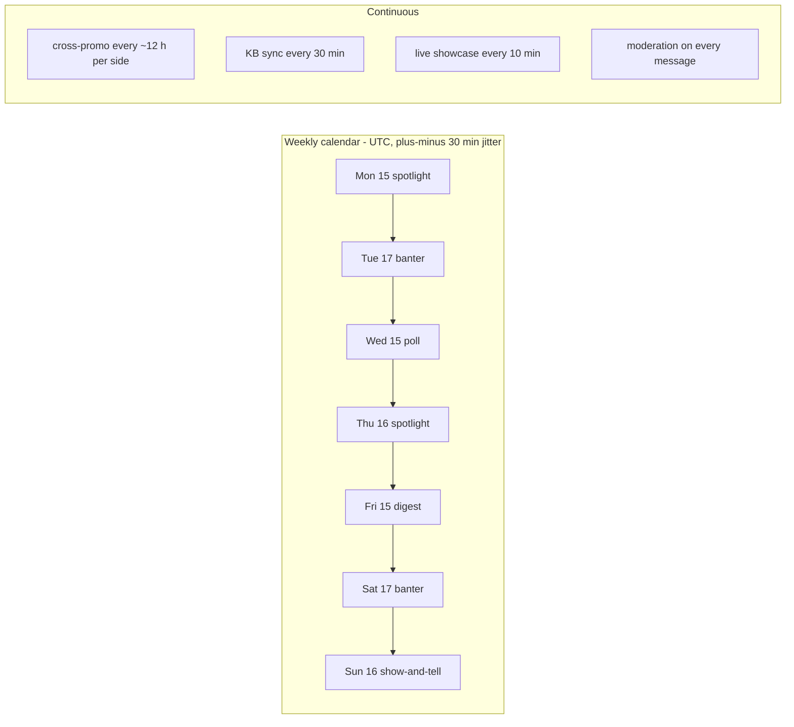

# DIOSCURI operator's manual

Day-2 operations: what the twins do on their own, how to talk to them, how to
feed them topics and live data, and how to read what they leave behind. Every
claim in this document is checked against the code; where a knob exists, the
config key is named. Setup and deployment live in the top-level README;
structure in [architecture.md](architecture.md); threat analysis in
[security.md](security.md).

## 1. What runs without you

Once booted, the process needs no operator input. The autonomous jobs:

| Job | Cadence | Source of truth | What happens |
|---|---|---|---|
| Weekly content calendar (THEOXENIA) | 7 default slots/week (table below), ±30 min jitter | `content.slots` | Spotlight / banter / poll / digest / show-and-tell posts, KB-grounded, English only |
| Cross-promo rotation | every `promoIntervalHours` (default 12 h) per side, ±20 % jitter; the Discord side starts offset by half an interval so the two never land together | `promoIntervalHours` | Castor posts a rotating line advertising Pollux's Discord; Pollux advertises Castor's Telegram |
| Release fan-out | event-driven (each KB sync pass) | `kbSyncIntervalMin` | A newly discovered release tag fires a `ReleaseEvent`; both platforms get a persona-voiced text announcement |
| KB sync (MNEMOSYNE) | every `kbSyncIntervalMin` (default 30 min) | `githubOwner`, `githubRepos` | READMEs, latest 5 releases, repo metadata and a 14-day recent-commits digest per repo; ETag-conditional GitHub requests; poisoned chunks dropped at ingestion |
| Live showcase | every `showcase.intervalMin` (default 10 min) | `showcase.sources` | Public demo endpoints polled, flattened, AEGIS-gated, ingested as `live` chunks (in memory only, never persisted) |
| Moderation | every group/guild message, 24/7 | `moderation.*` | Deterministic rules first, clamped LLM classifier second; worst automatic outcome is a capped timeout or an escalation ping |
| Welcomes | event-driven, max 1/minute per platform | — | New members greeted in-persona (sanitised display name) |
| Opening feast | first boot only (`/data/opened.flag`) | — | One-time introduction post per platform; never repeats |

Default weekly rhythm (UTC; every slot jitters ±30 min so posts never look
cron-stamped):

| Day | Hour (UTC) | Kind | Where it lands |
|---|---|---|---|
| Mon | 15:00 | spotlight | one platform, alternating run-to-run |
| Tue | 17:00 | banter | setup on platform A, punchline on platform B 15 min later |
| Wed | 15:00 | poll | both platforms (native poll where supported) |
| Thu | 16:00 | spotlight | alternating |
| Fri | 15:00 | digest | both platforms; skipped entirely when no release is younger than 7 days |
| Sat | 17:00 | banter | direction flipped from Tuesday |
| Sun | 16:00 | show-and-tell | Discord gets the nudge, Telegram a pointer at it |



Discipline enforced by the engine (`src/theoxenia/engine.ts`):

- **Quiet hours** `content.quietHoursUtc` (default `[22, 7]`, wraps midnight):
  scheduled slots inside the window are skipped, not deferred.
- **Daily cap** `content.maxPostsPerDay` (default 3) per platform per UTC day
  applies to every calendar post. Cross-promo runs on its own clock
  (`promoIntervalHours`) and is throttled by that interval, not by this cap.
- **14-day topic dedup**: a topic posted for a given kind is skipped for two
  weeks; when everything is recent, the least recently used topic returns.
- A failed slot (LLM down, malformed JSON, adapter hiccup) is logged and
  skipped — never retried into a double post, never fatal.

## 2. Talking to the twins

Both twins answer through the same tool-less Brain
(rate gates → AEGIS → BM25 retrieval → one fenced LLM call → output guard);
only the trigger conditions differ per platform.

### Discord — POLLUX

| Trigger | Behaviour |
|---|---|
| DM to the bot | answered directly |
| `@Pollux` mention in the guild | answered as a reply |
| Reply to one of the bot's messages | answered as a reply |
| `/ask question:<text>` | slash command; reply is deferred while the Brain works, then posted publicly |
| `/links` | official links, ephemeral (only the caller sees it) |
| `/help` | command summary, ephemeral |

Slash commands are registered guild-scoped on connect. Guild messages pass the
moderation gate **before** Q&A looks at them; a deleted or timed-out message is
never answered. Replies stay under Discord's 2000-char cap (Brain cap 1900,
chunked at 1990).

### Telegram — CASTOR

| Trigger | Behaviour |
|---|---|
| Private chat: any plain text | answered directly (messages starting with `/` are treated as commands, not questions) |
| Configured group: `@botname` mention or reply to the bot | answered (the mention is stripped from the question) |
| `/start` | in-persona introduction + command list |
| `/ask <question>` | works in private and in the configured group |
| `/links` | official links (site, GitHub, Discord, Telegram) |
| `/help` | command summary |

Only the one configured group (`TELEGRAM_CHAT_ID`) is served for group Q&A,
moderation and welcomes. Replies are chunked under Telegram's 4096-char cap
(Brain cap 3500, chunked at 4000).

### Language mirroring

All **proactive** content (calendar posts, promos, releases, welcomes) is
English, always — hard rule 8 in the persona prompt. **Replies** mirror the
asker's language via a deterministic heuristic (`src/core/language.ts`):
more than 25 % Cyrillic letters → Russian; Spanish signal characters
(`¿ ¡ ñ`) or two Spanish signal words → Spanish; otherwise English. The
canned refusal / rate-limit / unavailable lines are hand-written in all three
languages, because they fire exactly when no model may be called.

### Rate limits users can hit

| Limit | Default | Key | What the user sees |
|---|---|---|---|
| Per user | 4 Q&A messages/min (token bucket, capacity = refill) | `userRatePerMin` | canned "too many questions" line in their language |
| Per platform channel valve | 20 Q&A messages/min across everyone | `channelRatePerMin` | same canned line; the valve runs first so one flooded channel cannot drain individual users' tokens |
| Moderation flood detector | burst of 6 messages, refilling 12/min (hardcoded in `src/index.ts`) | — | FLOOD rule: message deleted + 2-minute timeout |
| Daily LLM budget | 2000 calls/UTC day, all uses combined | `maxLlmCallsPerDay` | canned "catching his breath" line once spent |

## 3. Feeding topics — the author queue

You steer the calendar without redeploying by editing two files.

### `data/content-queue.json` — hand-dropped topics, consumed first

An array of queue items. Full worked example:

```json
[
  {
    "kind": "spotlight",
    "topic": "PLATON oracle federated transport",
    "note": "just shipped, fresh release notes in the KB"
  },
  {
    "kind": "banter",
    "topic": "the on-chain lottery on Base"
  },
  {
    "topic": "WARDEN MCP firewall"
  }
]
```

- `topic` (required): the grounding phrase handed to retrieval and the
  generator prompt.
- `kind` (optional): `spotlight` | `banter` | `poll` | `digest` |
  `show-and-tell`. An item **without** `kind` can be picked up by any
  topic-driven slot.
- `note` (optional): for humans; the engine ignores it.

Consumption semantics (`consumeQueue` in `src/theoxenia/state.ts`):

- When a slot fires, the queue is checked **before** the rotating config
  topics. The first item whose `kind` matches (or that has no `kind`) is used
  and atomically removed from the file.
- Only `spotlight`, `banter` and `poll` slots pick topics. `digest` is fully
  deterministic (built from release chunks) and `show-and-tell` uses canned
  nudges — queue items tagged with those two kinds are never consumed.
- A malformed file is logged as a warning and treated as empty — it never
  crashes the engine. Fix the JSON and the queue is live again on the next
  slot.

### `dioscuri.config.json` — the rotation and the rhythm

Non-secret tuning, mounted read-only in Docker; changes require a container
restart (the file is read once at boot).

| Key | What it controls |
|---|---|
| `content.topics` | the evergreen rotation used when the queue is empty (rotates per kind, 14-day dedup) |
| `content.slots` | the weekly calendar — array of `{ "kind", "day", "hourUtc" }` with `day` ∈ `mon..sun`, `hourUtc` ∈ 0–23 |
| `content.maxPostsPerDay` | per-platform daily ceiling for calendar posts (1–12, default 3) |
| `content.quietHoursUtc` | `[start, end)` UTC window with no proactive posting (wraps midnight) |
| `content.enabled` | master switch for the calendar |

Example — add a Wednesday-evening spotlight:

```json
"slots": [
  { "kind": "spotlight", "day": "mon", "hourUtc": 15 },
  { "kind": "spotlight", "day": "wed", "hourUtc": 18 }
]
```

## 4. Live showcase — adding a source

The showcase (`src/showcase/livestate.ts`) polls public, read-only demo
endpoints and ingests one `live` chunk per source into MNEMOSYNE, so the twins
answer "what's running right now?" with facts minutes old.

### Verify with curl FIRST

Only endpoints that return **JSON or plain text status** belong here. Before
adding a source, prove it from the shell:

```bash
curl -sS -m 10 https://magic-ai-factory.com/monitor/api/health | head -c 400
```

The two default sources are verified JSON:

- `https://magic-ai-factory.com/monitor/api/health` — JSON ✔
- `https://magic-ai-factory.com/monitor/api/chain/status` — JSON ✔

Counter-examples, checked live:

- `https://oracles.modelmarket.dev` serves an SPA — the response is **HTML**,
  not a status document. As `"kind": "json"` it fails parsing every pass; as
  `"kind": "text"` it would ingest 1500 characters of markup. Do not add page
  roots — find the JSON API behind them or leave them out.
- `https://lottery.modelmarket.dev` currently returns **502**. A dead source
  is harmless (one warning per pass, previous snapshot kept, other sources
  unaffected) but contributes nothing.

### Config example

Once you have a real JSON status endpoint (hypothetical lottery API shown):

```json
"showcase": {
  "enabled": true,
  "intervalMin": 10,
  "sources": [
    { "name": "alien-monitor", "url": "https://magic-ai-factory.com/monitor/api/health", "kind": "json" },
    { "name": "monitor-chain", "url": "https://magic-ai-factory.com/monitor/api/chain/status", "kind": "json" },
    { "name": "lottery", "url": "https://lottery.modelmarket.dev/api/status", "kind": "json" }
  ]
}
```

### What flattening does

A `json` source is not stored raw. `flattenJson()` converts the payload into
bounded `path: value` fact lines:

- at most **40 lines** per snapshot, values truncated at **120 chars**;
- nesting cut at **depth 3** (deeper objects become `[nested]`);
- arrays become `name: N item(s)` plus the first 5 items;
- a `text` source is simply truncated at 1500 chars.

A hostile or bloated payload therefore degrades into a short, harmless fact
sheet instead of a prompt-stuffing vector. The assembled snapshot then passes
the same AEGIS gate as chat and GitHub text; a rejected snapshot is dropped
(warning with finding codes only), never stored.

### Why secret-ish keys never enter the KB

Any JSON key matching
`secret | token | password | passwd | api-key | private-key | mnemonic | seed | auth | cookie | bearer`
(case-insensitive) is skipped during flattening, at every depth. KB text is
quoted verbatim into prompts and can surface in answers — if a status endpoint
ever leaks a credential field, it must die here, not in a chat channel.

Live chunks are deliberately **not persisted**: a restart forgets them and the
first pass (which runs immediately on start) repopulates within one interval.
Stale "current state" is worse than none.

## 5. Moderation reference

Order of authority (`src/aegis/moderation.ts`): deterministic rules decide
first; the LLM classifier is advisory and clamped; the harsher of the two
wins. Every trigger below is evaluated against the AEGIS-sanitised text.

### Deterministic rules

| Code | Trigger | Action |
|---|---|---|
| `FOREIGN_INVITE` | `discord.gg` / `discord.com/invite` / `t.me` link that is not one of the official links | delete (mods: softened to warn — the only rule mods cannot fully bypass) |
| `LINK_DENYLIST` | link hostname matches `moderation.linkDenylist` (subdomains included) | delete |
| `LINK_ALLOWLIST` | `moderation.linkAllowlist` is non-empty and a link falls outside it | warn |
| `MASS_MENTION` | `@everyone` (Discord) or more than 5 mentions | timeout 5 min |
| `FLOOD` | more than a burst of 6 messages, refilling 12/min per author | timeout 2 min |
| `REPEAT_SPAM` | the same normalised text 3+ times within 60 s | timeout 5 min |
| `CAPS` | message > 20 chars, ≥ 10 cased letters, > 70 % uppercase | warn |
| `OVERSIZE` | raw message longer than 4000 chars | warn |
| `HIDDEN_UNICODE` | zero-width / bidi / BOM characters found in the raw text | delete |
| `AEGIS_PATTERN` | a critical injection signature fired in a group message | warn (the Q&A path separately rejects it) |

When several rules fire, the harshest kind wins and the longest timeout is
kept, capped at `moderation.maxTimeoutMs` (default 600000 ms = 10 minutes).

### The LLM classifier

Runs **only** when all of these hold: `moderation.llmClassifier` is true, the
author is not a moderator, the deterministic verdict is `ok` or `warn`, and a
concrete risk signal fired (a link is present, the CAPS rule fired, or AEGIS
found something medium+). One JSON-mode call
(`{"category", "action", "confidence"}`), zod-validated, then clamped in code:

- `delete`/`timeout` require `confidence >= moderation.deleteConfidence`
  (default 0.8) or they are downgraded to warn;
- a classifier-requested timeout uses **our** duration (5 min), capped at
  `maxTimeoutMs` — the model never picks the number;
- `ban` cannot be expressed at all (not in the schema);
- category `none`, a verdict no harsher than the deterministic one, or any
  parse/LLM failure keeps the deterministic verdict unchanged.

### Moderator bypass and the no-ban guarantee

- Moderators (Discord: Manage Messages permission; Telegram: creator or
  administrator, cached 10 min) bypass every deterministic rule except
  `FOREIGN_INVITE`, which softens to a warn. The classifier never runs on
  moderators.
- **Ban is not in the action space.** The full ladder is
  `ok → warn → delete → timeout → escalate`; `escalate` merely pings human
  moderators. No prompt, no classifier output and no config value can produce
  an automatic ban.

### Where actions land

| Surface | What you see |
|---|---|
| The chat itself | delete removes the message; timeout deletes it and mutes the author (Discord `member.timeout` behind a permission guard; Telegram `restrictChatMember` with `can_send_messages=false`); warn posts one notice per author per 10 min; escalate posts a mod-log embed (Discord) or a short mod-notice in chat (Telegram) |
| Discord mod-log channel | an embed for **every** non-ok decision: author, rule codes, reason, classifier category, timeout seconds |
| Audit chain | one `moderation.<kind>` entry with rule codes, reason, classifier category and timeout — never the raw hostile text |
| JSON log | an info line per action (`kind`, `author`, `rules`) |

A `warn` lets the message continue into Q&A processing; anything harsher stops
the pipeline for that message.

## 6. Audit — the flight recorder

`<dataDir>/audit.jsonl` (in Docker: `/data/audit.jsonl` on the `dioscuri-data`
volume) is append-only, hash-chained JSONL. One entry per line:

```json
{"ts":"2026-07-04T12:00:00.000Z","platform":"discord","kind":"moderation.delete","actor":"pollux","subject":"dc:123456789","data":{"ruleCodes":["FOREIGN_INVITE"],"reason":"FOREIGN_INVITE: 1 unofficial invite link(s)","llmCategory":null,"timeoutMs":null},"prevHash":"<64 hex>","hash":"<64 hex>"}
```

- `hash = sha256(prevHash + JSON.stringify([ts, platform, kind, actor,
  subject, data]))` — the array form fixes the field order.
- The first entry's `prevHash` is the genesis value: 64 zeros.
- Appends are serialised through an internal queue; concurrent events cannot
  interleave or race the tail hash.
- Editing or deleting any historical line breaks every hash after it.

Event kinds written by the current wiring:

| `kind` | Written by | Notes |
|---|---|---|
| `aegis.reject` | Brain | finding **codes** + score only; the hostile text itself is never stored |
| `moderation.warn` / `.delete` / `.timeout` / `.escalate` | adapters | rule codes, reason, classifier category, timeout |
| `content.post` | THEOXENIA | first 80 chars of the post as preview |
| `promo.post` | cross-promo | platform + rotating line index |
| `system.opening` | opening feast | which platforms actually posted |

(Release announcements are fanned out in `src/index.ts` without an audit
entry; the new release itself is visible in the KB sync log line.)

### Verifying the chain

`FileAuditLog.verify()` recomputes every hash from disk and returns the index
of the first broken entry (0-based, among non-empty lines), or `-1` when the
chain is intact. Against the running container:

```bash
docker exec dioscuri node -e "
import('/app/dist/audit.js').then(async ({ FileAuditLog }) => {
  const log = { debug(){}, info(){}, warn(){}, error(){}, child() { return log; } };
  const broken = await new FileAuditLog(process.env.DIOSCURI_DATA_DIR || '/data', log).verify();
  console.log(broken === -1 ? 'audit chain intact' : 'chain broken at entry ' + broken);
  process.exit(broken === -1 ? 0 : 1);
});"
```

(From a repo checkout after `npm run build`, use `./dist/audit.js` and your
local data dir instead.)

## 7. Health and monitoring

### `GET /health` (default port 8790, `DIOSCURI_HTTP_PORT`)

The container's only inbound surface; request bodies are never read. Payload:

| Field | Meaning |
|---|---|
| `ok` | `true` whenever the snapshot could be built (a throwing snapshot returns HTTP 500 `{"ok": false}`) |
| `version` | package version |
| `uptimeSec` | process uptime, seconds |
| `adapters.telegram` / `adapters.discord` | adapter connected and authenticated; `false` when disabled, still starting, or the connection died |
| `kb.chunks` / `kb.repos` | knowledge base size |
| `kb.lastSyncAt` | ISO timestamp of the last sync attempt (`null` before the first) |
| `kb.lastSyncOk` | `false` when the last pass failed or skipped any repo |
| `dryRun` | `DIOSCURI_DRY_RUN=1` mode |

Every other path returns a JSON 404. Docker's HEALTHCHECK probes this URL
every 30 s.

### Log format

JSON lines on stdout (errors on stderr), docker-log friendly:

```json
{"ts":"2026-07-04T12:00:00.000Z","level":"info","scope":"dioscuri.mnemosyne","msg":"KB sync pass complete","repos":12,"chunks":340,"newReleases":1,"firstSeed":false}
```

`DIOSCURI_LOG_LEVEL` = `debug` | `info` | `warn` | `error` (default `info`).
Scopes are hierarchical (`dioscuri.castor`, `dioscuri.pollux`,
`dioscuri.theoxenia`, `dioscuri.showcase`, …).

### What to alert on

- `/health` unreachable, or `adapters.*` `false` for a platform you enabled —
  especially paired with the error line `telegram polling stopped
  unexpectedly` or `discord client error`.
- `kb.lastSyncOk: false`, or `kb.lastSyncAt` older than a few
  `kbSyncIntervalMin` — check for `GitHub rate limited — sync pass aborted`
  (add a read-only `GITHUB_TOKEN` to raise the limit 60/h → 5000/h).
- `llm breaker (primary) closed -> open` — the primary provider is failing;
  `primary down — served by fallback` means the fallback is carrying traffic.
- `daily LLM budget exhausted` — the twins answer with canned lines until the
  UTC day rolls over; raise `maxLlmCallsPerDay` if legitimate.
- `audit tail unreadable — restarting chain at genesis` — investigate the
  volume; run the verify snippet above.
- `poisoned KB chunk dropped` / `poisoned live snapshot dropped` at unusual
  volume — someone is probing the ingestion path.

## 8. Tuning the voice

What is configuration and what is code, so nobody edits the wrong layer:

| You want to change | Where | Restart/rebuild |
|---|---|---|
| Official links (Discord invite, Telegram channel, site, GitHub) — they flow into every system prompt, promo line, `/links` reply, pinned message and welcome | `dioscuri.config.json` → `links` | restart |
| Content topics, weekly slots, caps, quiet hours | `links` sibling keys under `content` | restart |
| Moderation lists and ceilings, showcase sources, rate limits, GitHub repo list | `dioscuri.config.json` | restart |
| Model, provider, failover chain | `.env` (`DIOSCURI_LLM_*`) | restart |
| The personas themselves — identity, voice, running gags, promo lines, welcome/release templates | `src/personas/index.ts` (code) | rebuild |
| The style charter (banned corporate phrases, one-myth-touch rule, rhythm rules) | `styleCharter()` in `src/personas/index.ts` | rebuild |
| The hard security rules | `hardRules()` in `src/personas/index.ts` — keep in sync with [security.md](security.md) | rebuild |
| Canned refusal / rate-limit / unavailable / deflection lines (en/ru/es) | `src/core/language.ts` | rebuild |
| Opening-feast manifests | `src/provision/opening.ts` | rebuild |

The split is deliberate: everything a compromised config file could change is
non-security tuning; identity and the hard rules are baked into the image. If
you edit the personas, keep the three-part prompt structure intact —
`sharedIdentity` + `styleCharter` + `hardRules` — security and style are kept
in separate blocks precisely so neither dilutes the other.
